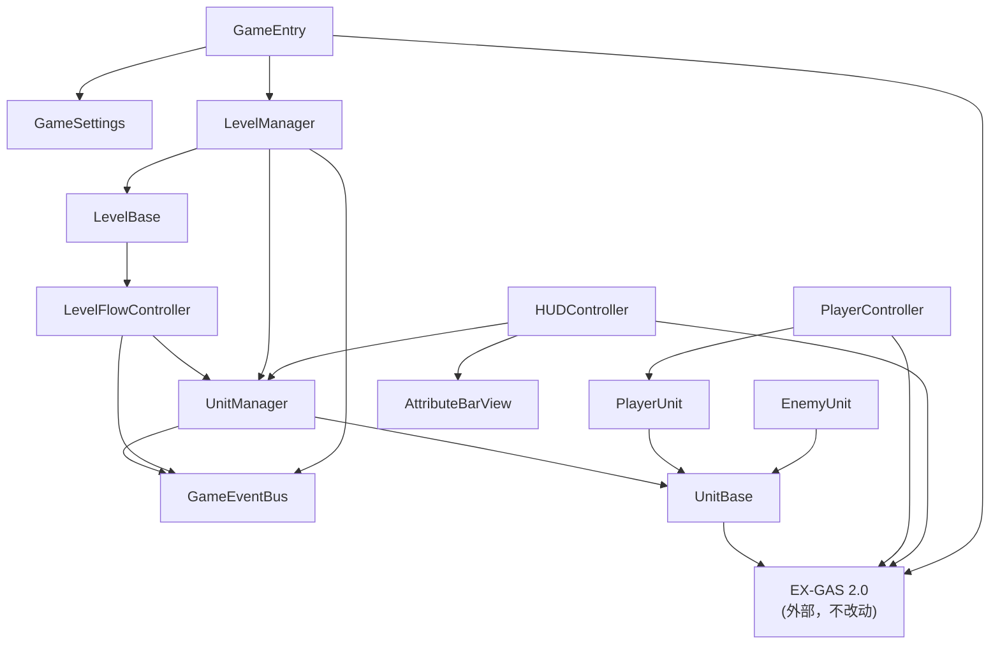

# EX-GAS Demo Gameplay Framework — 框架说明文档 v1.0

> 本文档面向新 session 重建用途。读完后可独立实现与本框架接口一致的完整实现。

---

## 一、总览

本框架是架设在 **EX-GAS 2.0**（Unity DOTS/ECS GAS 系统）之上的**关卡运行 Gameplay 框架**，不修改 EX-GAS 内部逻辑。

EX-GAS 核心概念简记：
- **WHO**：`AbilitySystemCell`（ASC）— GAS 运行单元，每个游戏单位持有一个
- **DO**：`Ability` — 所有行为/技能的触发载体
- **WHAT**：`GameplayEffect`（GE）— 属性修改的唯一途径
- **ECS 驱动**：`GASManager.Run()` 启动，`GASManager.Stop()` 关闭
- **配置**：Excel → Luban → JSON，运行时由 `XLuban.GetAscConfig(id)` 加载

---

## 二、目录结构

```
Assets/
├── Framework/                      ← 可跨项目复用，不含业务逻辑
│   ├── Core/
│   │   ├── GameEntry.cs            ← MonoBehaviour 启动入口
│   │   ├── GameEventBus.cs         ← 泛型全局事件总线
│   │   └── GameSettings.cs         ← ScriptableObject 全局参数
│   ├── Level/
│   │   ├── LevelBase.cs            ← 关卡抽象基类
│   │   ├── LevelManager.cs         ← 关卡生命周期单例
│   │   └── LevelFlowController.cs  ← 波次/胜负状态机
│   ├── Unit/
│   │   ├── UnitBase.cs             ← 单位基类（持有 ASC）
│   │   ├── UnitManager.cs          ← 单位注册/查找
│   │   ├── PlayerUnit.cs           ← 玩家单位扩展
│   │   └── EnemyUnit.cs            ← 敌人单位扩展
│   ├── Input/
│   │   └── PlayerController.cs     ← 输入 → Ability 分发
│   └── UI/
│       ├── HUDController.cs        ← 属性事件 → UI 刷新
│       └── AttributeBarView.cs     ← 通用进度条视图
└── Demo/                           ← 业务层，依赖 Framework
    ├── Levels/
    ├── Units/
    ├── Config/                     ← EX-GAS Luban JSON 表
    └── Scenes/
```

---

## 三、依赖层级图



**开发顺序（零依赖优先）**：
`GameEventBus` → `UnitBase` → `UnitManager` → `PlayerUnit`/`EnemyUnit` → `LevelFlowController` → `LevelBase` → `PlayerController` / `AttributeBarView` → `LevelManager` → `HUDController` → `GameEntry`

---

## 四、各模块接口规范

### 4.1 `GameEventBus`（Core/GameEventBus.cs）

**职责**：全局事件解耦，无任何外部依赖。

```csharp
public static class GameEventBus
{
    public static void Register<T>(Action<T> handler);
    public static void Unregister<T>(Action<T> handler);
    public static void Dispatch<T>(T evt);
}
```

**约定事件结构体举例**：
```csharp
public struct UnitDeadEvent   { public UnitBase Unit; }
public struct LevelEndEvent   { public LevelResult Result; }
public struct WaveStartEvent  { public int WaveIndex; }
```

> 现有 Demo 中等价实现为 `EventCenter`（字符串 key），新框架改为泛型强类型。

---

### 4.2 `GameSettings`（Core/GameSettings.cs）

**职责**：`ScriptableObject`，存放全局只读配置参数（初始关卡 ID、资源包名等）。

```csharp
[CreateAssetMenu(menuName = "Framework/GameSettings")]
public class GameSettings : ScriptableObject
{
    public string AssetPackageName;
    public string GameConfigDir;
    public int    StartLevelId;
}
```

---

### 4.3 `GameEntry`（Core/GameEntry.cs）

**职责**：`MonoBehaviour`，挂在永不销毁的启动 GameObject 上，按序初始化所有子系统。

对应现有 `DemoLauncher`。

```csharp
public class GameEntry : MonoBehaviour
{
    [SerializeField] private GameSettings _settings;

    private void Awake()
    {
        DontDestroyOnLoad(gameObject);
        // 1. 启动 ECS GAS World
        XLauncher.Launch();
        GASManager.Run();
        // 2. 初始化资源系统（YooAsset 或其他）
        // 3. 初始化 UI 系统
        // 4. 注册 GameEventBus 顶层事件
        // 5. 配置表加载完成后：LevelManager.Instance.LoadLevel(_settings.StartLevelId)
    }
}
```

**关键约定**：
- `GASManager.Run()` 必须在任何 ASC 创建之前调用
- 配置表（`XLuban.InitConfigTables`）必须在 `UnitBase.Awake` 之前加载完毕
- 关卡卸载时调用 `GASManager.Stop()` 防止 ECS World 泄漏 

---

### 4.4 `UnitBase`（Unit/UnitBase.cs）

**职责**：所有游戏单位的基类 `MonoBehaviour`，持有 `AbilitySystemComponent`。

对应现有 `BaseUnit`。

```csharp
public abstract class UnitBase : MonoBehaviour
{
    public AbilitySystemComponent ASC { get; private set; }
    [SerializeField] protected int _ascPresetId;

    protected virtual void Awake()
    {
        ASC = GetOrAddComponent<AbilitySystemComponent>();
        ASC.Init(XLuban.GetAscConfig(_ascPresetId));   // ASC 预设初始化
        UnitManager.Instance.Register(this);
    }

    protected virtual void OnDestroy()
    {
        UnitManager.Instance.Unregister(this);
        GameEventBus.Dispatch(new UnitDeadEvent { Unit = this });
    }

    // 供子类调用的 GAS 快捷方法
    public bool TryActivateAbility(int abilityId, params object[] args)
        => ASC.Cell.TryActivateAbility(abilityId, args);

    public void ApplyEffectToSelf(int effectId, int level = 1)
        => ASC.Cell.ApplyGameplayEffectToSelf(effectId, level);

    public bool HasTag(int tagId) => ASC.Cell.HasTag(tagId);
}
```

**ASC 初始化流程**：`XLuban.GetAscConfig(id)` → `AbilitySystemCellConfig` → `ASC.Init(tags, attrSets, abilities, level)`。

**属性事件注册约定**（参照现有 `BaseUnit.OnEnable`）：

```csharp
protected virtual void OnEnable()
{
    // 属性钳制/监听 用 GASEventCenter
    GASEventCenter.SetOnAttrBaseValueChangeBefore(ASC.Cell, attrSetId, attrId, ClampCallback);
}
protected virtual void OnDisable()
{
    GASEventCenter.ClearOnAttrBaseValueChangeBefore(ASC.Cell, attrSetId, attrId);
}
```

---

### 4.5 `PlayerUnit`（Unit/PlayerUnit.cs）

**职责**：玩家单位，继承 `UnitBase`，暴露 Ability 触发方法供 `PlayerController` 调用。

对应现有 `DemoPlayer`。

```csharp
public class PlayerUnit : UnitBase
{
    public static PlayerUnit Instance { get; private set; }

    protected override void Awake()
    {
        base.Awake();
        Instance = this;
        // 可在此施加初始 buff，添加固有 Tag 等
        // ASC.Cell.AddFixedTag(XTag.Ability);
        // ASC.Cell.ApplyGameplayEffectToSelf(initBuffId);
    }

    public void Move(Vector3 inputDir, Vector3 cameraForward) { /* 调用 ABILITY_move */ }
    public void StopMove()   { /* TryEndAbility */ }
    public void StartRun()   { /* TryActivateAbility(ABILITY_run) */ }
    public void StopRun()    { /* TryEndAbility(ABILITY_run) */ }
    public void Attack()     { /* TryActivateAbility(ABILITY_attack) */ }
}
```

---

### 4.6 `EnemyUnit`（Unit/EnemyUnit.cs）

**职责**：敌人单位，继承 `UnitBase`，包含简单 AI 逻辑（定时激活 Ability）。

```csharp
public class EnemyUnit : UnitBase
{
    [SerializeField] private int _attackAbilityId;
    // AI 逻辑：感知范围检测 PlayerUnit，调用 TryActivateAbility(_attackAbilityId)
}
```

---

### 4.7 `UnitManager`（Unit/UnitManager.cs）

**职责**：单位注册/注销/查找，按 `GameplayTag` 过滤。

```csharp
public class UnitManager : MonoSingleton<UnitManager>
{
    private List<UnitBase> _units = new();

    public void Register(UnitBase unit)   { _units.Add(unit); }
    public void Unregister(UnitBase unit) { _units.Remove(unit); }

    // 按 Tag 过滤（调用 asc.Cell.HasTag）
    public List<UnitBase> GetUnitsWithTag(int tagId)
        => _units.Where(u => u.ASC.Cell.HasTag(tagId)).ToList();

    // 按类型获取
    public T GetUnit<T>() where T : UnitBase
        => _units.OfType<T>().FirstOrDefault();

    // Spawn：从预设 ID 实例化并初始化
    public UnitBase SpawnUnit(GameObject prefab, int ascPresetId, Vector3 pos)
    {
        var go = Instantiate(prefab, pos, Quaternion.identity);
        var unit = go.GetComponent<UnitBase>();
        // unit._ascPresetId 已在 prefab 中配置，Awake 时自动 Init
        return unit;
    }
}
```

`HasTag` 接口来自 EX-GAS `AbilitySystemCell`。

---

### 4.8 `PlayerController`（Input/PlayerController.cs）

**职责**：捕获输入，调用 `PlayerUnit` 的 Ability 触发方法。不硬编码按键，通过 `InputActionAsset` 或简单字典配置映射。

对应现有 `EasyInputController`。

```csharp
public class PlayerController : MonoBehaviour
{
    [SerializeField] private PlayerUnit _player;
    private bool _inputBanned;

    private void Update()
    {
        if (_inputBanned) return;
        HandleMove();
        HandleRun();
        HandleAttack();
    }

    public void SetBanInput(bool ban) => _inputBanned = ban;

    private void HandleMove()  { /* 读轴 → _player.Move(dir, cameraFwd) / StopMove() */ }
    private void HandleRun()   { /* LeftShift Down/Up → _player.StartRun/StopRun() */ }
    private void HandleAttack(){ /* E Down → _player.Attack() */ }
}
```

**关键约定**：
- `PlayerController` 只调用 `PlayerUnit` 的语义方法（`Move/Attack/StartRun`），不直接调用 `ASC` API。
- 输入屏蔽由 `SetBanInput(true)` 实现（对应现有 `EasyInputController.SetBanInput`）。 

---

### 4.9 `LevelFlowController`（Level/LevelFlowController.cs）

**职责**：波次/胜负状态机，通过 `GameEventBus` 监听事件，通过 `UnitManager` 查询单位。

```csharp
public enum FlowState { Preparing, Running, Paused, Ended }

public class LevelFlowController
{
    public FlowState State { get; private set; }
    private int _currentWave;

    public void StartFlow()
    {
        State = FlowState.Running;
        SpawnNextWave();
    }

    public void Pause()  { State = FlowState.Paused; }
    public void Resume() { State = FlowState.Running; }

    private void SpawnNextWave()
    {
        _currentWave++;
        GameEventBus.Dispatch(new WaveStartEvent { WaveIndex = _currentWave });
        // 具体 Spawn 逻辑由 LevelBase 的子类重写或订阅 WaveStartEvent
    }

    // 监听单位死亡，判断胜负
    private void OnUnitDead(UnitDeadEvent e)
    {
        var remaining = UnitManager.Instance.GetUnitsWithTag(EnemyTagId);
        if (remaining.Count == 0)
        {
            State = FlowState.Ended;
            GameEventBus.Dispatch(new LevelEndEvent { Result = LevelResult.Win });
        }
    }
}
```

---

### 4.10 `LevelBase`（Level/LevelBase.cs）

**职责**：关卡抽象基类，定义关卡生命周期，持有 `LevelFlowController` 实例。

```csharp
public abstract class LevelBase
{
    protected LevelFlowController FlowController { get; } = new();

    public virtual void OnInit()   { /* 初始化单位、配置 */ }
    public virtual void OnStart()  { FlowController.StartFlow(); }
    public virtual void OnPause()  { FlowController.Pause(); }
    public virtual void OnResume() { FlowController.Resume(); }
    public virtual void OnEnd(LevelResult result) { /* 清理工作 */ }
}
```

**设计约定**：
- `LevelBase` 单向持有 `LevelFlowController`（不反向依赖）。
- `LevelFlowController` 通过 `GameEventBus.Dispatch(LevelEndEvent)` 通知关卡结束，`LevelBase` 订阅该事件后调用 `OnEnd()`，以打破潜在循环依赖。

---

### 4.11 `LevelManager`（Level/LevelManager.cs）

**职责**：关卡加载/卸载/生命周期驱动的单例，对应现有 `GameManager` 中的场景管理部分。

```csharp
public class LevelManager : MonoSingleton<LevelManager>
{
    private LevelBase _currentLevel;

    public void LoadLevel<T>(string sceneName) where T : LevelBase, new()
    {
        // 异步加载场景，加载完成后：
        // 1. _currentLevel = new T();
        // 2. _currentLevel.OnInit();
        // 3. _currentLevel.OnStart();
    }

    public void UnloadCurrentLevel()
    {
        _currentLevel?.OnEnd(LevelResult.Quit);
        _currentLevel = null;
        GASManager.Stop(); // 关卡卸载时停止 ECS World
    }
}
```

---

### 4.12 `AttributeBarView`（UI/AttributeBarView.cs）

**职责**：纯 View 组件，显示单条属性进度条（Hp/Mp/Sp 等），无业务逻辑依赖。

对应现有 `VMMainWindow` 中的 `ObservableVariable<float> Hp/Mp/Sp`。

```csharp
public class AttributeBarView : MonoBehaviour
{
    [SerializeField] private Slider _slider;
    [SerializeField] private TMP_Text _label;

    public void SetValue(float current, float max)
    {
        _slider.value = max > 0 ? current / max : 0;
        _label.text = $"{current}/{max}";
    }
}
```

---

### 4.13 `HUDController`（UI/HUDController.cs）

**职责**：订阅 EX-GAS `GASEventCenter` 的属性变化事件，刷新 `AttributeBarView`。

对应现有 `VMMainWindow.RegisterUpdateEvent`。

```csharp
public class HUDController : MonoBehaviour
{
    [SerializeField] private AttributeBarView _hpBar;
    [SerializeField] private AttributeBarView _mpBar;
    [SerializeField] private AttributeBarView _spBar;

    private AbilitySystemComponent _watchedAsc;

    public void Bind(AbilitySystemComponent asc)
    {
        _watchedAsc = asc;
        RefreshAll();
        GASEventCenter.RegisterOnAttrCurrentValueChangeAfter(asc.Cell, attrSetId, XAttribute.Hp, OnHpChange);
        GASEventCenter.RegisterOnAttrCurrentValueChangeAfter(asc.Cell, attrSetId, XAttribute.Mp, OnMpChange);
        GASEventCenter.RegisterOnAttrCurrentValueChangeAfter(asc.Cell, attrSetId, XAttribute.Sp, OnSpChange);
    }

    public void Unbind()
    {
        GASEventCenter.UnRegisterOnAttrCurrentValueChangeAfter(_watchedAsc.Cell, attrSetId, XAttribute.Hp, OnHpChange);
        // ... Mp, Sp 同理
    }

    private void OnHpChange(float last, float cur)
    {
        var max = _watchedAsc.GetAttrCurrentValue(attrSetId, XAttribute.HpMax);
        _hpBar.SetValue(cur, max);
    }
    // OnMpChange / OnSpChange 同理
}
```

**关键约定**：
- `Bind(asc)` 由外部（如 `LevelBase.OnStart` 或 `GameEntry`）在玩家单位就绪后调用。
- 显示/隐藏窗口时必须对应调用 `Bind/Unbind`，防止 GASEventCenter 事件泄漏。

---

## 五、EX-GAS API 速查表

| 操作 | API | 说明 |
|---|---|---|
| 启动 GAS ECS World | `GASManager.Run()` | GameEntry 最先调用 |
| 停止 GAS | `GASManager.Stop()` | 关卡卸载时调用 |
| 初始化 ASC | `ASC.Init(XLuban.GetAscConfig(id))` | UnitBase.Awake |
| 激活技能 | `ASC.Cell.TryActivateAbility(id, param)` | PlayerUnit 方法内 |
| 结束技能 | `ASC.Cell.TryEndAbility(id)` | PlayerUnit.StopRun 等 |
| 判断技能激活状态 | `ASC.Cell.IsAbilityActive(id)` | 防重复激活 |
| 设置技能参数 | `ASC.Cell.SetAbilityParam(id, param)` | 移动方向更新 |
| 施加 GE | `ASC.Cell.ApplyGameplayEffectToSelf(spec)` | Buff/Debuff |
| 对目标施加 GE | `ASC.Cell.ApplyGameplayEffectTo(spec, target)` | 攻击伤害 |
| 查询 Tag | `ASC.Cell.HasTag(tagId)` | UnitManager 过滤 |
| 添加固有 Tag | `ASC.Cell.AddFixedTag(tagId)` | 阵营/状态初始化 |
| 属性变化监听 | `GASEventCenter.RegisterOnAttrCurrentValueChangeAfter(...)` | HUDController |
| 属性钳制 | `GASEventCenter.SetOnAttrBaseValueChangeBefore(...)` | UnitBase.OnEnable |

参考现有 `DemoPlayer` 的完整 Ability 调用模式：

---

## 六、关键约束与实现规则

1. **初始化顺序（强制）**：`XLauncher.Launch()` → `GASManager.Run()` → 资源系统就绪 → `XLuban` 配置表加载 → 场景加载 → `UnitBase.Awake`（ASC 初始化）。
2. **ASC 必须由 `AbilitySystemComponent` 包装**：框架层通过 `ASC.Cell` 访问 `AbilitySystemCell`，不直接 new。
3. **GE 构造方式**：`new GameplayEffectSpec(XLuban.GetGameplayEffectConfig(id).ComponentConfigs)`。 
4. **属性事件必须成对注册/注销**：`OnEnable` 注册，`OnDisable` 注销，防止野引用。 
5. **`GameplayCue` 不在框架层处理**：特效/音效由 GE/Ability 配置中的 `CueOnApply/OnTick` 驱动，框架脚本不封装 Cue。
6. **`GameEventBus` 用强类型 struct 事件**，不用字符串 key（区别于现有 `EventCenter`）。
7. **`LevelFlowController` 通过事件通知 `LevelBase`**，不直接持有引用，避免循环依赖。

---

## 七、现有 Demo 脚本 → 新框架映射对照

| 现有脚本 | 新框架对应 | 变化点 |
|---|---|---|
| `DemoLauncher` | `GameEntry` | 拆出 GameManager 职责，职责单一化 |
| `GameManager` | `LevelManager` + `GameEntry` | 分拆为关卡管理 + 启动入口 |
| `BaseUnit` | `UnitBase` | 去除硬编码 move Ability 绑定，改为虚方法 |
| `DemoPlayer` | `PlayerUnit` | 静态单例改为 `UnitManager.GetUnit<PlayerUnit>()` 获取 |
| `EasyInputController` | `PlayerController` | 解除 CharacterController 耦合，仅调用 PlayerUnit 方法 |
| `VMMainWindow` | `HUDController` + `AttributeBarView` | MVVM 改为轻量 MVC，去除 Loxodon 依赖 |
| `EventCenter`（字符串） | `GameEventBus`（泛型） | 强类型，编译期安全 |

---

## Notes

- `MonoSingleton<T>` 是一个通用的 Unity MonoBehaviour 单例基类，需自行在 `Framework/Core/` 中实现（`Awake` 中 `Instance = this; DontDestroyOnLoad(gameObject)`）。
- `PlayerUnit.Instance` 的静态单例写法参考现有 `DemoPlayer.Player()`，  但新框架优先通过 `UnitManager.GetUnit<PlayerUnit>()` 获取，解耦静态引用。
- 现有 `VMMainWindow.RefreshState()` 展示了属性初始值刷新的完整实现，可作为 `HUDController` 的参考。