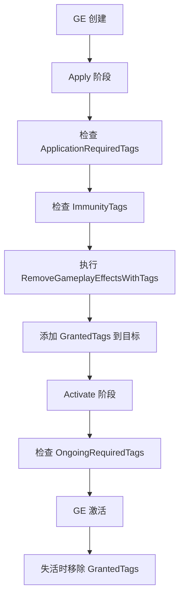
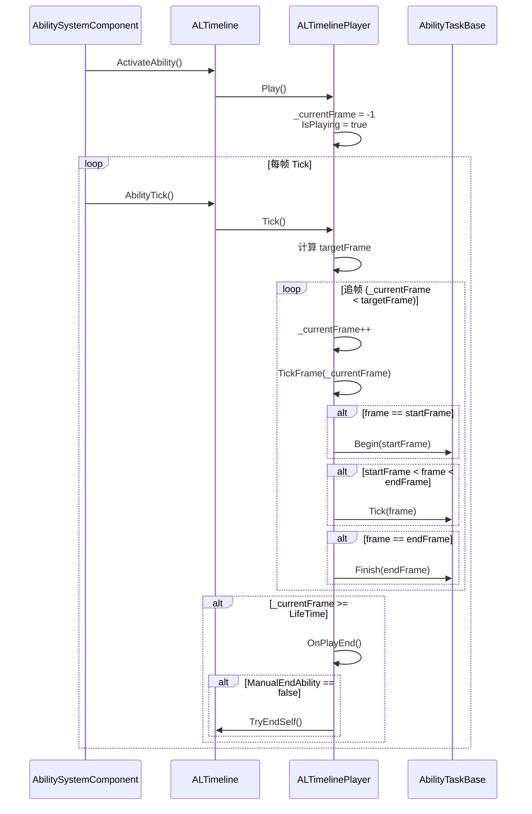
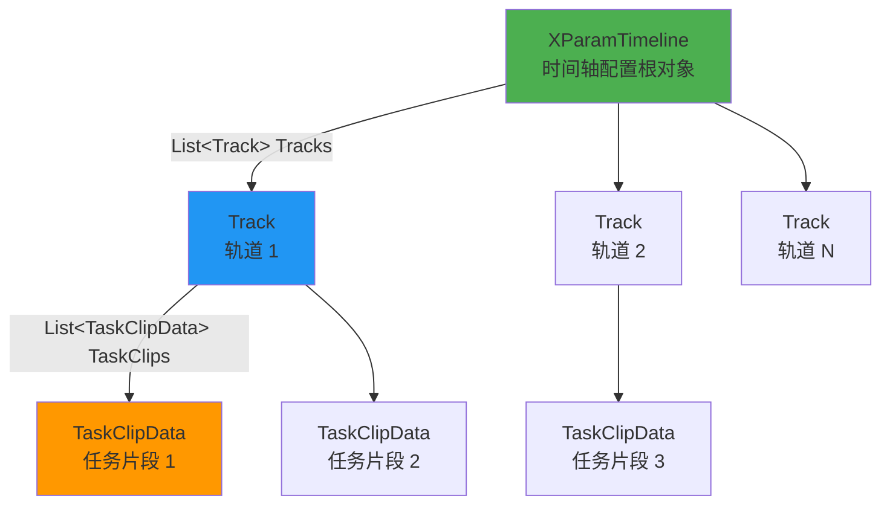
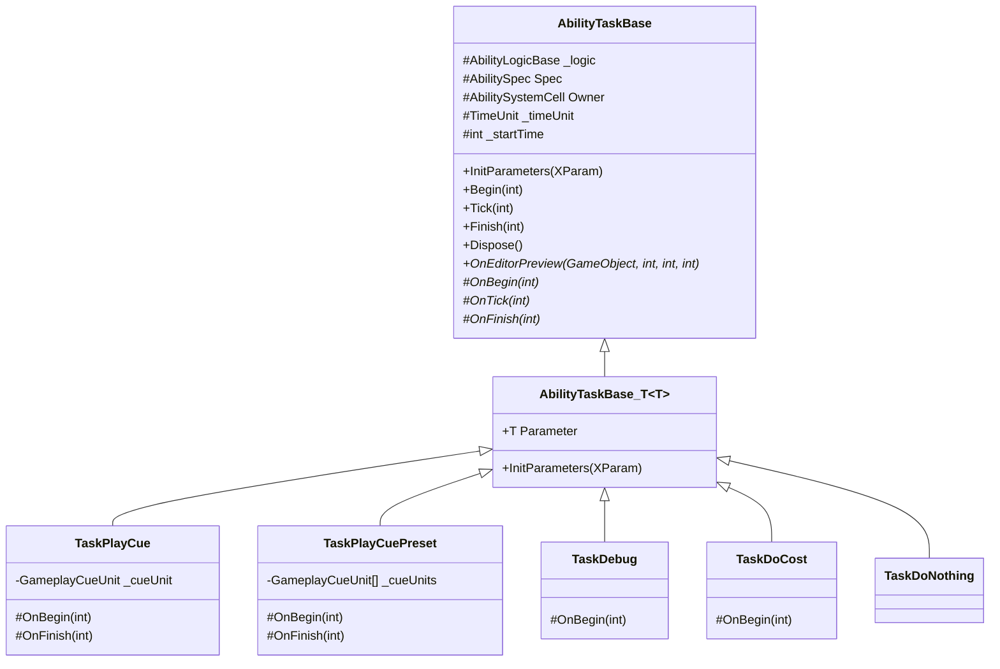
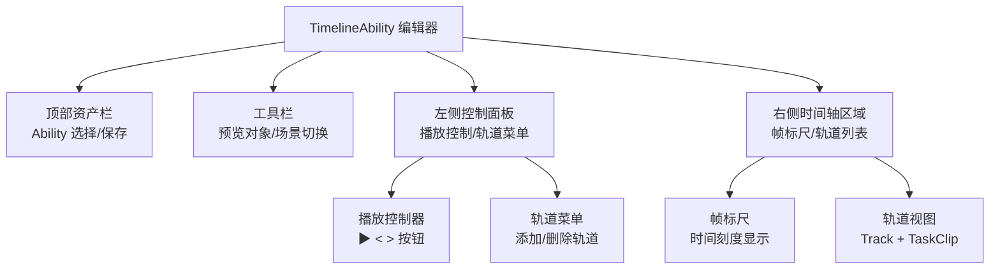
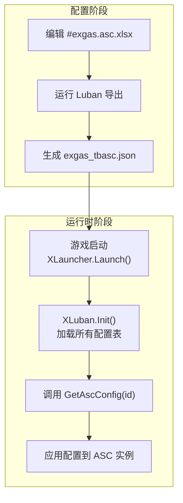
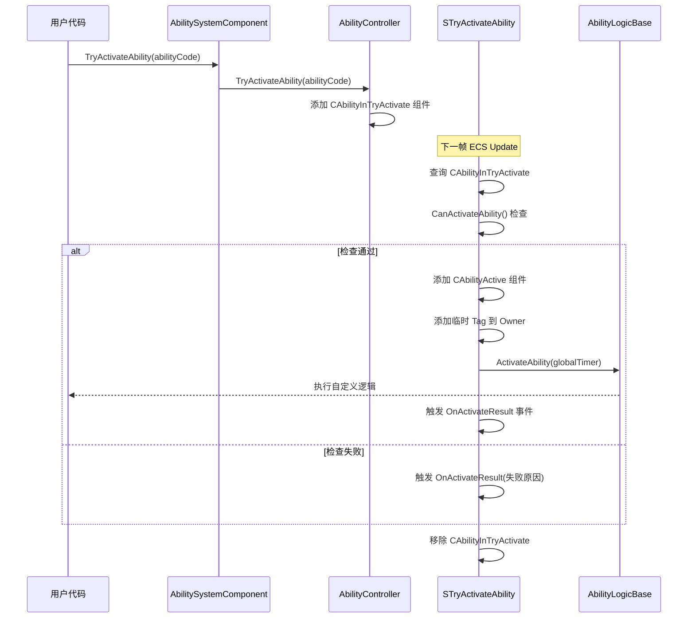

# EX Gameplay Ability System For Unity 2.0
## 前言
该项目为Unreal Engine的Gameplay Ability System的Unity实现，目前实现了部分功能，后续会继续完善。

经历了将近2年的开发，EX-GAS2.0版本总算是公布了。其实2.0才是我认为的完整可用版本，尽管1.0有一些群友也在用，但终究还是有不少缺陷。
而2.0版本，在整体实现框架替换（由传统OOP的Unity Mono转为dop的Unity DOTS）的基础上，还整改了许多1.0使用过程中的不便之处。

>该项目完全开源，欢迎大家一起参与开发，提出建议，共同完善。可以基于该项目进行二次开发。

## 捐赠/打赏
如果你觉得EX-GAS对你有所帮助，你可以捐赠/打赏我一杯奶茶钱。
我是开源主义者，所以不会作盈利的插件框架。有人赞助我，我会有更多动力产出新的轮子和开源项目。感谢！


## 目录
- [使用事项](#使用事项使用ex-gas前请务必确认)
- [入门教学案例系列文章](#入门教学案例系列文章)
- 1.[快速开始](#1快速开始)
    - [安装](#安装)
    - [使用](#使用)
        - [关于配置需求](#关于配置需求)
        - [建议使用流程](#建议使用流程luban-excel-json-配置工作流)
- [【选读】A. Excel 配置表说明](#选读a-excel-配置表说明)
    - [配置表概述](#配置表概述)
    - [配置表文件列表](#配置表文件列表)
    - [通用表格式规范](#通用表格式规范)
    - [1. GameplayTag 配置表](#1-gameplaytag-配置表-exgasgameplaytagsxlsx)
    - [2. Attribute 配置表](#2-attribute-配置表-exgasattributexlsx)
    - [3. AttributeSet 配置表](#3-attributeset-配置表-exgasattributesetxlsx)
    - [4. GameplayEffect 配置表](#4-gameplayeffect-配置表-exgasgameplayeffectxlsx)
    - [5. Ability 配置表](#5-ability-配置表-exgasabilityxlsx)
    - [6. GameplayCue 配置表](#6-gameplaycue-配置表-exgasgameplaycuexlsx)
    - [7. MMC 配置表](#7-mmc-配置表-exgasmmcxlsx)
    - [8. ASC 配置表](#8-asc-配置表-exgasascxlsx)
    - [9. TimelineAbility 配置表](#9-timelineability-配置表-exgastimelineabilityxlsx)
    - [流式配置说明](#流式配置说明)
    - [配置表导出流程](#配置表导出流程)
- [【选读】B. EX-GAS中心管理器使用说明](#选读b-ex-gas中心管理器-gascenterwindow-使用说明)
    - [打开方式](#打开方式)
    - [UI 布局](#ui-布局)
    - [各配置页面功能](#各配置页面功能)
    - [完整使用流程](#完整使用流程)
    - [日常编辑流程](#日常编辑流程)
    - [重要提示](#重要提示)
- 2.[GAS系统介绍](#2ex-gas系统介绍)
    - 2.1 [EX-GAS概述](#21-ex-gas概述)
    - 2.2 [GameplayTag](#22-gameplaytag)
        - 2.2.a [GameplayTag Manager](#22a-gameplaytag-manager)
    - 2.3 [Attribute](#23-attribute)
        - 2.3.a [Attribute Manager](#23a-attribute-manager)
    - 2.4 [AttributeSet](#24-attributeset)
        - 2.4.a [AttributeSet Manager](#24a-attributeset-manager)
    - 2.5 [ModifierMagnitudeCalculation](#25-modifiermagnitudecalculation)
    - 2.6 [GameplayCue](#26-gameplaycue)
    - 2.7 [GameplayEffect](#27-gameplayeffect)
    - 2.8 [Ability](#28-ability)
        - 2.8.1 [Ability各组件介绍](#281-Ability各组件介绍)
        - 2.8.2 [【选读】Ability配置工作流程](#282-选读Ability配置工作流程)
        - 2.8.a [Ability编辑界面](#28a-Ability编辑界面)
        - 2.8.b [TimelineAbility 通用性顺序时间轴技能](#28b-TimelineAbility-通用性顺序时间轴技能)
        - 2.8.c [Granted Ability From GameplayEffect](#28c-granted-ability-from-gameplayeffect-来自游戏效果授予的能力)
    - 2.9 [AbilitySystemComponent](#29-abilitysystemcomponentabilitysystemcell)
        - 2.9.a [AbilitySystemComponent Preset](#29a-abilitysystemcomponent-preset)
- 3.[API && Source Code Documentation](#3api--source-code-documentation)
    - 3.1 [Core](#31-core)
    - 3.2 [AbilitySystemComponent](#32-abilitysystemcomponent)
    - 3.3 [Tag](#33-tag)
    - 3.4 [Attribute & AttributeSet](#34-attribute--attributeset)
    - 3.5 [GameplayEffect](#35-gameplayeffect)
    - 3.6 [Ability](#36-ability)
    - 3.7 [GameplayCue](#37-gameplaycue)
    - 3.8 [ModifierMagnitudeCalculation](#38-modifiermagnitudecalculation)
    - 3.9 [外围Helper 工具类](#39-外围helper-工具类)
    - 3.10 [事件系统](#310-事件系统)
    - 3.11 [XParam 参数系统](#311-XParam-参数系统)
    - 3.12 [Timeline Ability 系统](#312-timeline-ability-系统)
    - 3.13 [全局管理](#313-全局管理)
- 4.[调试工具 监测台GASWatcher](#4调试工具-监测台gaswatcher)
- 5.[如果...我想...,应该怎么做?](#5如果我想应该怎么做wip)
- 6.[暂不支持的功能](#6暂不支持的功能可能有遗漏)
- 7.[后续计划](#7后续计划)
- 8.[特别感谢](#8特别感谢)
- 9.[插件反馈渠道](#9插件反馈渠道)

---
## 使用事项 【使用EX-GAS前，请务必确认】
1. 该插件要求Unity版本 : 2022.3+
2. 该插件要求使用Unity的官方包 : Entities 1.2.3版本（前后版本不要差距太多）
3. （如果你要使用我提供的配置方案工作流）需要第三方插件 : Odin Inspector 3.2+版本 【付费】
4. （如果你要使用我提供的配置方案工作流）需要第三方配置工作流框架Luban【https://www.datable.cn/docs/intro】

> 关于Entities的版本问题：因为Unity官方对DOTS的维护非常糟糕，一直在频繁变动一些关键API。我开始2.0的开发，选用了2024当时较为稳定的1.2.3版本。
> 但我也并不能完全保证Entities（或者说Unity DOTS）后续的版本兼容性。至少在 Unity6 版本之前，应该所有常用API都是稳定兼容的。

``` 上述使用事项中，若没有较好的方法解决，可以加反馈qq群（616570103），群内提供帮助 ```

目前EX-GAS 2.0没有非常全面的测试，存在不可知的bug和性能问题。所以对于打算使用该插件的朋友请谨慎考虑，当然我是希望更多人用EX-GAS，毕竟相当于是变相的QA。

但是要讲良心嘛，现在的EX-GAS算不上很稳定的版本，如果你是业余时间开发rpg类的独立游戏，开发时间十分充裕，我当然建议你试试EX-GAS，我会尽可能修复bug，提供使用上的帮助。

如果有好兄弟确实打算用，那么请务必加反馈群（616570103）。我会尽力抽时间修复提出的bug。

>我非常希望EX-GAS 2.0能早日稳定，为更多游戏提供支持帮助。

---
[//]: # (## 参考案例 [Demo]&#40;Assets/Demo&#41;)
## 入门教学案例系列文章

W.I.P 施工中...

---
## 1.快速开始
### 安装
1. （如果你要使用我提供的配置方案工作流）导入Odin Inspector插件(付费),Odin Inspector来源请自行解决。建议使用3.2+版本。
2. （如果你要使用我提供的配置方案工作流）导入Luban的Unity版本插件
3. 导入EX-GAS，建议以下3种方式：
- 使用Unity Package Manager安装
在Unity Package Manager中添加git地址:https://github.com/No78Vino/gameplay-ability-system-for-unity.git?path=Assets/GAS
>【国内镜像】https://gitee.com/exhard/gameplay-ability-system-for-unity.git?path=Assets/GAS
- 使用git clone本仓库[镜像同上]，然后将Assets/GAS文件夹拷贝到你的项目中即可
- 【个人推荐】（给自己的另一个插件打个广告）直接使用EX开源插件管理器来安装时序活动队列管理器。具体使用方法详见（默认menu已经包含EX-GAS）:
   https://zhuanlan.zhihu.com/p/1921532124277765575


### 使用
GAS十分复杂，使用门槛较高。因为本项目是对UE的GAS的模仿移植，所以实现逻辑基本一致。建议先粗略了解一下UE版本的GAS整体逻辑，参考项目文档：https://github.com/BillEliot/GASDocumentation_Chinese

#### *关于配置需求*
如果你正在开发的项目，已经有一套自己完备的配置系统，无法改为luban的结构，又或者你有自己的需求，不希望使用excel转json的配置工作流，
想要使用Unity的ScriptableObject来配置，
那么你可以跳过【建议使用流程】，完全忽略编辑器相关的内容。因为GAS可视化编辑器整个是和配置表强绑定的。
EX-GAS2.0还优化了分层，将数据层和逻辑层做了强分离。我提供的以编辑器和excel为工作流的方案是数据层的，你完全可以使用自己的数据方案来代替。

#### *建议使用流程【Luban->Excel->json 配置工作流】*
0. 准备好luban框架的配置工程目录。 
- 首次导入，可以直接在Edit Menu栏找到【EXTool -> EX-GAS -> 导入模板Luban配置目录】，
  点击【一键部署】后会自动从云端（其实就是我github公共仓库）拷贝模板Luban配置目录到本地项目中。
- 如果你已经熟悉了luban + EX-GAS的配置流程，也可以自己创建目录。

```text
配置工程目录结构规范：
- 根目录
   └── exgas_config/
       └── Datas/
               ├── #exgas.ability.xlsx           \\ 技能配置表
                ├── #exgas.asc.xlsx               \\ ASC预设配置表
                ├── #exgas.attribute.xlsx         \\ 属性配置表
                ├── #exgas.attributeSet.xlsx      \\ 属性集配置表
                ├── #exgas.gameplayCue.xlsx       \\ Cue（演出效果）配置表
                ├── #exgas.gameplayEffect.xlsx    \\ buff效果配置表
                ├── #exgas.gameplayTags.xlsx      \\ 标签配置表
                ├── #exgas.mmc.xlsx               \\ MMC配置表
                ├── #exgas.timelineAbility.xlsx   \\ 时间轴技能数据配置表
                ├── __beans__.xlsx                \\ 自定义数据结构配置表
                ├── __enums__.xlsx                \\ 枚举表
                └── __tables__.xlsx               \\ table导出配置表
        ├── Defines/
                └── builtin.xml                    \\ luban的xml格式数据结构定义文件
        ├── gen.bat     \\ 批量导出json的bat工具文件
        ├── gen.sh     \\ EX-GAS调用的power shell命令文件
        └── luban.conf     \\ luban配置文件
   └── Tools/    
        └── ... (luban导表/生成C#类脚本，用到的一系列工具库和类)
```

---
## 【选读】A. Excel 配置表说明

### 配置表概述

EX-GAS 2.0 采用 **Excel → Luban → JSON** 的配置工作流,所有配置表位于 `配置工程目录/Datas/` 文件夹下。

---
### **Bean EX-GAS多态定义**

详见[BeanMappingSpec.md](BeanMappingSpec.md)

**BeanUpdater 自动化工具**

通过菜单 `EXTool/EX-GAS/生成脚本/更新Bean定义` 运行 BeanUpdater，自动扫描项目中的自定义类并更新 `__beans__.xlsx` 文件。

BeanUpdater 会扫描以下 6 类继承体系，自动生成/更新对应的 Luban Bean 定义：
| 扫描类型 | 基类 | 说明 |
|---------|------|------|
| XParam 参数类 | `XParam` | 通过 `[BeanField]` / `[BeanPolymorphicField]` 标注的字段自动收集 |
| Cue 逻辑类 | `GameplayCueBase<T>` | 自动提取泛型参数类型 |
| MMC 逻辑类 | `ModMagnitudeCalculationBase<T>` | 自动提取泛型参数类型 |
| AbilityLogic 逻辑类 | `AbilityLogicBase<T>` | 自动提取泛型参数类型 |
| AbilityTask 类 | `AbilityTaskBase<T>` | 自动提取泛型参数类型 |
| TargetCatcher 类 | `TargetCatcherBase<T>` | 自动提取泛型参数类型 |

> 新增自定义类后，运行 BeanUpdater 即可自动更新 Bean 定义，无需手动编辑 `__beans__.xlsx`。

---
### 配置表文件列表

| 配置表文件 | JSON 输出 | 用途 |  
|-----------|----------|------|  
| `#exgas.gameplayTags.xlsx` | `exgas_tbgameplaytags.json` | 游戏标签层级结构定义 |  
| `#exgas.attribute.xlsx` | `exgas_tbattribute.json` | 属性定义(生命值、攻击力等) |  
| `#exgas.attributeSet.xlsx` | `exgas_tbattributeset.json` | 属性集合定义 |  
| `#exgas.gameplayEffect.xlsx` | `exgas_tbgameplayeffect.json` | Buff/Debuff 效果配置 |  
| `#exgas.ability.xlsx` | `exgas_tbability.json` | 技能/能力配置 |  
| `#exgas.gameplayCue.xlsx` | `exgas_tbgameplaycue.json` | 视觉/音效表现配置 |  
| `#exgas.mmc.xlsx` | `exgas_tbmmc.json` | 数值计算公式配置 |  
| `#exgas.asc.xlsx` | `exgas_tbasc.json` | ASC 预设模板配置 |  
| `#exgas.timelineAbility.xlsx` | `exgas_tbtimelineability.json` | 时间轴技能配置 | [0-cite-1](#0-cite-1)   

### 通用表格式规范

所有配置表遵循统一的格式规范:

- **第 1 行**: 列名(字段名)
- **第 2-3 行**: Luban 框架的类型定义和注释(由 Luban 使用)
- **第 4 行起【视情况可能从第5行】**: 实际数据行
- **第 2 列**: 必须为 `ID` 字段,作为唯一标识符
- **列名格式**: 支持 `#` 后缀标注 Luban 类型,如 `AssetTags#sep=;`

### 1. GameplayTag 配置表 (`#exgas.gameplayTags.xlsx`)

**用途**: 定义层级化的游戏标签,用于状态判断和逻辑控制。

**字段说明**:
- `ID`: 标签唯一 ID
- `Name`: 标签名称,使用点分隔表示层级(如 `State.Debuff.Stun`)
- `Desc`: 标签描述

**实现功能**: 标签系统支持父子关系查询,用于 GameplayEffect 和 Ability 的条件判断。

### 2. Attribute 配置表 (`#exgas.attribute.xlsx`)

**用途**: 定义游戏中的数值属性。

**字段说明**:
- `ID`: 属性唯一 ID
- `Name`: 属性名称(如 `Health`, `Attack`)
- `Desc`: 属性描述

**实现功能**: 属性是 GAS 数值管理的基础单位,所有数值修改都通过 GameplayEffect 作用于属性。

### 3. AttributeSet 配置表 (`#exgas.attributeSet.xlsx`)

**用途**: 将多个属性组合成集合,便于批量管理。

**字段说明**:
- `ID`: 属性集 ID
- `Name`: 属性集名称
- `Attributes`: 包含的属性 ID 列表(分号分隔)

**实现功能**: 生成对应的 C# AttributeSet 类,用于 ASC 初始化。

### 4. GameplayEffect 配置表 (`#exgas.gameplayEffect.xlsx`)

**用途**: 配置 Buff/Debuff 效果,是属性修改的唯一途径。

**核心字段**: 

- `ID`: 效果唯一 ID
- `Name`: 效果名称
- `Desc`: 效果描述
- `AssetTags`: 描述性标签(分号分隔)
- `GrantedTags`: 激活时授予的标签
- `ApplicationRequiredTags`: 施加时目标需拥有的标签
- `OngoingRequiredTags`: 持续生效需要的标签
- `RemoveGameplayEffectsWithTags`: 移除带有指定标签的效果
- `ImmunityTags`: 免疫标签
- `Duration`: 持续时间配置(包含时间单位、时长、是否重置)
- `Period`: 周期触发配置(周期时长、触发的效果 ID 列表)
- `Stacking`: 叠加配置(最大层数、刷新策略、溢出处理等)
- `Modifiers`: 属性修改器列表
- `CueOnApply/Add/Remove/Activate/Deactivate/Tick`: 各阶段触发的 Cue ID

**实现功能**: 通过组件化设计,支持复杂的 Buff 逻辑,包括持续时间、周期触发、层数叠加、条件激活等。

### 5. Ability 配置表 (`#exgas.ability.xlsx`)

**用途**: 配置技能/能力的基础参数。

**核心字段**:

- `ID`: 技能 ID
- `Name`: 技能名称
- `Desc`: 技能描述
- `Cost`: 消耗的 GameplayEffect ID
- `CdEffect`: 冷却 GameplayEffect ID
- `Cd`: 冷却时间(覆盖 CdEffect 的持续时间)
- `AssetTags`: 技能描述性标签
- `CancelAbilityWithTags`: 激活时取消带有这些标签的技能
- `BlockAbilityWithTags`: 激活时阻塞带有这些标签的技能
- `ActivationOwnedTags`: 激活时获得的标签
- `ActivationRequiredTags`: 激活所需的标签(必须全部拥有)
- `ActivationBlockedTags`: 阻止激活的标签(拥有任意一个即阻止)
- `AbilityLogic`: 技能逻辑类型名称
- **后续 50 列**: 技能逻辑自定义参数(流式配置)

**实现功能**: 配置技能的 GAS 系统参数,自定义逻辑参数由程序员在对应的 AbilitySpec 类中实现。

### 6. GameplayCue 配置表 (`#exgas.gameplayCue.xlsx`)

**用途**: 配置视觉和音效表现。

**核心字段**:

- `ID`: Cue ID
- `Name`: Cue 名称
- `Desc`: Cue 描述
- `CueLogic`: Cue 逻辑类型名称
- **后续 50 列**: Cue 逻辑自定义参数(流式配置)

**实现功能**: 解耦表现和逻辑,由程序员实现具体的 Cue 逻辑类。

### 7. MMC 配置表 (`#exgas.mmc.xlsx`)

**用途**: 配置复杂的数值计算公式。

**核心字段**:

- `ID`: MMC ID
- `Name`: MMC 名称
- `Desc`: MMC 描述
- `MmcLogic`: MMC 逻辑类型名称
- **后续 50 列**: MMC 逻辑自定义参数(流式配置)

**实现功能**: 用于 GameplayEffect 的 Modifier 中,支持基于多属性的复杂计算。

### 8. ASC 配置表 (`#exgas.asc.xlsx`)

**用途**: 配置 AbilitySystemComponent 预设模板。

**核心字段**:

- `id`: 预设 ID
- `Name`: 预设名称
- `Desc`: 预设描述
- `Level`: 等级
- `Tag`: 初始标签列表(分号分隔)
- `AttrSet`: 属性集 ID 列表(分号分隔)
- `Ability`: 初始技能 ID 列表(分号分隔)

**实现功能**: 快速创建预配置的 ASC 实例,用于角色/怪物模板。

### 9. TimelineAbility 配置表 (`#exgas.timelineAbility.xlsx`)

**用途**: 配置基于时间轴的通用技能。

**核心字段**:

- `ID`: 技能 ID
- `Name`: 技能名称
- `LifeTime`: 技能总时长
- `ManualEnd`: 是否支持手动结束
- `TrackName`: 轨道名称
- `StartTime`: 任务开始时间
- `EndTime`: 任务结束时间
- `TaskName`: 任务名称
- `TaskType`: 任务类型

**实现功能**: 支持多轨道、多任务的时序技能配置,无需编写代码即可实现复杂技能。

### 流式配置说明
Ability、Cue、MMC 三种配置表采用**流式配置**,即自定义参数占用连续的 50 列。

**注意事项**:
- 必须在 `XParam` 实现类中正确处理 `DecodeExcelData()` 和 `EncodeExcelData()` 方法
- 空值必须用默认占位数据代替(如 `0`、`""`、`0f`、`false`)
- 参数顺序必须与代码中的解析顺序一致

### 配置表导出流程
1. 在 GAS 中心管理器设置配置工程路径 
2. 编辑 Excel 配置表
3. 点击"导出更新 Json 表"按钮,调用 Luban 的 `gen.bat` 生成


---
## 【选读】B. EX-GAS中心管理器 (GASCenterWindow) 使用说明

GAS 中心管理器是 EX-GAS 2.0 的核心可视化编辑工具,提供了统一的配置管理界面


### 打开方式

通过 Unity 菜单栏: **EXTool → EX-GAS → GAS中心管理器**

窗口会以 1200x600 的尺寸居中显示,并自动加载所有配置数据。

### UI 布局

GAS 中心管理器采用左右分栏布局:

**左侧菜单栏** (配置类型导航):
- Setting 基本设置
- GameplayTag 标签
- Attribute 属性
- Attribute Set 属性集
- GameplayCue 演出提示
- MMC 修改器
- GameplayEffect 效果buff
- GameplayAbility 技能
- ASC 预设

**右侧编辑区域**: 根据左侧选择的配置类型,显示对应的编辑界面。

### 各配置页面功能

#### 1. Setting 基本设置

配置 EX-GAS 的核心路径参数:

- **配置表工程路径**: Luban 配置工程的根目录
- **脚本生成路径**: 生成的 C# 代码输出目录
- **导出 Json 表**: 一键调用 Luban 导出所有配置表

#### 2. GameplayTag 标签页

以树形结构展示所有标签,支持层级查看。

**功能按钮**:
- 打开 Tag Excel 文件所在文件夹
- 打开 Tag Json 文件所在文件夹
- 导出更新 Json 表
- 刷新

#### 3. Attribute 属性页

以表格形式展示所有属性配置。

**功能按钮**:
- 打开属性 Excel 文件所在文件夹
- 打开属性 Json 文件所在文件夹
- 导出更新 Json 表
- 刷新

#### 4. Attribute Set 属性集页

展示属性集配置,每个属性集包含的属性列表。

**功能按钮**: 与 Attribute 页面相同。

#### 5. GameplayCue 演出提示页

编辑 Cue 配置,包括视觉和音效表现。

**编辑界面**:
- 顶部工具栏: 打开文件夹、导出 Json、刷新按钮
- Cue 选择下拉框: 选择要编辑的 Cue (支持添加/删除)
- 基础信息: 名称、描述
- 标签配置: RequiredTags、ImmunityTags
- Cue 逻辑: 选择 Cue 类型及其自定义参数

#### 6. MMC 修改器页

编辑 MMC (Modifier Magnitude Calculation) 配置。

**编辑界面**: 与 Cue 页面类似,包含 MMC 逻辑类型选择和自定义参数编辑。

#### 7. GameplayEffect 效果buff页

编辑 GameplayEffect 配置,这是最复杂的配置页面。

**编辑界面**:
- 顶部工具栏: 打开文件夹、导出 Json 按钮
- Effect 选择下拉框: 选择要编辑的 Effect (支持添加/删除)
- 基础信息: 名称、描述
- **组件列表**: 勾选需要的 Effect 组件
- **详情页签**: 根据勾选的组件显示对应配置项

**支持的组件类型**:
- AssetTags: 描述性标签
- GrantedTags: 授予的标签
- ApplicationRequiredTags: 施加条件标签
- OngoingRequiredTags: 持续条件标签
- RemoveGameplayEffectsWithTags: 移除效果标签
- ImmunityTags: 免疫标签
- Duration: 持续时间
- Period: 周期触发
- Stacking: 层数叠加
- Modifiers: 属性修改器
- GrantedAbility: 授予的技能
- CueOnApply/Tick/Add/Remove/Activate/Deactivate: 各阶段触发的 Cue

#### 8. GameplayAbility 技能页

编辑 Ability 配置。 [1-cite-21](#1-cite-21)

**编辑界面**:
- 顶部工具栏: 打开文件夹、导出 Json 按钮
- Ability 选择下拉框: 选择要编辑的 Ability (支持添加/删除)
- 基础信息: 名称、描述
- **Ability 逻辑类型**: 选择技能逻辑类型
- **自定义参数**: 根据逻辑类型显示对应参数编辑器
- **组件列表**: 勾选需要的 Ability 组件 (Cost、Cooldown、Tags 等)

#### 9. ASC 预设页

编辑 AbilitySystemComponent 预设配置。

**编辑界面**:
- 顶部工具栏: 打开文件夹、导出 Json、刷新按钮
- ASC 选择下拉框: 选择要编辑的 ASC 预设
- 基础信息: 名称、描述、等级
- 初始配置: 初始标签、属性集、技能列表

### 通用操作流程

所有配置页面遵循统一的操作流程:

1. **选择配置项**: 从下拉框选择要编辑的配置
2. **编辑参数**: 在右侧编辑区修改配置参数
3. **保存**: 修改会自动保存到 Excel 文件
4. **导出**: 点击"导出更新 Json 表"生成运行时数据


### 完整使用流程

#### 第一步:初始化配置路径

1. 打开 GAS 中心管理器: **EXTool → EX-GAS → GAS中心管理器** 

2. 在左侧菜单选择 **Setting 基本设置** 

3. 配置以下路径: [2-cite-3](#2-cite-3)
    - **配置表工程路径**: Luban 配置工程根目录(包含 `Datas/` 文件夹和 `gen.bat`)
    - **脚本生成路径**: 生成的 C# 代码输出目录
    - **表导出路径**: JSON 表输出目录
    - **表 class 生成路径**: Luban 生成的表类输出目录

4. 点击 **导出 Json 表** 按钮,验证 Luban 工具链是否正常工作 [2-cite-4](#2-cite-4)

#### 第二步:配置基础数据

按以下顺序配置基础数据,因为后续配置依赖这些基础数据:

**2.1 配置 GameplayTag**
- 在左侧菜单选择 **GameplayTag 标签**
- 点击 **打开 Tag Excel 文件所在文件夹**,在 Excel 中编辑标签
- 编辑完成后,点击 **导出更新 Json 表**
- 点击 **刷新** 查看更新后的标签树
- 关于Tag的使用及运作逻辑详见章节([GameplayTag](#22-gameplaytag))

**2.2 配置 Attribute**
- 在左侧菜单选择 **Attribute 属性**
- 点击 **打开属性 Excel 文件所在文件夹**,编辑属性定义 
- 导出 Json 表并刷新
- 关于Attribute的使用及运作逻辑详见章节([Attribute](#23-attribute))

**2.3 配置 AttributeSet**
- 在左侧菜单选择 **Attribute Set 属性集**
- 编辑属性集配置,组合已定义的属性
- 导出 Json 表并刷新
- 关于AttributeSet的使用及运作逻辑详见章节([AttributeSet](#24-attributeset))

#### 第三步:配置游戏逻辑

基础数据配置完成后,可以配置游戏逻辑相关的配置:

**3.1 配置 GameplayCue**
- 在左侧菜单选择 **GameplayCue 演出提示**
- 使用窗口内的编辑器直接编辑 Cue 配置
- 点击 **保存** 按钮保存到 Excel
- 导出 Json 表
- 详见[GameplayCue](#26-gameplaycue)

**3.2 配置 MMC**
- 在左侧菜单选择 **MMC 修改器**
- 编辑 MMC 配置
- 保存并导出
- 详见[MMC](#25-modifiermagnitudecalculation)

**3.3 配置 GameplayEffect**
- 在左侧菜单选择 **GameplayEffect 效果buff**
- 从下拉框选择要编辑的 Effect,或点击 **添加** 创建新 Effect
- 在 **组件列表** 标签页勾选需要的组件
- 在 **详情** 标签页配置各组件参数
- 点击 **保存** 按钮
- 导出 Json 表
- 详见 [Gameplay Effect](#27-gameplayeffect)

**3.4 配置 GameplayAbility**
- 在左侧菜单选择 **GameplayAbility 技能**
- 选择或创建 Ability 
- 选择 **Ability 逻辑类型**
- 配置自定义参数和组件
- 保存并导出
-  详见 [Ability](#28-ability)

**3.5 配置 ASC 预设(可选)**
- 在左侧菜单选择 **ASC 预设**
- 配置预设的初始标签、属性集和技能
- 保存并导出
- 详见 [AbilitySystemComponent](#29-abilitysystemcomponent)

#### 第四步:生成运行时代码
配置完成后,需要生成 C# 代码供运行时使用:
1. 返回 **Setting 基本设置** 页面
2. 点击 **一键生成所有** 按钮,生成所有必要的 C# 代码
    - 或者根据需要点击单独的生成按钮(Tag 脚本、属性脚本等)

### 日常编辑流程
配置完成后,日常编辑流程简化为:
1. 打开 GAS 中心管理器
2. 选择要编辑的配置类型
3. 编辑配置(直接在窗口内编辑或打开 Excel 编辑)
4. 点击 **保存** 按钮(如果在窗口内编辑)
5. 点击 **导出更新 Json 表** 按钮
6. 如果修改了基础配置(Tag/Attribute/AttributeSet),需要重新生成对应的 C# 代码

### 重要提示
- **Excel 和窗口编辑器同步**: 窗口内的编辑器直接读写 Excel 文件,两者始终保持同步
- **导出顺序**: 必须先导出 Json 表,再生成 C# 代码
- **刷新按钮**: 如果在外部修改了 Excel 或 Json 文件,使用刷新按钮重新加载数据

---
## 2.EX-GAS系统介绍
### 2.1 EX-GAS概述
>EX-GAS是对UnrealEngine的GAS（Gameplay Ability System）的模仿和实现。

GAS 是 "Gameplay Ability System" 的缩写，是一套游戏能力系统。
这个系统的目的是为开发者提供一种灵活而强大的框架，用于实现和管理游戏中的各种角色能力、技能和效果。

如果把EX-GAS高度概括为一句话，那就是：**WHO DO WHAT**。
- Who：AbilitySystemComponent（ASC）,EX-GAS的实例对象，是体系运转的基础单位
- Do：Ability，是游戏中可以触发的一切行为和技能
- What：GameplayEffect(GE)，掌握了游戏内元素的属性实际控制权，GameplayEffect本身应该理解为结果

GAS本质是一套属性数值的管理系统，GameplayCue我个人理解为附加价值（虽然这个附加价值很有分量）。
纵使GAS的Tag体系解决复杂的GameplayEffect和Ability的逻辑，但最终的结果目的也只是掌握属性数值变化。
而属性的最底层修改权力交由了GameplayEffect。所以我把GE理解为结果。

UE的GAS的使用门槛很高，这一点在我构筑完EX-GAS雏形后更是深有体会。
所以在EX-GAS的设计上，我尽可能的做简化，优化，来降低了使用门槛。
我制作了几个关键的编辑器，来帮助开发者快速的使用EX-GAS。
但即便如此，GAS本身的繁多参数依然让编辑器的界面看上去十分臃肿，这很难简化，没有哪个参数是可以被删除的。
甚至，雏形阶段的EX-GAS还有很多功能还未实现，也就是说还有更多的参数是没有被编辑器暴露出来的。

_**GAS的使用者必须至少有一名程序开发人员，因为GAS的使用需要编写大量自定义业务逻辑。
Ability，Cue，MMC等都是必须根据游戏类型和内容玩法而定的。
非程序开发人员则需要完全理解EX-GAS的运作逻辑，才能更好的配合程序开发人员快速配置出各种各样的技能，完善玩法表现。**_

---
### 2.2 GameplayTag
>Gameplay Tag,标签,它用于分类和描述对象的状态，非常有用于控制游戏逻辑。

- Gameplay Tag以树形层级结构（如Parent.Child.Grandchild）组织，用于描述角色状态/事件/属性/等，如眩晕（State.Debuff.Stun）。
- Gameplay Tag主要用于替代布尔值或枚举值，进行逻辑判断。
- 通常将Gameplay Tag添加到AbilitySystemComponent（ASC）以与系统（GameplayEffect，GameplayCue,Ability）交互。

Gameplay Tag在GAS中的使用涉及到标签的添加、移除以及对标签变化的响应。
开发者可以通过[GameplayTag Manager](#22a-gameplaytag-manager)在项目设置中管理这些标签，无需手动编辑配置文件。
Gameplay Tag的灵活性和高效性使其成为GAS中控制游戏逻辑的重要工具。
它不仅可以用于简单的状态描述，还可以用于复杂的游戏逻辑和事件触发。

>举个例子，GameplayEffect中有一个字段RequiredTags，其含义是当前GameplayEffect生效的AbilitySystemComponent（ASC）
需要拥有【所有】的RequiredTags（需求标签）。

上述例子，如果用传统的思路去做，可能需要写很多if-else判断，同时元素的实例脚本可能会增加很多状态标记的变量，
而且还需要考虑多个游戏效果的交互，这使得代码的设计和实现变得复杂，耦合。

GameplayTag的使用可以大大简化这些逻辑，使得代码更加清晰，易于维护。
他把状态和标记全部抽象成了一个独立的Tag系统，而且最巧妙的是树形结构的设计。
他解决了很多Gameplay设计上的问题，常见的问题比如：移除所有Debuff，传统的做法可能是让（中毒，减速，灼伤，等等）继承自Debuff类/接口；
而GameplayTag只需要添加一个Tag（中毒:Debuff.Poison，减速:Debuff.SpeedDown，灼伤:Debuff.Burning）

GameplayTag自身可以作为一个独立的系统去使用。
我在开发Demo的过程中就发现了GameplayTag的强大之处，他几乎替代了我的所有状态值。
甚至我设计了一个全局ASC，专门用来管理全局状态，我不需要对每个系统的状态管理，转而维护一个ASC即可。（虽然最后并没有落地这个设计，因为DEMO没有那么复杂。）

#### 2.2.a GameplayTag Manager


我模仿了UE的GAS的Tag管理视图，做了树结构管理。

GameplayTag 的编辑采用 **Excel 编辑 + 可视化预览** 的工作模式。

##### 编辑流程

###### 1. 打开 Excel 文件进行编辑
在 GAS 中心管理器左侧选择 **GameplayTag 标签** 页面,点击 **打开 Tag Excel 文件所在文件夹** 按钮。

在 Excel 中编辑 `#exgas.gameplayTags.xlsx` 文件:
- **ID 列**: 标签的唯一 ID (整数)
- **Name 列**: 标签名称,使用 `.` 分隔表示层级关系 (如 `State.Debuff.Stun`)
- **Desc 列**: 标签描述

###### 2. 导出 JSON 配置表
Excel 编辑完成后,返回 GAS 中心管理器,点击 **导出更新 Json 表** 按钮。

这会调用 Luban 工具将 Excel 转换为 `exgas_tbgameplaytags.json` 文件。 

###### 3. 刷新预览

点击 **刷新** 按钮,窗口会重新读取 JSON 文件并以树形结构展示标签层级。 

可视化界面会将标签名称中的 `.` 转换为 `/` 显示为树形菜单,方便查看父子关系。 

###### 4. 生成 C# 代码
返回 **Setting 基本设置** 页面,点击 **Tag 脚本** 按钮生成 `XTag.gen.cs` 文件。 

生成的代码包含:
- 所有标签的常量定义 (如 `State_Debuff_Stun`)
- 标签的父子关系映射
- 标签初始化方法
- 标签名称中的 `.` 会在生成的 C# 代码中转换为 `_`,例如 `State.Debuff.Stun` 生成的常量名为 `State_Debuff_Stun`。

###### 关键点
- **编辑位置**: 直接在 Excel 文件中编辑,不在窗口内编辑
- **预览作用**: 窗口仅用于查看标签树形结构和验证配置
- **必须步骤**: 编辑后必须依次执行 "导出 Json 表" → "生成 Tag 脚本"

---
### 2.3 Attribute
>Attribute，属性，是GAS中的核心数据单位，用于描述角色的各种属性，如生命值，攻击力，防御力等。

Attribute和AttributeSet（属性集）需要结合起来才能作为唯一标识，简单点说AttributeSet是姓氏，Attribute是名字。
不同的AttributeSet可以有相同名字的Attribute，但是同一组的AttributeSet不可以有相同名字的Attribute。
常见的情况，如下：
> AttributeSet 人物: 生命值, 法力, 攻击力, 防御力
> 
> AttributeSet 武器: 生命值（耐久度）, 攻击力, 防御力
> 
> 而这两组AttributeSet中的生命值，攻击力，防御力，都是不同的属性，他们的意义和作用不同。但他们可以属于同一个单位。
#### 2.3.a Attribute Manager


Attribute 编辑流程

##### 1. 打开 Excel 文件进行编辑

在 GAS 中心管理器左侧选择 **Attribute 属性** 页面,点击 **打开属性 Excel 文件所在文件夹** 按钮。

在 Excel 中编辑 `#exgas.attribute.xlsx` 文件:
- **ID 列**: 属性的唯一 ID (整数)
- **Name 列**: 属性名称 (如 `Health`, `Attack`, `Defense`)
- **Desc 列**: 属性描述

##### 2. 导出 JSON 配置表

Excel 编辑完成后,返回 GAS 中心管理器,点击 **导出更新 Json 表** 按钮。 

这会调用 Luban 工具将 Excel 转换为 `exgas_tbattribute.json` 文件。

##### 3. 刷新预览
点击 **刷新** 按钮,窗口会重新读取 JSON 文件并以表格形式展示所有属性。

##### 4. 生成 C# 代码
返回 **Setting 基本设置** 页面,点击 **属性脚本** 按钮生成 `XAttribute.gen.cs` 文件。

- 生成的代码包含所有属性的常量定义 (如 `public const int Health = 1001;`)。
- Attribute 名称会直接作为常量名,建议使用 PascalCase 命名 (如 MaxHealth)

---
### 2.4 AttributeSet
>AttributeSet，属性集，是GAS中的核心数据单位集合，用于描述角色的某一类别的属性集合。

在上文的[2.3 Attribute]中，我们提到了AttributeSet是姓氏，Attribute是名字。二者结合起来才能作为唯一标识。
而对于AttributeSet的设计，可以较为随意，大多数情况，大家会更乐意一个单位只有一个AttributeSet。
因为这样便于管理和分类，不同类别的单位直接使用不同的AttributeSet。但实际上一个单位是可以拥有复数AttributeSet。
我其实比较认同一个单位只有一个AttributeSet的设计，因为这对程序开发也是好事，逻辑处理会更简单直白。

配置时的注意项：
- AttributeSet的名字禁止重复或空。这是因为AttributeSet的名字会作为类名。
- AttributeSet内的Attribute禁止重复。

#### 2.4.a AttributeSet Manager


AttributeSet Manager统筹属性集的命名和属性管理。

##### 1. 打开 Excel 文件进行编辑

在 GAS 中心管理器左侧选择 **Attribute Set 属性集** 页面,点击 **打开属性集 Excel 文件所在文件夹** 按钮。 

在 Excel 中编辑 `#exgas.attributeSet.xlsx` 文件:
- **ID 列**: 属性集的唯一 ID (整数)
- **Name 列**: 属性集名称 (如 `Fight`, `Weapon`)
- **Attribute 列**: 包含的属性 ID 列表 (分号分隔,如 `1001;1002;1003`)

##### 2. 导出 JSON 配置表

Excel 编辑完成后,返回 GAS 中心管理器,点击 **导出更新 Json 表** 按钮。 

这会调用 Luban 工具将 Excel 转换为 `exgas_tbattributeset.json` 文件。 

##### 3. 刷新预览

点击 **刷新** 按钮,窗口会重新读取 JSON 文件并以列表形式展示所有属性集及其包含的属性。

##### 4. 生成 C# 代码

返回 **Setting 基本设置** 页面,点击 **属性集脚本** 按钮生成 `XAttrSet.gen.cs` 文件。

生成的代码包含:
- 属性集 ID 常量 (如 `public const int Fight = 2001;`)
- 属性集类定义 (如 `AS_Fight` 类,包含该属性集的所有属性常量)
- 属性集配置映射字典
- `AttributeSet` 名称会生成`AS_`前缀的类名,如 `Fight` 生成 `AS_Fight` 类
- 生成的 AttributeSet 类会包含该集合内所有属性的常量定义,方便代码中引用

---
### 2.5 ModifierMagnitudeCalculation
>ModifierMagnitudeCalculation，修改器，负责GAS中Attribute的数值计算逻辑。

#### 核心概念
MMC 是 GameplayEffect 中属性修改的计算单元,负责将基础模值 (Magnitude) 转换为最终修改值。

**核心作用**: 在 GAS 体系内,只有 GameplayEffect 能修改 Attribute 数值,而 GameplayEffect 正是通过 MMC 来实现数值计算的。

**关键特性**:
- **与 Attribute 集成**: 计算时可读取角色属性值,实现基于属性的动态计算(如伤害随攻击力提升)
- **运行时动态计算**: 根据游戏状态实时调整效果强度,而非固定数值
- **高度复用**: 同一 MMC 可被多个 GameplayEffect 引用,确保计算逻辑一致性
- **自定义扩展**: 支持继承基类实现复杂计算逻辑,满足各种游戏需求
- **灵活性**: 效果强度可根据不同游戏情境动态调整 [6-cite-3](#6-cite-3)

#### MMC 在 GameplayEffect 中的位置

MMC 被存储在 Modifier 中,Modifier 是 GameplayEffect 的组成部分。每个 Modifier 包含:
- **目标属性**: 要修改的属性(如 `AS_Fight.Health`)
- **基础模值 (Magnitude)**: 修改器的基础数值,作为 MMC 计算的输入
- **操作类型**:
    - `Add`: 加法(负值即减法)
    - `Multiply`: 乘法(倒数即除法)
    - `Override`: 直接覆写属性值
- **MMC**: 计算单位,决定如何将 Magnitude 转换为最终修改值 [6-cite-4](#6-cite-4)

#### 内置 MMC 类型详解

##### 1. MMCScalableFloat - 线性缩放计算

**计算公式**: `最终值 = Magnitude × k + b`

这是一个简单的线性函数,适用于大多数基础数值缩放场景。

**参数**:
- `k`: 缩放系数(默认 1.0)
- `b`: 偏移量(默认 0)

**应用场景**:
- 技能伤害随等级提升: `伤害 = 基础伤害 × 等级系数 + 固定加成`
- 治疗量缩放: `治疗量 = 基础治疗 × 1.5 + 10`
- 护盾值计算: `护盾 = 基础护盾 × 2.0 + 0`

**示例**:
```  
配置: k = 1.5, b = 20  
Magnitude = 100  
最终值 = 100 × 1.5 + 20 = 170  
```

##### 2. MMCNone - 直接使用模值

**计算公式**: `最终值 = Magnitude`

不进行任何计算,直接使用 Modifier 的基础模值。

**应用场景**:
- 固定数值的伤害/治疗
- 不需要动态计算的简单效果
- 快速原型开发 

##### 3. AttributeBasedModCalculation - 基于属性的计算(W.I.P)

**计算公式**: `最终值 = AttributeValue × k + b`

与 MMCScalableFloat 类似,但输入值来自角色属性而非 Magnitude。

**核心参数**:
- **attributeFromType**: 属性来源
    - `Source`: 从效果创建者(施法者)获取
    - `Target`: 从效果目标(受击者)获取
- **attributeName**: 属性名称(如 `AS_Fight.Attack`)
- **captureType**: 捕获方式
    - `Track`: 实时追踪,执行时读取当前属性值
    - `SnapShot`: 快照模式,效果创建时记录属性值,后续使用快照值

**应用场景**:
- 伤害基于攻击力: `伤害 = 攻击力 × 1.5 + 10`
- 治疗基于最大生命值: `治疗量 = 最大生命 × 0.1 + 0`
- 护盾基于防御力: `护盾 = 防御 × 2.0 + 50`

**Track vs SnapShot 的区别**:
- **Track**: 适用于需要实时响应属性变化的场景(如推导属性)
- **SnapShot**: 适用于效果创建时确定数值的场景(如技能伤害快照) 

##### 4. SetByCallerModCalculation - 调用者设置(W.I.P)

**特点**: 不使用任何预设值,而是在运行时由调用者动态设置。

**设置方式**:
- 通过字符串键值: `spec.RegisterValue("DamageKey", 150.0f)`
- 通过 GameplayTag: `spec.RegisterValue(damageTag, 150.0f)`

**应用场景**:
- 技能伤害需要根据蓄力时间动态计算
- 效果强度依赖复杂的外部逻辑
- 需要在运行时传递参数的场景

##### 5. CustomCalculation - 自定义计算

**用途**: 当内置 MMC 类型无法满足需求时,继承 `ModMagnitudeCalculationBase<TParam>` 实现自定义逻辑。

**实现示例**:
```csharp  
public class MMCCriticalDamage : ModMagnitudeCalculationBase<MmcParamCritical>  
{  
    public override float CalculateMagnitude(Entity geEntity, float magnitude)  
    {  
        // 获取暴击率和暴击伤害  
        var critRate = Parameter.CritRate;  
        var critDamage = Parameter.CritDamage;  
          
        // 随机判定是否暴击  
        if (Random.value < critRate)  
            return magnitude * critDamage;  
        return magnitude;  
    }  
}  
```  

**应用场景**:
- 暴击系统
- 多属性联合计算(如物理+魔法混合伤害)
- 复杂的游戏逻辑(如连击加成、距离衰减等) 

#### 2.5.a MMC编辑器使用流程


##### 1. 打开 MMC 编辑页面

在 GAS 中心管理器左侧选择 **MMC 修改器**。

##### 2. 创建或选择 MMC

- 从下拉框选择现有 MMC,或点击 **添加** 按钮创建新 MMC
- 输入唯一 ID (整数)

##### 3. 配置 MMC 参数
**基础信息**:
- `Name`: MMC 名称 (如 "伤害x1.5加成")
- `Desc`: 描述信息(如 "技能伤害提升 50%")
- `MmcLogic`: 选择 MMC 类型 (如 `MMCScalableFloat`)

**自定义参数**: 根据选择的 MMC 类型,配置对应参数
- 对于 `MMCScalableFloat`: 设置 k 和 b 值
- 对于自定义 MMC: 配置自定义参数结构

##### 4. 保存并导出
- 点击 **保存** 按钮写入 Excel
- 点击 **导出更新 Json 表** 生成运行时配置 

#### 2.5.b 在 GameplayEffect 中使用 MMC

MMC 在 GameplayEffect 的 Modifier 中引用,完整的数值修改流程如下:

**配置结构**:
- **目标属性**: 要修改的属性 (如 `AS_Fight.Health`)
- **基础模值**: Modifier 的基础数值(如 100)
- **操作类型**: Add / Multiply / Override
- **MMC**: 选择已配置的 MMC ID

**运行时执行流程**:
```  
1. GameplayEffect 被应用到目标 ASC  
2. 系统遍历 Effect 的所有 Modifier  
3. 对每个 Modifier:  
   a. 从配置加载 MMC 实例  
   b. 调用 MMC.CalculateMagnitude(geEntity, magnitude)  
   c. 获得计算后的最终值  
   d. 根据操作类型应用到目标属性  
4. 触发属性变化事件  
```

#### 2.5.c 运行时加载机制
配置表通过 Luban 转换为 JSON,运行时加载流程:
1. **读取配置**: `XLuban.GetMmcConfig(mmcId)` 从 JSON 表读取 MMC 数据
2. **类型解析**: 根据 `MmcLogic` 字段获取对应的 C# 类型
3. **参数填充**: 创建 MMC 参数实例并填充配置数据
4. **实例化**: 返回 `MMCConfig` 对象,包含 MMC 类型和参数
5. **创建 MMC**: 调用 `CreateMmc()` 生成实际的 MMC 实例 

#### 2.5.d 实际应用示例

##### 示例 1: 固定伤害技能
**需求**: 造成 100 点固定伤害

**配置**:
- MMC: `MMCNone`
- Magnitude: 100
- 操作类型: Add
- 目标属性: `AS_Fight.Health`

**结果**: `最终伤害 = 100`

##### 示例 2: 伤害提升技能
**需求**: 造成基础伤害的 150% 并额外增加 20 点

**配置**:
- MMC: `MMCScalableFloat` (k=1.5, b=20)
- Magnitude: 100
- 操作类型: Add
- 目标属性: `AS_Fight.Health`

**结果**: `最终伤害 = 100 × 1.5 + 20 = 170`

---
### 2.6 GameplayCue
#### 2.6.1 什么是 GameplayCue?

GameplayCue (简称 Cue) 是 EX-GAS 的**表现层系统**,专门负责游戏中的视觉和音效反馈。它是连接游戏逻辑与玩家感知的桥梁,将抽象的数值变化转化为直观的视听体验。

**典型应用场景**:
- 受击特效与音效
- 技能释放的粒子效果
- Buff/Debuff 的持续视觉提示
- 伤害数字飘字
- 角色状态动画切换
- UI 提示与反馈

#### 2.6.2 核心设计原则

##### 1. 表现与逻辑分离

Cue 遵循严格的**单一职责原则**,只负责表现,不参与游戏逻辑:

- ✅ **允许**: 播放特效、音效、动画,显示 UI 提示
- ❌ **禁止**: 修改 Attribute 数值、添加/移除 GameplayEffect、影响战斗判定

**为什么这样设计?**
- **可维护性**: 美术和程序可以并行工作,互不干扰
- **可调试性**: 移除所有 Cue 不影响游戏逻辑,便于定位问题
- **可扩展性**: 更换表现方案无需修改核心逻辑

##### 2. 灵活的边界定义

第二条原则"Cue 不应影响玩法"在不同游戏类型中有不同解释: 

- **即时战斗游戏**: Cue 控制角色位移可能影响战斗结果,应避免
- **回合制游戏**: Cue 控制角色位移可视为动画表现,可以接受
- **最终判断**: 由开发者根据游戏类型自行决定边界

> Cue是需要程序开发人员大量实现的，毕竟游戏不同导致游戏提示千变万化。

##### 系统架构特性

##### ECS + OOP 混合架构

EX-GAS 2.0 的 Cue 系统采用创新的混合架构:

**ECS 层 (高性能运行时)**:
- 使用 Unity DOTS Entity 存储 Cue 状态
- 通过 Enable Component 控制播放/停止,避免频繁创建销毁
- 系统化更新,支持大量 Cue 并发

**OOP 层 (开发者友好)**:
- `GameplayCueUnit`: 封装 ECS 操作的控制单元
- `GameplayCueBase<T>`: 继承实现自定义逻辑的基类
- 熟悉的面向对象编程模式,降低学习成本

##### 独立性设计
Cue 系统设计为**可独立使用**的模块:
- 可在 GameplayEffect 中自动触发
- 可在 Ability 中手动控制
- 可在 GAS 体系外独立调用
- 只需遵守核心原则,使用场景不受限制

#### 2.6.3 核心功能特性

##### 1. 标签过滤系统
Cue 支持基于 GameplayTag 的条件播放:
- **RequiredTags**: ASC 必须拥有**所有**这些标签才播放
- **ImmunityTags**: ASC 拥有**任意**这些标签则不播放

**应用场景**:
- 隐身单位不播放受击特效
- 只对玩家控制单位显示 UI 提示
- 根据图形设置标签控制特效质量

##### 2. 生命周期管理
Cue 提供完整的生命周期回调,精确控制表现时机:

| 回调 | 触发时机 | 典型用途 |  
|------|---------|---------|  
| `OnAdd` | Cue 添加到 ASC | 缓存组件引用 |  
| `OnActivate` | Cue 激活 | 播放特效/音效 |  
| `OnTick` | 每帧更新 | 更新粒子/动画 |  
| `OnDeactivate` | Cue 失活 | 暂停效果 |  
| `OnRemove` | Cue 移除 | 清理资源 |  
| `OnDestroy` | 实体销毁 | 最终清理 |  

##### 3. 与 GameplayEffect 深度集成

GameplayEffect 可在不同生命周期阶段自动触发 Cue:

| Effect 类型 | Cue 字段 | 触发时机 |  
|------------|---------|---------|  
| Instant | `CueOnApply` | Effect 执行时 |  
| Duration/Infinite | `CueOnAdd` | Effect 添加时 |  
| Duration/Infinite | `CueOnRemove` | Effect 移除时 |  
| Duration/Infinite | `CueOnActivate` | Effect 激活时 |  
| Duration/Infinite | `CueOnDeactivate` | Effect 失活时 |  
| Duration/Infinite | `CueOnTick` | 每帧更新 |  


##### 4. 编辑器预览支持
Cue 支持在 Timeline 编辑器中实时预览,无需进入播放模式:
- 可视化编辑技能表现
- 快速迭代调整
- 美术人员友好

#### 2.6.4 性能优化特性

##### Enable Component 模式

使用 Unity ECS 的 Enable Component 实现高效状态切换: 

- `ECCuePlayable`: 标记 Cue 可播放
- `ECCuePlaying`: 标记 Cue 正在播放
- Enable/Disable 比创建/销毁 Entity 快得多
- 系统只处理 Enabled 的组件,减少无效遍历

##### 组件缓存策略

推荐在 `OnAdd()` 中缓存 Unity 组件引用,避免每帧查找:

```csharp  
private Animator _animator;  
  
public override void OnAdd(float time)  
{  
    // 一次性查找并缓存  
    _animator = _abilitySystemCell.GameObject  
        .GetComponentInChildren<Animator>();  
}  
  
public override void OnActivate(float time)  
{  
    // 直接使用缓存,无需查找  
    _animator?.Play(Parameter.AnimationName);  
}  
```  

#### 2.6.5 开发友好特性

##### 1. 类型安全的参数系统

每个 Cue 类型对应一个强类型参数类,避免类型转换错误:

```csharp  
public class CuePlayAnimator : GameplayCueBase<XParamAnimator>  
{  
    // Parameter 自动推断为 XParamAnimator 类型  
    public override void OnActivate(float time)  
    {  
        _animator?.Play(Parameter.AnimationName);  
    }  
}  
```  

##### 2. 代码生成与注册

系统自动生成 Cue 类型注册代码,无需手动维护映射:

- 编译时扫描所有 Cue 类型
- 生成 `XCue.gen.cs` 注册脚本
- 运行时通过字符串名称创建实例

##### 3. 调试支持

提供多种调试手段:
- Entity 命名: `Cue_{类型名}_{Version}_{Index}`
- 生命周期日志: 可在回调中输出调试信息
- 标签过滤验证: 检查 RequiredTags/ImmunityTags 是否生效

#### 2.6.a GameplayCue 编辑器使用说明


GameplayCue 编辑器是 GAS 中心管理器的一部分,提供了可视化的 Cue 配置界面。与 Tag/Attribute 不同,Cue 编辑器支持**直接在窗口内编辑**,修改会实时保存到 Excel 文件。 

##### 打开编辑器
在 GAS 中心管理器左侧菜单选择 **GameplayCue 演出提示**。
##### 界面布局

编辑器界面分为三个区域:

###### 1. 顶部工具栏
- **打开 Excel 文件所在文件夹**: 快速定位到 `#exgas.gameplayCue.xlsx` 文件
- **打开 Json 文件所在文件夹**: 查看导出的 `exgas_tbgameplaycue.json`
- **导出更新 Json 表**: 调用 Luban 将 Excel 转换为 JSON
- **刷新**: 重新从 Excel 加载数据
- **保存**: 将当前编辑内容写入 Excel

###### 2. Cue 选择区域
- **当前编辑 Cue 下拉框**: 选择要编辑的 Cue ID
- **添加按钮 (+)**: 创建新 Cue,需输入唯一 ID
- **删除按钮 (垃圾桶)**: 删除当前选中的 Cue (需二次确认)

###### 3. 配置编辑区域
**基础信息**:
- **名字**: Cue 的显示名称,用于在 GameplayEffect/Ability 编辑器中识别
- **描述**: Cue 的功能说明

**标签过滤**:
- **播放时需求的 tag**: ASC 必须拥有**所有**这些标签才播放 Cue
- **播放时免疫的 tag**: ASC 拥有**任意**这些标签则不播放 Cue

**Cue 逻辑**:
- **Cue 类型**: 从下拉框选择 Cue 实现类 (如 `CueLog`, `CuePlayAnimator`)
- **自定义参数**: 根据选择的 Cue 类型,动态显示对应的参数编辑器

##### 完整编辑流程

###### 创建新 Cue
1. 点击 **添加** 按钮
2. 在弹窗中输入唯一的 Cue ID (整数)
3. 系统验证 ID 不重复后创建空配置
4. 自动切换到新创建的 Cue
###### 编辑 Cue 配置
1. 从下拉框选择要编辑的 Cue ID
2. 系统自动加载该 Cue 的配置数据 
3. 编辑各项参数:
    - 填写名称和描述
    - 配置标签过滤 (可选)
    - 选择 Cue 类型
    - 配置 Cue 类型的自定义参数

**Cue 类型切换**: 当切换 Cue 类型时,系统会自动创建对应的参数实例
###### 保存配置
点击 **保存** 按钮,系统会:
1. 将当前编辑的数据写入 Excel 文件 
2. 自动调用刷新,重新加载数据

**保存逻辑**:
- 如果是已存在的 Cue,覆写对应行
- 如果是新创建的 Cue,追加到表格末尾
- Cue 逻辑参数通过 `XParam.EncodeExcelData()` 序列化为 Excel 列

###### 导出运行时数据
1. 点击 **导出更新 Json 表** 按钮
2. 系统调用 Luban 的 `gen.bat` 生成 JSON 文件
3. 运行时通过 `XLuban.GetGameplayCueConfig(id)` 加载配置 
###### 删除 Cue
1. 选择要删除的 Cue
2. 点击 **删除** 按钮
3. 在确认对话框中点击"是"
4. 系统从内存中移除该 Cue 数据
5. 点击保存后,Excel 中对应行会被清空 
##### 数据存储机制

编辑器使用 EPPlus 库直接读写 Excel 文件:

**加载流程** :
1. 读取第 1 行表头,构建列名到列索引的映射 (`_headerMap`)
2. 从第 4 行开始读取数据行 (第 2-3 行是 Luban 类型定义)
3. 将每行数据存储到 `_data` 字典 (键为 Cue ID)
4. 提取 Cue 逻辑参数 (从 `CueLogic` 列后的 50 列)

**保存流程** :
1. 确定写入行号 (已存在则覆写,新建则追加)
2. 写入基础字段 (ID, Name, Desc)
3. 写入标签列表 (分号分隔)
4. 写入 Cue 类型名称
5. 调用 `XParam.EncodeExcelData()` 序列化自定义参数

##### 流式配置说明

Cue 的自定义参数采用**流式配置**,占用 `CueLogic` 列后的连续 50 列。
**关键点**:
- 每个 Cue 类型对应一个 `XParam` 子类
- 参数的序列化/反序列化由 `XParam` 实现
- 空值必须用占位符 (如 `0`, `""`) 代替,不能留空

##### 使用示例

###### 示例 1: 创建日志 Cue
1. 点击添加,输入 ID: `5001`
2. 名称: "测试日志"
3. Cue 类型: 选择 `CueLog`
4. 配置参数: 输入日志内容
5. 点击保存
6. 点击导出 Json 表

###### 示例 2: 创建动画 Cue
1. 点击添加,输入 ID: `5002`
2. 名称: "受击动画"
3. 播放时需求的 tag: 选择 `State.Alive` (只对存活单位播放)
4. Cue 类型: 选择 `CuePlayAnimator`
5. 配置参数:
    - AnimatorNodePath: `Model/Character`
    - AnimationName: `Hit`
6. 点击保存并导出

##### 注意事项
- **ID 唯一性**: Cue ID 必须唯一,系统会在创建时验证
- **保存时机**: 编辑后必须点击保存,否则数据不会写入 Excel
- **导出顺序**: 先保存到 Excel,再导出 Json 表
- **刷新操作**: 如果外部修改了 Excel,使用刷新按钮重新加载


---


### 2.7 GameplayEffect
>GameplayEffect是EX-GAS的核心之一，一切的游戏数值体系交互基于GameplayEffect。

GameplayEffect掌握了游戏内元素的属性控制权。理论上，只有它可以对游戏内元素的属性进行修改
（这里指的是修改，数值的初始化不算是修改）。当然，实际情况下，游戏开发人员当然可以手动直接修改属性值。
但是还是希望游戏开发者尽可能的不要打破EX-GAS的数值体系逻辑，因为过多的额外操作可能会导致游戏的数值体系变得混乱，难以追踪数值变化等等。

另外GameplayEffect还可以触发Cue（游戏提示）完成游戏效果的表现，以及控制获取额外的能力等。

#### 2.7.1 核心职责

- 属性修改: 通过 Modifier 修改目标 ASC 的 Attribute
- 标签管理: 授予/移除 GameplayTag,控制游戏状态
- 能力授予: 临时授予 Ability 给目标单位
- 表现触发: 在不同生命周期阶段触发 GameplayCue
- 效果联动: 移除/触发其他 GameplayEffect

> GameplayEffect的施加（Apply）和激活（Activate）
>   - GameplayEffect的施加（Apply）和激活（Activate）是两个概念，施加是指GameplayEffect被添加到目标身上，激活是指GameplayEffect实际生效。
      >      - 为什么做区分？
>      - 举个例子：固有被动技能（Ability）是持续回血，被动技能的逻辑显然是永久激活的状态，而持续回血的效果（GameplayEffect）
         >        来源于被动技能，那如果单位受到了外部的debuff禁止所有的回血效果，那么是不是被动技能被禁止？显然不是，被动技能还是会持续激活的。
         >        那应该是移除回血效果吗？显然也不是，被动技能整个过程是不做任何变化，如果移除回血效果，那debuff一旦消失，谁再把回血效果加回来？
         >        所以，这里需要区分施加和激活，被动技能的持续回血效果被施加到单位身上，而debuff做的是让回血效果失活，而不是移除回血效果，一旦debuff结束，
         >        回血效果又被激活，而这个激活的操作可以理解为回血效果自己激活的（依赖于Tag系统）。

#### 2.7.2 GameplayEffect 组件一览

| 组件名称 | 参数列表 | 参数说明 | 适用 GE 类型 | 使用场景 |  
|---------|---------|---------|---------|---------|  
| **AssetTags** | `List<int> AssetTags` | 标签 ID 列表 | 全部 | 描述 GE 特性(伤害/治疗/控制);<br/>配合 RemoveGameplayEffectsWithTags 批量移除;<br/>游戏逻辑判断和分类 |
| **GrantedTags** | `List<int> GrantedTags` | 授予的标签 ID 列表 | Duration/Infinite | GE 生效时添加到目标 ASC;<br/>GE 移除时自动移除;<br/>状态标记(如"正在奔跑") |
| **ApplicationRequiredTags** | `List<int> ApplicationRequiredTags` | 必需标签 ID 列表 | 全部 | 目标必须拥有**所有**这些标签才能被施加;<br/>实现条件性 Buff(如"只对眩晕目标生效") |
| **OngoingRequiredTags** | `List<int> OngoingRequiredTags` | 激活条件标签列表 | Duration/Infinite | 目标必须拥有**所有**这些标签才会激活;<br/>控制 GE 激活/失活状态;<br/>标签条件满足时自动重新激活 |
| **RemoveGameplayEffectsWithTags** | `List<int> RemoveGameplayEffectsWithTags` | 要移除的 GE 标签列表 | 全部 | 目标身上拥有**任一**这些标签的 GE 会被移除;<br/>驱散特定类型 Buff/Debuff;<br/>实现互斥效果 | 
| **ImmunityTags** | `List<int> ImmunityTags` | 免疫标签 ID 列表 | 全部 | 目标拥有**任一**这些标签时 GE 无法施加;<br/>实现免疫机制(如"霸体免疫控制") |
| **Duration** | `TimeUnit` (Frame/Turn)<br/>`Time` (int)<br/>`ResetStartTimeWhenActivated` (bool) | 时间单位;<br/>持续时长(-1 表示无限);<br/>激活时是否重置计时 | Duration/Infinite | Duration 类型 GE 必需;<br/>Infinite 类型设置 Time=-1;<br/>控制 Buff/Debuff 持续时间 | 
| **Period** | `Time` (int)<br/>`Effects` (List\<int\>)<br/>`FirstTrigger` (bool) | 周期间隔;<br/>周期执行的 GE ID 列表;<br/>是否首次立即触发 | Duration/Infinite<br/>(需要 Duration 组件) | 持续伤害/治疗(DoT/HoT);<br/>周期性触发效果;<br/>子 GE 通常为 Instant 类型 | 
| **Modifiers** | `AttrSet` (int)<br/>`Attribute` (int)<br/>`Magnitude` (float)<br/>`Operation` (int)<br/>`Mmc` (int) | 属性集 ID;<br/>属性 ID;<br/>基础数值;<br/>操作类型(0=Add, 1=Multiply, 3=Override);<br/>MMC 计算逻辑 ID | 全部 | 修改目标属性值;<br/>支持加法/乘法/覆写;<br/>通过 MMC 实现复杂计算 |
| **CueOnApply** | `List<int> CueOnApply` | Cue ID 列表 | Instant | Instant 类型 GE 执行时触发;<br/>播放音效/特效/UI 提示;<br/>瞬时反馈 |
| **CueOnTick** | `List<int> CueOnTick` | Cue ID 列表 | Duration/Infinite | 持续性特效/音效;<br/>生命周期与 GE 完全同步 |
| **CueOnAdd** | `List<int> CueOnAdd` | Cue ID 列表 | Duration/Infinite | GE 被添加到目标时触发;<br/>播放 Buff 获得提示 |
| **CueOnRemove** | `List<int> CueOnRemove` | Cue ID 列表 | Duration/Infinite | GE 被移除时触发;<br/>播放 Buff 消失提示 |
| **CueOnActivate** | `List<int> CueOnActivate` | Cue ID 列表 | Duration/Infinite | GE 激活时触发;<br/>配合 OngoingRequiredTags 使用 | 
| **CueOnDeactivate** | `List<int> CueOnDeactivate` | Cue ID 列表 | Duration/Infinite | GE 失活时触发;<br/>配合 OngoingRequiredTags 使用 |
| **GrantedAbility** | `Ability` (int)<br/>`AbilityLevel` (int)<br/>`ActivationPolicy` (enum)<br/>`DeactivationPolicy` (enum)<br/>`RemovePolicy` (enum) | 授予的能力 ID;<br/>能力等级;<br/>激活策略(None/WhenAdded/SyncWithEffect);<br/>取消激活策略(None/SyncWithEffect);<br/>移除策略(None/SyncWithEffect/WhenEnd/WhenCancel/WhenCancelOrEnd) | Duration/Infinite | GE 生效期间授予临时能力;<br/>GE 移除时根据策略处理能力 | 
| **Stacking** | `StackingCode` (int)<br/>`StackType` (enum)<br/>`LimitCount` (int)<br/>`DurationRefreshPolicy` (enum)<br/>`PeriodResetPolicy` (enum)<br/>`ExpirationPolicy` (enum)<br/>`denyOverflowApplication` (bool)<br/>`clearStackOnOverflow` (bool)<br/>`overflowEffects` (List\<int\>) | 堆叠唯一标识码;<br/>堆叠类型(None/AggregateBySource/AggregateByTarget);<br/>叠加上限;<br/>持续时间刷新策略(NeverRefresh/RefreshOnSuccessfulApplication);<br/>周期重置策略(NeverReset/ResetOnSuccessfulApplication);<br/>过期策略(ClearEntireStack/RemoveSingleStackAndRefreshDuration/RefreshDuration);<br/>是否拒绝溢出应用;<br/>溢出时是否清空层数;<br/>溢出时施加的 GE ID 列表 | Duration/Infinite | 叠层 Buff 设计(如《黑帝斯》叠攻 buff);<br/>按来源/目标分别计数;<br/>溢出触发额外效果 |   

#### 2.7.3 组件注意事项说明

- **组件化设计**: 每个组件对应一个独立的 `GameplayEffectComponentConfig` 子类
- **类型限制**: 部分组件(如 GrantedTags、OngoingRequiredTags、所有 Cue 组件)仅对特定类型的 GE 有效
- **标签逻辑**: ApplicationRequiredTags 和 OngoingRequiredTags 要求**所有**标签,而 RemoveGameplayEffectsWithTags 和 ImmunityTags 只需**任一**标签
- **Period 前置条件**: Period 组件必须配合 Duration 组件使用

#### 2.7.4 GE主要数据来源【选读】
所有组件参数定义在 Luban 生成的表结构中,运行时通过 `XLuban.GetGameplayEffectConfig(int id)` 加载配置。

#### 2.7.5 GE组件详解

##### 2.7.5.a Tag类组件

| 组件名称 | 数据类型 | 匹配逻辑 | 检查时机 | 作用对象 | 核心功能 |
|---------|---------|---------|---------|---------|---------|
| **AssetTags** | `List<int>` | 任一匹配 | 被其他 GE 检查时 | GE 自身 | 描述 GE 特性(伤害/治疗/控制等);<br/>被 RemoveGameplayEffectsWithTags 用于识别;<br/>被 CheckEffectHasAnyTags 检查 |
| **GrantedTags** | `List<int>` | - | GE Apply/Remove 时 | 目标 ASC | GE 生效时添加到目标 ASC;<br/>GE 移除时从目标移除;<br/>Instant 类型无效 |
| **ApplicationRequiredTags** | `List<int>` | 全部匹配 | GE Apply 前 | 目标 ASC | 目标必须拥有**所有**这些标签;<br/>否则 GE 无法施加;<br/>Apply 阶段校验 |
| **OngoingRequiredTags** | `List<int>` | 全部匹配 | GE Activate 时 | 目标 ASC | 目标必须拥有**所有**这些标签;<br/>控制 GE 激活/失活状态;<br/>Instant 类型无效 |
| **RemoveGameplayEffectsWithTags** | `List<int>` | 任一匹配 | GE Apply 时 | 目标身上的其他 GE | 移除目标身上拥有**任一**这些标签的 GE;<br/>检查其他 GE 的 AssetTags 和 GrantedTags |
| **ImmunityTags** | `List<int>` | 任一匹配 | GE Apply 前 | 目标 ASC | 目标拥有**任一**这些标签时免疫此 GE;<br/>Apply 阶段校验 |

###### 1. 匹配逻辑差异
Tag 组件分为两种匹配逻辑:
- **全部匹配 (All Tags)**: ApplicationRequiredTags、OngoingRequiredTags
    - 目标必须拥有列表中的**所有**标签才满足条件
    - 实现通过 `ASCHelper.HasAllTags()` 检查 [4-cite-7](#4-cite-7)

- **任一匹配 (Any Tag)**: AssetTags、GrantedTags、RemoveGameplayEffectsWithTags、ImmunityTags
    - 只要拥有列表中的**任意一个**标签即满足条件
    - 实现通过 `ASCHelper.HasAnyTags()` 或 `TagHelper.HasTag()` 检查 [4-cite-8](#4-cite-8)

###### 2. 生命周期阶段
Tag 组件在 GE 不同生命周期阶段发挥作用:



###### 3. Apply vs Activate 分离

OngoingRequiredTags 实现了施加(Apply)和激活(Activate)的分离:
- **Apply**: GE 被添加到目标,但可能未激活
- **Activate**: GE 实际生效,修改属性

这种设计允许 GE 在目标 Tag 变化时自动激活/失活,无需手动管理。

##### 2.7.5.b Cue类组件

| 组件名称 | 数据类型 | 适用 GE 类型 | 触发时机 | 生命周期 | 核心功能 |
|---------|---------|-------------|---------|---------|---------|
| **CueOnApply** | `List<int>` | Instant | GE 执行时 | 瞬时 | Instant 类型 GE 执行时触发;<br/>播放瞬时音效/特效/UI 提示 |
| **CueOnTick** | `List<int>` | Duration/Infinite | 每帧更新 | 持续 | 持续性特效/音效;<br/>生命周期与 GE 完全同步;<br/>每帧调用 OnTick() | 
| **CueOnAdd** | `List<int>` | Duration/Infinite | GE 添加时 | 瞬时 | GE 被添加到目标时触发;<br/>播放 Buff 获得提示 |
| **CueOnRemove** | `List<int>` | Duration/Infinite | GE 移除时 | 瞬时 | GE 被移除时触发;<br/>播放 Buff 消失提示 |
| **CueOnActivate** | `List<int>` | Duration/Infinite | GE 激活时 | 瞬时 | GE 激活时触发;<br/>配合 OngoingRequiredTags 使用;<br/>Apply 后首次激活或失活后重新激活 |
| **CueOnDeactivate** | `List<int>` | Duration/Infinite | GE 失活时 | 瞬时 | GE 失活时触发;<br/>配合 OngoingRequiredTags 使用;<br/>Tag 条件不满足时失活 |

GE的Cue 分为两大类:

- **GameplayCueInstant (瞬时 Cue)**:
    - 触发后立即执行,不持续存在
    - 实现 `Trigger()` 方法
    - 用于 CueOnApply、CueOnAdd、CueOnRemove、CueOnActivate、CueOnDeactivate

- **GameplayCueDurational (持续 Cue)**:
    - 生命周期与 GE 同步
    - 实现 `OnAdd()`、`OnRemove()`、`OnGameplayEffectActivate()`、`OnGameplayEffectDeactivate()`、`OnTick()` 方法
    - 用于 CueOnTick

###### GE的Cue触发流程

Instant 类型 GE
1. GE Apply → 触发 **CueOnApply**
2. GE 执行完毕 → 销毁

Duration/Infinite 类型 GE
1. GE Apply → 触发 **CueOnAdd**
2. 检查 OngoingRequiredTags → 满足则激活 → 触发 **CueOnActivate**
3. GE 激活期间 → 每帧触发 **CueOnTick**
4. Tag 条件不满足 → GE 失活 → 触发 **CueOnDeactivate**
5. Tag 条件重新满足 → GE 重新激活 → 再次触发 **CueOnActivate**
6. GE 移除 → 触发 **CueOnRemove**


###### 运行时GE的Cue实现机制

**1. CueOnApply 触发**

在 Instant 类型 GE 执行时触发:

```
1. 检查目标 ASC 是否满足 Cue 的 RequiredTags
2. 检查目标 ASC 是否拥有 Cue 的 ImmunityTags
3. 重置 Cue 逻辑单元
4. 调用 cue.AddToTargetAsc(targetAsc)
5. 调用 cue.Play(true) 激活播放
```

**2. CueOnAdd 触发**

在 Duration/Infinite 类型 GE 被添加时触发:

通过 `GameplayEffectHelper.GetTriggerCues()` 创建运行时 Cue 实例并存储到 `runtimeCues` 数组中。

**3. CueOnActivate 触发**

在 GE 激活时触发:
```
1. 检查 GE 是否有 CCueOnActivate 组件
2. 调用 GetTriggerCues() 创建 Cue 实例
3. 更新 runtimeCues 数组
```

**4. CueOnDeactivate 触发**

在 GE 失活时触发: 

逻辑与 CueOnActivate 类似,但在 GE 失活时执行。

**5. CueOnRemove 触发**

在 GE 被移除时触发,由系统 `SPlayCueOnRemove` 处理

###### Cue基类的实现思路

所有 Cue 逻辑类继承自 `GameplayCueBase`,提供以下核心方法:

| 方法 | 功能 | 调用时机 |
|-----|------|---------|
| `AddToTargetAsc(Entity e)` | 将 Cue 添加到目标 ASC | Cue 创建时 |
| `RemoveFromTargetAsc()` | 从目标 ASC 移除 Cue | Cue 销毁时 |
| `Play(bool replay)` | 播放 Cue | 触发时 |
| `Stop(bool immediate)` | 停止 Cue | 需要停止时 |
| `OnAdd(float time)` | Cue 添加回调 | 添加到 ASC 时 |
| `OnRemove(float time)` | Cue 移除回调 | 从 ASC 移除时 |
| `OnActivate(float time)` | Cue 激活回调 | GE 激活时 |
| `OnDeactivate(float time)` | Cue 失活回调 | GE 失活时 |
| `OnTick(float time)` | Cue 每帧更新 | 每帧调用 |

##### 2.7.5.c 时间类组件
| 组件名称 | 适用 GE 类型 | 核心功能 |
|---------|-------------|---------|
| **Duration** | Duration/Infinite | 控制 GE 持续时间;<br/>管理激活/失活状态;<br/>支持 Frame/Turn 两种时间单位 | 
| **Period** | Duration/Infinite<br/>(需要 Duration 组件) | 周期性执行子 GE;<br/>支持首次立即触发;<br/>失活时可重置计时 |
###### **Duration 组件详解**

| 参数名称 | 类型 | 说明 | 配置示例 |
|---------|------|------|---------|
| `duration` | `int` | 持续时间,≤0 表示无限 | `600` (600 帧或回合) |
| `timeUnit` | `TimeUnit` | 计时单位(Frame/Turn) | `TimeUnit.Frame` |
| `ResetStartTimeWhenActivated` | `bool` | 激活时是否重置计时起始时间 | `false` |
| `StopTickWhenDeactivated` | `bool` | 失活时是否停止计时 | `false` |
| `activeTime` | `int` | (运行时)开始计时的时间点 | - |
| `active` | `bool` | (运行时)是否激活生效中 | - |
| `lastActiveTime` | `int` | (运行时)上次开始计时时间 | - |
| `remianTime` | `int` | (运行时)剩余持续时间 | - |

> 时间单位说明:
> 
> GAS 的所有计时单位只有 **Frame(逻辑帧)** 和 **Turn(回合)** 两种:
> - **Frame**: 逻辑帧,适用于实时游戏
> - **Turn**: 回合,适用于回合制游戏
> - 编辑器可能显示单位"秒",但实际存储时会换算为 Frame

> 激活机制:
>
> Duration 组件控制 GE 的激活/失活状态。激活时会记录当前时间:
> ```
> 1. 检查是否已激活,避免重复激活
> 2. 设置 active = true
> 3. 根据 timeUnit 获取当前 Frame 或 Turn
> 4. 如果 ResetStartTimeWhenActivated=true 或首次激活,重置 activeTime
> 5. 更新 lastActiveTime
> ```

###### **Period  组件详解**
| 参数名称 | 类型 | 说明 | 配置示例 |
|---------|------|------|---------|
| `Period` | `int` | 周期间隔(帧或回合) | `5` (每 5 帧执行一次) |
| `ResetTimeCountWhenDeactivated` | `bool` | 失活时是否重置计时 | `true` |
| `GameplayEffects` | `NativeArray<Entity>` | 周期执行的子 GE Entity 数组 | - |
| `StartTime` | `int` | (运行时)开始计时的时间点 | - |

> 前置条件:
> 
> **重要**: Period 组件必须配合 Duration 组件使用,否则不会生效。

**执行流程**:
```
1. 过滤未激活的 GE (duration.active == false)
2. 获取当前时间(Frame 或 Turn)
3. 如果 StartTime == 0,初始化为当前时间
4. 检查是否到达周期间隔: (当前时间 - StartTime) >= Period
5. 到达间隔时:
   - 重置 StartTime 为当前时间
   - 遍历 GameplayEffects 数组
   - 实例化每个子 GE
   - 设置子 GE 的 Source、Target、Level
   - 添加到 EntityCommandBuffer 等待应用
```

###### Duration 与 Stacking 的交互
在堆叠系统中,Duration 和 Period 都有对应的刷新策略: 

- DurationRefreshPolicy : 当 GE 堆叠成功时,可以选择是否刷新持续时间
  - **NeverRefresh**: 从不刷新,持续时间从第一层生效后就不再受影响
  - **RefreshOnSuccessfulApplication**: 每次堆叠成功后刷新持续时间
- PeriodResetPolicy:当 GE 堆叠成功时,可以选择是否重置周期计时: 
  - **NeverReset**: 从不重置周期 
  - **ResetOnSuccessfulApplication**: 每次堆叠成功后重置周期计时

###### 激活/失活与时间组件
Duration 组件与 OngoingRequiredTags 配合实现激活/失活机制: 

**激活时**:
1. 检查 OngoingRequiredTags
2. 设置 duration.active = true
3. 根据 timeUnit 记录 activeTime
4. 添加 GrantedTags 到目标
5. 触发 CueOnActivate

**失活时**:
- Period 组件会停止执行(因为过滤了 `duration.active == false`)
- 如果 `StopTickWhenDeactivated = true`,会暂停计时并记录剩余时间

##### 2.7.5.d Modifiers属性修改器
详见[MMC](#25-modifiermagnitudecalculation)

##### 2.7.5.e Stacking 堆叠Buff

Stacking:堆叠。该组件是为了处理常见的叠层类型Buff。比如《黑帝斯》中酒神，爱神，冬神的叠攻buff。stacking的参数基本囊括了绝大多数的叠层型buff的设计。
- 生效的GE类型：只有非Instant类型（持续型）的GameplayEffect，可以产生叠加（stacking）。
- stackingCodeName: 堆叠GE的唯一标识码，用于可堆叠GE的识别。
    - 本身是字符串，但是runtime实际使用的是其对应的HashCode。如果为空，则视为不可堆叠
    - stackingCodeName除了基础的堆叠类GE识别功能外，另一个作用是用于支持不同GE的共同堆叠。举个例子：有一个团队性质的增伤buff【元素增伤】，团队所有成员对同一个目标都可以叠加【元素增伤】，至多10层，增伤
      随层数增加而增加。但是增伤是指定第一个施加buff成员的元素，比如第一层打的是【火增伤】，那么之后不管是【水增伤】，【雷增伤】，都是【火增伤】buff往上叠加。遇到这种特殊情况，就可以把【水增伤】，【雷增伤】，【火增伤】
      的stackingCodeName设置为同一个值，这样就可以实现【元素增伤】的共同堆叠。
- stackingType：GameplayEffect的叠加类型，有三种：
    -  | stacking类型 | 作用                                                                                                                                                               |
       |---|------------------------------------------------------------------------------------------------------------------------------------------------------------------|
       | None | 不叠加                                                                                                                                                              |
       | AggregateBySource | 基于GE来源（ASC）的叠加计数，所有释放单位各自管理一个叠加计数的GE。 举例：BUFF【聚能】效果是单位被叠加三次该buff（来自同一单位）后触发爆炸。 小怪被A玩家叠了2次【聚能】，然后B玩家又对小怪施加了1次【聚能】，但是不会触发爆炸。因为叠加计数是按来源单位各自计数，需要A再叠1次或者B叠2次，小怪才会爆炸。 |
       | AggregateByTarget | 基于GE目标（ASC）的叠加计数，所有释放单位共享一个叠加计数的GE。举例：BUFF【诅咒】效果是单位被叠加3次该buff（无关来源单位）后触发即死效果。经典魂游的咒蛙攻击buff。玩家被数只咒蛙围攻，只要被咒蛙打到3次就死亡。在场所有咒蛙的【诅咒】都会叠加在玩家身上一个计数器上。                    |
- limitCount：叠加上限。
    - 需要注意一点，叠加溢出的效果触发是在叠加计数【大于】limitCount时触发。举个例子，如果某个buff叠加3层后触发爆炸伤害，那limitCount应该是2。
- DurationRefreshPolicy：持续时间刷新策略。GE叠加成功后，GE的持续时间的刷新策略。
    - | DurationRefreshPolicy | 作用 |
      |-----------------------|---------------------------------------|
      | NeverRefresh                  | 从不刷新持续时间。即叠加的BUFF持续时间从第一层生效后计时就不再受影响。 |
      | RefreshOnSuccessfulApplication | 每次Effect叠加apply成功后刷新Effect的持续时间。      |
- PeriodResetPolicy：周期重置策略。GE叠加成功后，GE的周期（Period）的刷新策略。
    -  | PeriodResetPolicy | 作用                       |
       |-----------------------|--------------------------|
       | NeverReset                  | 从不重置周期。                  |
       | ResetOnSuccessfulApplication | 每次apply成功后重置Effect的周期计时。 |
- ExpirationPolicy：过期策略（持续时间结束时逻辑处理）。GE叠加成功后，GE的过期时间（Expiration）的刷新策略。
    - | ExpirationPolicy | 作用                                      |
      |-----------------------|-----------------------------------------|
      | ClearEntireStack                  | 持续时间结束时,清楚所有层数                          |
      | RemoveSingleStackAndRefreshDuration | 持续时间结束时减少一层，然后重新经历一个Duration，一直持续到层数减为0 | 
      | RefreshDuration | 持续时间结束时,再次刷新Duration，这相当于无限Duration。    | 
- denyOverflowApplication：布尔类型。是否允许溢出的GE叠加生效。
    - 对应于DurationRefreshPolicy = RefreshOnSuccessfulApplication时，如果为true则多余的Apply不会刷新Duration
- clearStackOnOverflow: 布尔类型。是否溢出时清空所有层数，移除GE。
    - 当DenyOverflowApplication为True是才有效，当Overflow时是否直接删除所有层数，移除GE。
- overflowEffects:GameplayEffect的数组，溢出时施加的游戏效果。当Stack计数溢出时，对生效单位执行这些GE。

##### 2.7.5.f Granted Ability
授予的能力，只有DurationPolicy为Duration或者Infinite时有效。在GameplayEffect生命周期内，GameplayEffect的持有者会被授予这些能力。

GameplayEffect被移除时，这些能力也会被移除。具体详见[GrantedAbility](#28c-granted-ability-from-gameplayeffect-来自游戏效果授予的能力)


---

### 2.8 Ability
> Ability是EX-GAS的核心类之一，它是游戏中的所有能力基础。
>
> 同时Ability也是程序开发人员最常接触的类，Ability的完整逻辑都是由程序开发人员实现的。

在EX-GAS内，Ability是游戏中可以触发的一切行为和技能。多个Ability可以在同一时刻激活, 例如移动和持盾防御。
Ability作为EX-GAS的核心类之一，他起到了Do（做）的功能。

Ability的业务逻辑取决于游戏类型和玩法。所以不存在一个通用的Ability模板，当然可以针对游戏类型制作一些通用的ability。
Ability的逻辑并非自由，如果胡乱的实现Ability逻辑，可能会导致游戏逻辑混乱，所以需要遵循一些规则。

Ability的具体实现需要策划和程序配合。

Ability运作逻辑的组成可以拆成两部分：
- GAS系统内的运作逻辑：所有Ability通用的数据字段，如各功能性的Tag。
- 具体游戏内的表现逻辑：每个Ability都有自己的表现逻辑（AbilityLogic），这部分逻辑是由程序开发人员自行实现的。

#### 2.8.1 Ability各组件介绍
| 字段名 | 类别 | 必填 | 数据类型 | 功能说明                                                                                                   | 典型应用场景 |
|-------|------|------|---------|--------------------------------------------------------------------------------------------------------|-----------|
| **ID** | 基础 | ✓ | 整数 | Ability 的全局唯一标识符,用于代码中引用、配置表查询和运行时加载。生成的常量会以 `ABILITY_{Name}` 形式存在于 `XAbility.gen.cs` 中                | 所有 Ability 必须配置。通过 `ASC.GrantAbility(10001)` 授予技能,通过 `XLuban.GetAbilityConfig(10001)` 加载配置 |
| **Name** | 基础 | ✓ | 字符串 | Ability 的英文名称,用于编辑器显示、调试日志和代码常量生成。必须唯一且符合 C# 命名规范(不含空格和特殊字符)                                           | 编辑器中快速识别 Ability,生成常量 `ABILITY_move = 10001` 供代码引用,调试时输出可读的技能名称 |
| **Desc** | 基础 | - | 字符串 | Ability 的中文描述或详细说明,纯文档用途,不影响任何运行时逻辑                                                                    | 帮助策划理解技能用途,在编辑器中提供额外的上下文信息,便于团队协作 |
| **Cost** | 资源 | - | 整数(GE ID) | 激活时消耗的资源,通过引用 GameplayEffect ID 实现。该 GE 会用于激活检查，Cost的执行可以由开发者自行调用或者自动执行，应用到 Owner 身上。为 `0` 表示无消耗       | 技能消耗魔法值(GE 修改 Mana 属性),攻击消耗耐力(GE 修改 Stamina 属性),使用道具消耗数量(GE 修改 ItemCount 属性) |
| **CdEffect** | 资源 | - | 整数(GE ID) | 冷却效果的 GameplayEffect ID,该 GE 会用于激活检查，CD的执行可以由开发者自行调用或者自动执行,通常包含一个 Duration 和授予冷却 Tag 的逻辑。与 `Cd` 字段配合使用 | 定义技能冷却的 GameplayEffect,该 GE 会授予 `Cooldown.Skill` 等 Tag,阻止技能在冷却期间再次激活 |
| **Cd** | 资源 | - | 整数(毫秒) | 冷却时长,会覆盖 `CdEffect` 引用的 GameplayEffect 的 Duration 字段。允许同一个冷却 GE 模板配置不同的冷却时长                            | 为不同等级的技能配置不同冷却时间,例如 1 级技能 10 秒 CD,2 级技能 8 秒 CD,但都使用同一个 CdEffect 模板 |
| **AssetTags** | Tag | - | 整数数组 | 描述 Ability 特性的标签,纯描述性质,不影响激活逻辑。用于分类、查询和 UI 显示                                                          | 标记技能类型(如 `Ability.Attack`、`Ability.Heal`),在 UI 中显示技能图标分类,通过 Tag 查询所有伤害类技能 |
| **CancelAbilityWithTags** | Tag | - | 整数数组 | 激活时,取消 Owner 当前所有拥有**任意**这些 Tag 的 Ability。用于实现技能之间的互斥关系                                                | 攻击技能激活时取消移动技能,受击技能激活时取消施法技能,死亡技能激活时取消所有主动行为 |
| **BlockAbilityWithTags** | Tag | - | 整数数组 | 激活时,阻止 Owner 激活所有拥有**任意**这些 Tag 的 Ability。已激活的不受影响,只阻止新的激活                                             | 冲刺技能激活时阻止普通移动激活,施法技能激活时阻止攻击激活,眩晕状态阻止所有主动技能激活 |
| **ActivationOwnedTags** | Tag | - | 整数数组 | 激活时 Owner 获得这些 Tag,失活时自动移除。用于标识 Ability 的激活状态                                                          | 移动技能授予 `State.Moving`,攻击技能授予 `State.Attacking`,防御技能授予 `State.Blocking`,用于其他系统判断当前状态 |
| **ActivationRequiredTags** | Tag | - | 整数数组 | Owner 必须拥有**所有**这些 Tag 才能激活。用于定义激活的前置条件                                                                | 跳跃需要 `State.Grounded`(在地面上),冲刺需要 `State.Moving`(正在移动),施法需要 `State.Alive`(存活状态) |
| **ActivationBlockedTags** | Tag | - | 整数数组 | Owner 拥有**任意**这些 Tag 时无法激活。用于定义激活的禁止条件                                                                 | 攻击时阻止 `State.Attacking`(防止重复攻击),眩晕时阻止 `State.Stunned`(无法行动),沉默时阻止 `State.Silenced`(无法施法) |
| **AbilityLogic** | 逻辑 | ✓ | 多态对象 | 定义 Ability 的具体执行逻辑和参数。包含 `$type`(逻辑类型名)和 `Param`(逻辑参数对象)两个字段。不同的逻辑类型对应不同的参数结构                          | `ALMove` 实现移动控制,`ALApplyEffect` 施加 GameplayEffect,`ALTimeline` 执行基于时间轴的复杂技能序列,`ALDebugLog` 输出调试信息 |


---
##### Cooldown (冷却) 配置设计准则

> Cooldown 通过一个 **Durational 类型的 GameplayEffect** 来管理冷却状态。冷却 GE 在生效期间会通过 `GrantedTags` 向 Owner ASC 授予冷却标签，
> 框架通过检查 ASC 上是否存在冷却标签来判断技能是否处于冷却中。

**配置字段**

| 字段 | 说明 |
|------|------|
| `CdEffect` | 冷却 GE 的 ID。该 GE **必须**为 Durational 类型，且**必须**配置 `GrantedTags`（如 `Cooldown.Fireball`） |
| `Cd` | 冷却时长（帧数）。运行时会**覆盖** `CdEffect` 引用的 GE 的 Duration 字段。允许多个 Ability 复用同一个 CdEffect 模板但配置不同冷却时长 |

**冷却判断机制**

冷却状态的判断基于 **Tag 匹配**，而非 GE 实例引用：
- 启动冷却时，冷却 GE 被 Apply 并 Activate，其 `GrantedTags` 授予给 Owner ASC
- 检查冷却时，`CheckCooldownReady` 检查 Owner ASC 是否拥有冷却 GE 的 `GrantedTags` 中的**任意一个**
- 冷却 GE 到期后，框架自动移除 `GrantedTags`，冷却检查通过

**执行时机**

冷却的启动**不是框架自动执行的**，而是由开发者在 `AbilityLogic` 中自行调用 `AbilityUtil.DoCooldown(ability)` / `abilitySpec.DoCooldown()` 或使用 `TaskDoCooldown` 任务节点。
这样设计是为了支持**前摇打断**等场景——技能激活后若在前摇阶段被打断，冷却不会生效。

**CdEffect GE 配置要求**

| 组件 | 必须 | 说明 |
|------|------|------|
| `Duration` | ✓ | 提供基础冷却时长（会被 Ability 的 `Cd` 字段覆盖） |
| `GrantedTags` | ✓ | 冷却标签（如 `Cooldown.Fireball`），用于冷却状态判断 |
| 其他组件 | 可选 | 可配置 `CueOnActivate`/`CueOnDeactivate` 等用于冷却 UI 表现 |

**共享冷却设计**

通过 Tag 的层级匹配能力，可以实现共享冷却组：

```
示例：所有火系技能共享冷却
├── 火球术的 CdEffect → GrantedTags: [Cooldown.Fire.Fireball]
├── 烈焰风暴的 CdEffect → GrantedTags: [Cooldown.Fire.FlameStorm]
└── 两个技能的 CooldownTags 都匹配 Cooldown.Fire → 任一技能进入冷却，另一个也无法激活
```

**配置检查清单**
- [ ] `CdEffect` 引用的 GE 是否为 Durational 类型（配置了 Duration 组件）
- [ ] `CdEffect` 引用的 GE 是否配置了 `GrantedTags`
- [ ] Ability 的 `Cd` 字段是否已填写（覆盖 GE 的 Duration）
- [ ] `AbilityLogic` 中是否在正确的时机调用了 `DoCooldown`（如前摇结束后）

---

#### 2.8.2 【选读】Ability配置工作流程

| 阶段 | 工具 | 操作内容 | 输出结果 | 注意事项 |
|------|------|---------|---------|---------|
| **1. 策划配置** | Excel 编辑器 | 在 `#exgas.ability.xlsx` 中按字段顺序填写数据 | Excel 文件 | 确保 ID 唯一,Name 符合命名规范 |
| **2. 导出数据** | Luban 工具 | 运行 `gen.bat` 将 Excel 转换为 JSON | `exgas_tbability.json`   | 检查 JSON 格式是否正确,Tag 数组是否为空 |
| **3. 生成代码** | Unity 编辑器 | 在 GAS 中心管理器点击"生成 Ability 脚本" | `XAbility.gen.cs`(常量和注册代码) | 确保所有 AbilityLogic 类型已实现并编译通过 |
| **4. 运行时加载** | 游戏启动 | `XLauncher.Launch()` 初始化,`XLuban.GetAbilityConfig(id)` 加载 | 运行时 `AbilityConfig` 对象 | 确保 JSON 文件已打包到资源中 |

**配置路径设置**: 在 GAS 设置资产中配置 Excel、JSON 和代码生成路径
> 注意事项：
> - 所有 Tag 字段(AssetTags、CancelAbilityWithTags 等)都支持空数组 `[]`,表示不使用该功能
> - `Cost` 和 `CdEffect` 为 `0` 时表示不配置该组件,Ability 无消耗或无冷却
> - `AbilityLogic` 的 `Param` 结构由 `$type` 决定,需查看对应的 `XParam` 子类定义
> - 编辑器界面会根据配置的组件类型动态显示/隐藏相关字段
> - Tag 字段在 Excel 中使用分号 `;` 分隔多个 Tag ID,在 JSON 中自动转换为数组格式

#### 2.8.a Ability编辑界面


##### 编辑器入口
**打开方式**: 在 Unity 菜单栏选择 **EXTool → EX-GAS → GAS中心管理器**,然后在左侧菜单树中选择 **"GameplayAbility技能"**

##### 顶部工具栏
编辑器顶部提供了一组快捷操作按钮:

| 按钮名称 | 功能说明 | 实现方法          |
|---------|---------|---------------|
| **打开Excel文件所在文件夹** | 在文件浏览器中定位到 `#exgas.ability.xlsx` 文件 | `OpenExcelFileExplore()`|
| **打开Json文件所在文件夹** | 在文件浏览器中定位到 `exgas_tbability.json` 文件 | `OpenJsonFileExplore()`|
| **导出更新Json表** | 触发 Luban 工具,将 Excel 数据导出为 JSON 并生成代码 | `ExportJson()`|
| **刷新** | 重新从 Excel 加载数据到编辑器 | `RefreshAll()` |
| **保存** (绿色) | 将当前编辑的数据写回 Excel 文件 | `SaveConfig()` |

##### Ability 选择与管理
- **字段**: `SelectedId`
- **功能**:
  - 下拉框显示所有已配置的 Ability ID
  - 选择不同 ID 时,自动加载对应的配置数据
- **操作按钮**:
  - **添加** (`+`): 创建新的 Ability,弹出对话框输入新 ID
  - **删除** (垃圾桶图标): 删除当前选中的 Ability,需二次确认

##### Ability组件列表选择
> Ability的编辑逻辑与GameplayEffect类似,通过勾选需要的组件（组装功能）来显示对应的配置字段。
- **字段**: `ComponentTypes`
- **功能**: 多选下拉框,勾选需要配置的组件类型
- **可选组件**:
  - `Cost` - 消耗[GE]
  - `Cooldown` - 冷却[GE]
  - `AssetTags` - 描述标签
  - `CancelAbilityWithTags` - 拥有【任意】Tag的Ability会被取消
  - `BlockAbilityWithTags` - 拥有【任意】Tag的Ability会被阻止
  - `ActivationOwnedTags` - 激活后获得的Tag
  - `ActivationRequiredTags` - 激活需要的Tag
  - `ActivationBlockedTags` - 阻止激活的Tag

##### 组件详情面板
编辑器使用 `[ShowIf]` 特性实现条件显示,只有在 `ComponentTypes` 中勾选了对应组件,才会显示其配置字段。

##### 配置数据存储
- 加载流程 : 当选择不同的 Ability ID 时,触发 `OnSelectedIdChanged()` 方法
  1. 从 `_data` 字典中读取对应 ID 的行数据
  2. 解析各个字段值(Name, Desc, Cost, CD 等)
  3. 解析 Tag 数组(使用分号 `;` 分隔的字符串转为整数列表)
  4. 解析 AbilityLogic 类型和参数
  5. 根据已配置的字段自动勾选 `ComponentTypes`
- 保存流程 : 点击"保存"按钮时,触发 `SaveFile()` 方法 :
  1. 使用 EPPlus 库打开 Excel 文件
  2. 根据 `_idToRowMap` 确定写入的行号
  3. 写入基础字段(ID, Name, Desc)
  4. 根据 `ComponentTypes` 条件写入各组件字段
  5. 写入Excel 文件并保存


#### 2.8.b TimelineAbility 通用性顺序时间轴技能
> 在实际的开发过程中，我发现，许多的Ability都有顺序和时限两个特点。
> 
> 每次都新写一个Ability类来实现某个指定技能让我十分烦躁，于是我制作了TimelineAbility，一个极具通用性的顺序，时限Ability。

**TimelineAbility 实现流程**

新版 TimelineAbility 基于**帧驱动**的播放机制,通过 `ALTimeline` 和 `ALTimelinePlayer` 协同工作:


---
TimelineAbility 的运行时结构采用**三层嵌套**的数据组织方式:



- 1. XParamTimeline - 时间轴根配置  
  - **定义**:
  
      | 字段 | 类型 | 功能说明 |
      |------|------|---------|
      | `ID` | `int` | 时间轴技能的唯一标识符 |
      | `Name` | `string` | 时间轴技能名称,用于编辑器显示 |
      | `LifeTime` | `int` | 技能总帧数,决定时间轴长度 |
      | `ManualEndAbility` | `bool` | 是否需要手动结束技能(false 则播放完自动结束) |
      | `Tracks` | `List<Track>` | 包含的所有轨道列表 |
  - **用途**: 作为整个 Timeline 的配置容器,在 `ALTimeline.SetParam()` 时被加载 
- 2. Track - 轨道容器
  - **定义**:
    ```csharp
    public class Track
    {
        public string Name { get; set; }
        public List<TaskClipData> TaskClips = new List<TaskClipData>();
    }
    ```
    | 字段 | 类型 | 功能说明 |
    |------|------|---------|
    | `Name` | `string` | 轨道名称,用于编辑器中组织和识别(如"动画轨道"、"音效轨道") |
    | `TaskClips` | `List<TaskClipData>` | 该轨道包含的所有任务片段 |
  - **设计理念**: Track 是**纯粹的容器**,不包含任何执行逻辑,仅用于组织和分类 TaskClip。多个 Track 可以并行执行,互不干扰。
- 3. TaskClipData - 任务片段配置
  - **定义**: 
    ```csharp
    public class TaskClipData
    {
        public string Name;           // 任务显示名称
        public int StartTime;         // 起始帧
        public int EndTime;           // 结束帧
        public string TaskType;       // 任务类型名(如 "TaskPlayCue")
        public XParam Parameter;      // 任务参数
        
        public int Duration => EndTime - StartTime;  // 持续帧数
    }
    ```
    | 字段 | 类型 | 功能说明 |
    |------|------|---------|
    | `Name` | `string` | 任务片段的显示名称,用于编辑器识别 |
    | `StartTime` | `int` | 任务开始执行的帧索引 |
    | `EndTime` | `int` | 任务结束执行的帧索引 |
    | `TaskType` | `string` | 任务类型的类名(如 `TaskPlayCue`、`TaskDebug`) |
    | `Parameter` | `XParam` | 任务的配置参数,类型由 `TaskType` 决定 |
    | `Duration` | `int` (只读) | 计算属性,返回 `EndTime - StartTime` |

  - **实例化方法**:
    ```csharp
    public AbilityTaskBase InstantiateTask(AbilityLogicBase logic)
    {
        var task = AbilityHelper.TryCreateAbilityTask(TaskType, logic);
        task.InitParameters(Parameter);
        return task;
    }
    ```

- 4. 配置数据 → 运行时实例
  - 在 `ALTimelinePlayer.InitData()` 中,配置数据被转换为运行时结构:
    ```mermaid
    graph LR
        subgraph "配置层 (XParamTimeline)"
            Track["Track<br/>Name: '动画轨道'"]
            TaskClipData["TaskClipData<br/>StartTime: 2<br/>EndTime: 24<br/>TaskType: 'TaskPlayCue'"]
        end
        
        subgraph "运行时层 (ALTimelinePlayer)"
            RuntimeTaskClip["RuntimeTaskClip<br/>startFrame: 2<br/>endFrame: 24<br/>task: TaskPlayCue实例"]
        end
        
        Track --> TaskClipData
        TaskClipData -->|InstantiateTask()| RuntimeTaskClip
    ```
    **转换代码**:
    ```csharp
    public void InitData()
    {
        _cacheTaskTrack.Clear();
        foreach (var track in Param.Tracks)           // 遍历所有轨道
        foreach (var clip in track.TaskClips)         // 遍历轨道中的所有片段
        {
            var runtimeTaskClip = new RuntimeTaskClip
            {
                startFrame = clip.StartTime,
                endFrame = clip.EndTime,
                task = clip.InstantiateTask(_alTimeline)  // 实例化 Task
            };
            _cacheTaskTrack.Add(runtimeTaskClip);
        }
    }
    ```
  - **关键点**:
    - 所有 Track 的 TaskClip 被**扁平化**到 `_cacheTaskTrack` 列表中
    - Track 的层级结构在运行时被**忽略**,仅用于编辑器组织
    - 每个 `TaskClipData` 生成一个 `RuntimeTaskClip` 实例

- 5. RuntimeTaskClip - 运行时任务片段
  - **定义**:
    ```csharp
    internal class RuntimeTaskClip : RuntimeClipInfo
    {
        public AbilityTaskBase task;  // 实例化的任务对象
    }
    
    internal abstract class RuntimeClipInfo
    {
        public int endFrame;
        public int startFrame;
    }
    ```
    | 字段 | 类型 | 功能说明 |
    |------|------|---------|
    | `startFrame` | `int` | 任务开始帧(继承自 `RuntimeClipInfo`) |
    | `endFrame` | `int` | 任务结束帧(继承自 `RuntimeClipInfo`) |
    | `task` | `AbilityTaskBase` | 实例化的任务对象,包含执行逻辑 |

---
- 6. 执行时的帧驱动逻辑
  - 帧遍历与 Task 调度:
    在 `ALTimelinePlayer.TickFrame()` 中,遍历所有 `RuntimeTaskClip` 并根据当前帧调度: 
    ```csharp
    private void TickFrame(int frame)
    {
        foreach (var taskClip in _cacheTaskTrack)
        {
            if (frame == taskClip.startFrame)
                taskClip.task.Begin(frame);
            
            if (frame >= taskClip.startFrame && frame <= taskClip.endFrame)
                taskClip.task.Tick(frame);
            
            if (frame == taskClip.endFrame)
                taskClip.task.Finish(frame);
        }
    }
    ```
    **执行规则表**:
    
    | 帧条件 | 调用方法 | 说明 |
    |--------|---------|------|
    | `frame == startFrame` | `task.Begin(frame)` | 任务开始,仅调用一次 |
    | `startFrame ≤ frame ≤ endFrame` | `task.Tick(frame)` | 任务持续执行,每帧调用 |
    | `frame == endFrame` | `task.Finish(frame)` | 任务结束,仅调用一次 |

    > **示例时间线**:
    > ```
    > Frame:  0  1  2  3  4  5  6  7  8  9  10
    > Task A: -  -  B  T  T  T  F  -  -  -  -   (StartTime=2, EndTime=6)
    > Task B: -  -  -  -  -  B  T  T  F  -  -   (StartTime=5, EndTime=8)
    >
    > B = Begin(), T = Tick(), F = Finish()
    > ```

  - Track 的并行性:
    由于所有 `RuntimeTaskClip` 被扁平化到同一个列表,**不同 Track 的 Task 会在同一帧内并行执行**:
    ```
    Frame 5:
      - Track "动画轨道" 的 Task A: Tick()
      - Track "音效轨道" 的 Task B: Begin()
      - Track "特效轨道" 的 Task C: Tick()
    ```
    **执行顺序**: 按照 `_cacheTaskTrack` 列表的顺序,即**配置表中 Track 和 TaskClip 的声明顺序**。

---

#### 2.8.b.1 AbilityTask
AbilityTask 是**可复用的行为单元**,用于实现技能的具体逻辑。每个 Task 占据一个时间段(StartTime 到 EndTime),并在播放过程中接收生命周期回调。

> AbilityTask在TimelineAbility 中应用最广泛，整个TimelineAbility的实现都是基于它。

**核心特点**:
- **帧驱动**: 基于离散帧执行,不受帧率波动影响
- **参数化**: 通过 `XParam` 系统接收类型安全的配置参数
- **可组合**: 一个Ability内，可以复数个AbilityTask组合使用
- **可预览**: 支持编辑器中的非运行时预览

##### AbilityTask 基类架构

**核心属性**

| 属性 | 类型 | 功能说明 |
|------|------|---------|
| `_logic` | `AbilityLogicBase` | 父级 AbilityLogic 引用(通常是 `ALTimeline`) |
| `Spec` | `AbilitySpec` | Ability 规格,包含配置信息 |
| `Owner` | `AbilitySystemCell` | 拥有该 Ability 的 ASC |
| `_timeUnit` | `TimeUnit` | 时间单位(Frame/Second) |
| `_startTime` | `int` | Task 开始执行的帧 |

**生命周期：三阶段执行模型**

| 方法 | 调用时机 | 调用次数 | 典型用途 |
|------|---------|---------|---------|
| `Begin(int startTime)` | `frameIndex == startFrame` | 1 次 | 初始化状态,创建资源(如特效、音效) |
| `Tick(int tickTime)` | `startFrame ≤ frameIndex ≤ endFrame` | 每帧 | 更新持续效果(如动画采样、位置插值) |
| `Finish(int endTime)` | `frameIndex == endFrame` | 1 次 | 清理资源,触发结束逻辑 |

**执行示例**:
```
Frame:  0  1  2  3  4  5  6  7  8
Task A: -  -  B  T  T  T  F  -  -   (StartTime=2, EndTime=6)

B = Begin(), T = Tick(), F = Finish()
```
**参数初始化**:

泛型基类 `AbilityTaskBase<T>` 提供类型安全的参数传递:
```csharp
public override void InitParameters(XParam parameter)
{
    if (parameter is T t)
        Parameter = t;  // 自动类型转换
    else
        Debug.LogError($"Parameter type mismatch");
}
```
##### 官方提供的功能性 Task(W.I.P)

| Task 类名 | 参数类型 | 功能说明 |
|----------|---------|---------|
| `TaskPlayCue` | `XParamCue` | 播放单个 GameplayCue(动画/音效/特效) |
| `TaskPlayCuePreset` | `XParamCueList` |
| `TaskDebug` | `XParamString` | 输出调试日志 |
| `TaskDoCost` | `XParamNone` | 执行 Ability 消耗 |
| `TaskDoNothing` | `XParamNone` | 空任务(占位/测试用) |

- TaskPlayCue - 播放单个 Cue
  - **功能**: 播放单个 GameplayCue,支持 Tag 过滤和编辑器预览
  - **生命周期**:
    ```csharp
    InitParameters() → 创建 GameplayCueUnit
    OnBegin()        → AddToAsc() + Play()
    OnFinish()       → Stop() + RemoveFromAsc()
    ```
- TaskPlayCuePreset - 批量播放 Cue
  - **功能**: 同时播放多个 Cue,适用于复杂的视听效果组合
  - **核心逻辑**:
    ```csharp
    InitParameters() → 创建 GameplayCueUnit 数组
    OnBegin()        → foreach(cue) { Create() + AddToAsc() + Play() }
    OnFinish()       → foreach(cue) { Stop() + RemoveFromAsc() + Destroy() }
    ```
  - **参数**: `XParamCueList.IDs` - Cue ID 数组
- TaskDebug - 调试日志
  - **功能**: 在指定帧输出调试信息,用于验证 Timeline 执行流程
  - **实现**: 仅在 `OnBegin()` 输出 `Parameter.Value` 字符串
- TaskDoCost - 执行消耗
  - **功能**: 在技能执行过程中应用 Cost GameplayEffect
  - **典型用法**: 放在 Timeline 的第 1 帧,确保消耗在技能开始时扣除
- TaskDoNothing - 空任务
  - **功能**: 不执行任何逻辑,用于:
    - 占位(预留轨道位置)
    - 测试 Timeline 播放流程
    - 标记特定时间点


#### 2.8.b.3 TimelineAbility 编辑器


**打开方式**: Unity 菜单栏 → **EXTool → EX-GAS → 时间轴技能编辑器** 

编辑器采用 UIToolkit 实现 ,主要分为以下区域:

- 1.顶部资产栏

    | 控件 | 功能 |
    |------|------|
    | **保存按钮** | 保存当前编辑的 Timeline 到 Excel |
    | **当前ID下拉框** | 选择要编辑的 TimelineAbility |
    | **技能名输入框** | 编辑 Ability 名称 |
    | **需要手动结束** | 控制技能是否自动结束  |
- 2.工具栏

  | 按钮 | 功能 |
  |------|------|
  | **预览实例** | 拖入场景 GameObject 用于预览技能效果|
  | **预览场景** | 创建临时空场景用于预览|
  | **返回原场景** | 返回编辑前的场景  |
  | **子面板** | 显示右侧 Inspector 面板|
- 3.播放控制器

    | 控件 | 功能 |
    |------|------|
    | **< 按钮** | 上一帧 |
    | **▶ 按钮** | 播放/暂停预览|
    | **> 按钮** | 下一帧 |
    | **当前帧/最大帧** | 显示和编辑帧数 |

    **播放逻辑**: 基于 `DateTime` 计算帧索引,支持实时预览 
- 4.轨道管理 
  - **添加轨道**: 右键轨道菜单区域 → "添加轨道" 
  - **删除轨道**: 右键轨道 → "删除轨道" 
  - **轨道属性**: 点击轨道显示在 Inspector 中编辑名称
- 5.任务片段编辑
  - **添加任务**: 右键轨道内容区 → "添加任务"
  - **编辑任务**: 点击任务片段,在 Inspector 中编辑 :
    - 任务名称
    - 起始帧/结束帧
    - Task 类型(下拉选择)
    - Task 参数(动态显示)
  - **拖拽调整**:
    - 拖动片段主体移动位置
    - 拖动左/右边缘调整起止帧
- 6.帧标尺
  - 显示帧刻度和帧号 
  - 鼠标滚轮缩放时间轴 
  - 显示当前播放帧的选择线
  - 显示拖拽预览的虚线
  
> **工作流程**
> 1. **选择 Ability**: 从下拉框选择要编辑的 TimelineAbility
> 2. **添加轨道**: 右键添加 Track,命名轨道
> 3. **添加任务**: 在轨道上右键添加 TaskClip
> 4. **配置任务**: 点击任务片段,在 Inspector 中设置类型和参数
> 5. **调整时间**: 拖拽片段调整起止帧
> 6. **预览测试**: 设置预览对象,点击播放按钮查看效果
> 7. **保存**: 点击保存按钮写入 Excel

#### 2.8.c Granted Ability From GameplayEffect 来自游戏效果授予的能力
能力不仅仅可以由AbilitySystemComponent直接授予，还可以通过GE来授予,甚至是GE来全权控制。

我们为了更通俗的去理解BUFF的概念，就必须允许GE可以实现自由的逻辑自定义。
但是GAS本身的GE仅仅是遵循体系内固定逻辑，不存在开发者自定义GE逻辑。
GAS为GE提供了Granted Ability的解决方案。
> 为了更好理解这种情况，举个例子：
> 
> 在一个RPG游戏中，有一个名为“亡灵收割”的BUFF。
> “亡灵收割”效果为：BUFF持有者，在x米范围内，每当有单位死亡便获得y点生命值。
> 
> 一般的做法可能是把“亡灵收割”视作一个被动技能（Ability）,然后根据设计需求动态的添加/移除/激活/失活“亡灵收割”效果。
> 可能有些设计者为了使之更符合BUFF的逻辑，会通过GE的Add/Remove/Active/Deactive回调，来关联“亡灵收割”添加/移除/激活/失活。

上述例子的这个做法当然是没问题的，而且十分合理。 
而在EX-GAS中，我为了减少Ability管理的事件注册这个繁琐步骤。我对GE的逻辑进行了优化，兼并了这一设计方案。
做法就是在GE中，添加了GrantedAbility变量。
GrantedAbility有5个参数：
- Ability：授予的能力（数据）
- AbilityLevel：授予的能力等级
- ActivationPolicy: 授予的能力的激活策略，类型如下：
  - | 激活策略              | 作用                       |
    |-------------------|--------------------------
    | None | 无激活逻辑, 需要用户自己调用ASC能力激活接口 |
    | WhenAdded | 能力添加时激活（GE添加时激活）         |
    | SyncWithEffect | 同步GE，GE激活时激活             |
- DeactivationPolicy: 授予的能力的取消激活策略，类型如下：
    - | 取消激活策略              | 作用                           |
      |-------------------|------------------------------|
      | None | 无相关取消激活逻辑, 需要用户调用ASC能力取消激活接口 |
      | SyncWithEffect | 同步GE，GE失活时取消激活               |
- RemovePolicy: 授予的能力的移除策略，类型如下：
    - | 移除策略              | 作用                       |
      |-------------------|--------------------------
      | None | 不移除 |
      | SyncWithEffect | 同步GE，GE移除时移除           |
      |WhenEnd| 能力结束时自己移除|
      |WhenCancel|  能力取消时自己移除|
      |WhenCancelOrEnd|  能力结束或取消时自己移除|

到这里Granted Ability的逻辑就清晰了。我们提前将Ability的生命周期通过参数，来确定哪些阶段交给GE来管理。
> 有一点需要注意，Granted Ability的激活不会传任何参数，请保证Ability执行逻辑中依赖的参数，都可以通过Owner（ASC）直接或间接获取。

Granted Ability只是EX-GAS给出的一个现成设计方案，依然可以通过各个事件监听/回调，来实现同样的效果。

---
### 2.9 AbilitySystemComponent/AbilitySystemCell
> AbilitySystemComponent是EX-GAS的核心之一，它是GAS的基本运行单位。
> 1.0版本中，AbilitySystemComponent是运行单位。2.0版本替换为了AbilitySystemCell。
> 在2.0版本中，AbilitySystemCell是运行时的数据基础，而AbilitySystemComponent是运行依托的实例，类似于View和Model的关系。

ASC(之后都使用缩写指代AbilitySystemCell),持有Tag，Ability，AttributeSet，GameplayEffect等数据。
其主要职责如下：
- 管理能力（Abilities）： ASC 负责管理角色的所有能力。它允许角色获得、激活、取消和执行各种不同类型的能力，如攻击、防御、技能等。
- 处理效果（GameplayEffects）： ASC 负责处理与能力相关的效果，包括伤害、治疗、状态效果等。它能够跟踪和应用这些效果，并在需要时触发相应的回调或事件。
- 处理标签（Tags）： ASC 负责管理角色身上的标签。标签用于标识角色的状态、属性或其他特征，以便在能力和效果中进行条件检查和过滤。
- 处理属性（Attributes）： ASC 负责管理角色的属性。属性通常表示角色的状态，如生命值、能量值等。ASC 能够增减、修改和监听这些属性的变化。

整个GAS的运作都是围绕着ASC的，所有的Tag，GameplayEffect的作用对象最后都是ASC。而Ability也必须依赖ASC来执行。

ASC是GAS中最复杂，且操作空间最多的组件。对ASC的良好管理和操作就是程序开发人员的重任了。
GAS本身是被动的，而让推动和改变GAS的是ASC。换言之，Runtime下开发者其实是在操作ASC，而不是GAS。
增删管理ASC，调用ASC的Ability执行，以及ASC的体系外Tag，Effect管理才是Runtime下开发者的主要工作。
这之外的GAS配置和拓展，应该由策划承担大部分工作。（但实际上对于中小型团队，程序开发人员还是在做GAS配置的维护工作。）

#### 2.9.1 ASC 预设数据结构
ASC 预设包含以下核心配置字段:

| 字段名 | 类型 | 功能说明 |
|-------|------|---------|
| `ID` | `int` | ASC 预设的唯一标识符 |
| `Name` | `string` | 预设名称,用于编辑器显示 |
| `Desc` | `string` | 预设描述信息 |
| `Level` | `int` | 初始等级 |
| `Tag` | `int[]` | 初始固有标签列表 |
| `AttrSet` | `int[]` | 初始属性集 ID 列表 |
| `Ability` | `int[]` | 初始技能 ID 列表 |

#### 2.9.2 初始化流程
- 配置加载阶段。ASC 预设的初始化从配置加载开始,通过 `XLuban.GetAscConfig(int id)` 方法实现 :
    ```mermaid
    sequenceDiagram
        participant Game as 游戏代码
        participant XLuban as XLuban.GetAscConfig()
        participant Tables as cfg.Tables.Tbasc
        participant XAttrSet as XAttrSet.AttributeSetMap
        participant AbilityConfig as XLuban.GetAbilityConfig()
        
        Game->>XLuban: GetAscConfig(id)
        XLuban->>Tables: Get(id)
        Tables-->>XLuban: cfg.exgas.asc 数据
        
        alt 数据不存在
            XLuban-->>Game: 返回空配置
        end
        
        loop 遍历 Ability IDs
            XLuban->>AbilityConfig: GetAbilityConfig(abilityId)
            AbilityConfig-->>XLuban: AbilityConfig 对象
        end
        
        loop 遍历 AttrSet IDs
            XLuban->>XAttrSet: AttributeSetMap[attrSetId]
            XAttrSet-->>XLuban: AttrSetConfig 对象
        end
        
        XLuban->>XLuban: 构造 AbilitySystemCellConfig
        XLuban-->>Game: 返回完整配置对象
    ```
    **关键步骤**:
     1. **查询配置表**: 从 `Tables.Tbasc.Get(id)` 获取原始配置数据
     2. **错误处理**: 如果 ID 不存在,返回空配置并输出错误日志
     3. **加载 Ability 配置**: 遍历 `data.Ability` 数组,递归调用 `GetAbilityConfig()` 加载每个技能的完整配置
     4. **加载 AttributeSet 配置**: 从 `XAttrSet.AttributeSetMap` 中查找对应的属性集配置
     5. **构造配置对象**: 创建 `AbilitySystemCellConfig` 对象,包含 Tag 数组、属性集数组、技能数组和等级

- 运行时应用阶段。加载配置后,需要将其应用到 ASC 实例。
    ```csharp
    var ascConfig = XLuban.GetAscConfig(presetId);
    asc.Init(
        ascConfig.Tags,           // 固有 Tag
        ascConfig.AttributeSets,  // 属性集
        ascConfig.Abilities,      // 初始技能
        ascConfig.Level           // 等级
    );
    ```
#### 2.9.3 ASC预设 完整工作流

> 注意事项：
> - ASC 预设的配置数据存储在 `#exgas.asc.xlsx` 中,通过 Luban 导出为 `exgas_tbasc.json`
> - `GetAscConfig()` 方法会递归加载所有关联的 Ability 和 AttributeSet 配置,确保数据完整性
> - Tag、AttrSet、Ability 字段在 Excel 中使用分号 `;` 分隔多个 ID

#### 2.9.a AbilitySystemComponent Preset
AbilitySystemComponent Preset是ASC的预设，用于方便初始化ASC的数据。


ASC预设是为了可视化角色（单位）的参数。
- 基本信息：ASC的基本信息，仅用于显示，方便配置人员阅读，Runtime不会用到这些参数。
- 属性集：上文提到过，ASC的属性集设计建议只有一个属性集。不建议多个。
- 固有Tag：ASC的基础Tag，通常会把描述性的Tag作为固有Tag，
  比如种族（Race.Human,Race.Monster ）,职业（Job.Wizard,Job.Archer）,阵营（Camp.Good,Camp.Evil）等等。
  当然Tag本身是不做任何限制的，但从Gameplay设计的角度上，状态性质的Tag不建议作为固有Tag。就算设计一个绝对无敌的
  角色，那也应该是把无敌的Tag放在一个永久GameplayEffect上，然后挂到ASC上。而不是把无敌Tag直接当作固有Tag。
- 固有能力：Abilities，单位的基础能力。通常会把单位的基础能力放在这里，比如攻击，防御，跳跃等等。

---
## 3.API && Source Code Documentation
本章节会在介绍API和源码的同时，从代码的角度来理解GAS的运作逻辑。

> 该图简单的解释了GAS的运作逻辑。GAS其实简单的只干一件事：ASC使用Ability对指定的（可以包括自己）ASC释放GameplayEffect。
>
> GAS的推进和运行，就是在不断的重复这件事。
> 体系外的脚本不断的拨动ASC的Ability，而GAS内部会对Ability的运行结果自行消化。

### 3.1 Core
EX-GAS 2.0 的核心层基于 Unity DOTS/ECS 架构实现,主要由 `GASManager` 静态类统一管理整个系统的生命周期和运行时环境。

#### 3.1.1 GASManager
`GASManager` 是 EX-GAS 2.0 的核心管理类,负责初始化和管理整个 GAS 系统的 ECS 环境。

**主要属性:**
- `static World ExWorld { get; private set; }`
    - EX-GAS 专用的 ECS World 实例,名为 "EX_GAS_World"。
- `static EntityManager EntityManager { get; private set; }`
    - 用于管理所有 ECS Entity 的 EntityManager 实例。
- `static TurnController TurnController { get; private set; }`
    - 回合控制器,用于管理回合制逻辑。
- `static bool IsRunning { get; private set; }`
    - 标识 GAS 系统是否正在运行。
- `static bool IsInitialized { get; private set; }`
    - 标识 GAS 系统是否已初始化。
- `static Entity EntityGlobalTimer { get; private set; }`
    - 全局计时器 Entity,用于系统逻辑帧计时。
  
**主要方法:**
- `static void Initialize()`
    - 初始化 GAS 系统,创建 ECS World、EntityManager、系统组以及全局计时器。
    - 该方法会创建以下系统组结构:
        - `InitializationSystemGroup`
        - `SimulationSystemGroup`
            - `FixedStepSimulationSystemGroup` (固定时间步长)
                - `SGLogic` (逻辑系统组)
                    - `SGlobalTimer` (全局计时器系统)
                    - `SGAbility` (技能系统组)
                    - `SGAttribute` (属性系统组)
                    - `SGEffect` (效果系统组)
        - `PresentationSystemGroup`
- `static void Run()`
    - 启动 GAS 系统运行。
- `static void Stop()`
    - 停止 GAS 系统运行。
  
#### 3.1.2 系统组架构
EX-GAS 2.0 采用分层的系统组架构,所有游戏逻辑在 `FixedStepSimulationSystemGroup` 中以固定时间步长运行,确保逻辑帧的稳定性。
**核心系统组:**
- `SGLogic`: 逻辑系统组,包含所有 GAS 核心逻辑系统。
- `SGAbility`: 技能系统组,处理技能的激活、取消、结束和 Tick 更新。
- `SGAttribute`: 属性系统组,处理属性值的计算和更新。
- `SGEffect`: 效果系统组,处理 GameplayEffect 的应用和更新。

> 原1.x版本中的 `GASTimer` 和 `GasHost` 类在 2.0 版本中已被重构。 计时功能现在由 `GlobalTimer` 组件和 `SGlobalTimer` 系统实现, 
> 而原有的 `GasHost` 宿主概念已被 ECS 的 `World` 和 `SystemGroup` 架构取代。
> 
> 新架构下,所有 ASC、Ability、GameplayEffect 等都以 ECS Entity 的形式存在,通过对应的 Component 和 Buffer 存储数据,由各个 System 处理逻辑。 
> 这与 1.x 版本的 OOP 实现有本质区别。

### 3.2 AbilitySystemComponent
#### 3.2.1 AbilitySystemCell
AbilitySystemCell是EX-GAS 2.0的基本运行单位，它是GAS的核心类。
AbilitySystemCell的public方法和属性就是外部干涉GAS的唯一手段。
- `Entity Entity { get; private set; }`
    - ASC对应的ECS Entity实例
- `int Code { get; private set; }`
    - ASC的预设ID
- `int Level { get; private set; }`
    - ASC的等级
- `void Init(int[] baseTags, Type[] attrSetTypes, int[] baseAbilities, int level)`
    - 初始化ASC
    - baseTags：ASC的基础Tag ID数组
    - attrSetTypes：ASC的初始化AttributeSet类型数组
    - baseAbilities：ASC的初始化Ability ID数组
    - level：ASC的初始化等级
- `void SetLevel(int level)`
    - 设置ASC的等级
    - level：新等级值
- `bool HasTag(int tagId)`
    - 判断ASC是否持有指定Tag
    - tagId：指定Tag的ID
    - 返回值：是否持有
- `bool HasAllTags(int[] tagIds)`
    - 判断ASC是否持有指定Tag集合中的所有Tag
    - tagIds：指定Tag ID数组
    - 返回值：是否持有
- `bool HasAnyTags(int[] tagIds)`
    - 判断ASC是否持有指定Tag集合中的任意一个Tag
    - tagIds：指定Tag ID数组
    - 返回值：是否持有
- `void AddFixedTag(int tagId)`
    - 添加固有Tag
    - tagId：添加的Tag ID
- `void RemoveFixedTag(int tagId)`
    - 移除固有Tag
    - tagId：移除的Tag ID
- `void AddFixedTags(int[] tagIds)`
    - 批量添加固有Tag
    - tagIds：添加的Tag ID数组
- `void RemoveFixedTags(int[] tagIds)`
    - 批量移除固有Tag
    - tagIds：移除的Tag ID数组
- `void GrantAbility(int abilityCode, int level)`
    - 授予指定的Ability
    - abilityCode：Ability的配置ID
    - level：Ability的等级
- `void RemoveAbility(int abilityCode)`
    - 移除指定的Ability
    - abilityCode：Ability的配置ID
- `bool TryActivateAbility(int abilityCode, params object[] args)`
    - 尝试激活指定的Ability
    - abilityCode：Ability的配置ID
    - args：激活Ability的参数
    - 返回值：是否激活成功
- `void TryEndAbility(int abilityCode)`
    - 尝试结束指定的Ability
    - abilityCode：Ability的配置ID
- `void TryCancelAbility(int abilityCode)`
    - 尝试取消指定的Ability
    - abilityCode：Ability的配置ID
- `GameplayEffectSpec ApplyGameplayEffectTo(int effectCode, AbilitySystemCell target, int level)`
    - 对指定的ASC施加指定的GameplayEffect
    - effectCode：GameplayEffect的配置ID
    - target：目标ASC
    - level：GameplayEffect的等级
    - 返回值：施加的GameplayEffect的规格类实例
- `GameplayEffectSpec ApplyGameplayEffectToSelf(int effectCode, int level)`
    - 对自己施加指定的GameplayEffect
    - effectCode：GameplayEffect的配置ID
    - level：GameplayEffect的等级
    - 返回值：施加的GameplayEffect的规格类实例
- `void RemoveGameplayEffect(Entity effectEntity)`
    - 移除指定的GameplayEffect
    - effectEntity：GameplayEffect的Entity实例
- `void RemoveGameplayEffectsWithTags(int[] tagIds)`
    - 移除所有带有指定Tag的GameplayEffect
    - tagIds：Tag ID数组
- `void ClearGameplayEffect()`
    - 清空ASC的所有GameplayEffect
- `float? GetAttributeCurrentValue(int attrSetCode, int attrCode)`
    - 获取指定Attribute的当前值
    - attrSetCode：AttributeSet的配置ID
    - attrCode：Attribute的配置ID
    - 返回值：Attribute的当前值，不存在则返回null
- `float? GetAttributeBaseValue(int attrSetCode, int attrCode)`
    - 获取指定Attribute的基础值
    - attrSetCode：AttributeSet的配置ID
    - attrCode：Attribute的配置ID
    - 返回值：Attribute的基础值，不存在则返回null
- `void SetAttributeBaseValue(int attrSetCode, int attrCode, float value)`
    - 设置指定Attribute的基础值（不推荐直接使用，应通过GameplayEffect修改）
    - attrSetCode：AttributeSet的配置ID
    - attrCode：Attribute的配置ID
    - value：新的基础值

#### 3.2.2 AbilitySystemComponent
AbilitySystemComponent是ASC的MonoBehaviour包装类，用于将ASC挂载到Unity GameObject上。
在2.0版本中，AbilitySystemComponent作为运行依托的实例，内部持有AbilitySystemCell作为数据基础。

- `AbilitySystemCell Cell { get; }`
    - 获取关联的AbilitySystemCell实例
    - 通过此属性可以访问AbilitySystemCell的所有方法
- `void Init(AbilitySystemCellConfig config)`
    - 初始化ASC
    - config：ASC配置对象，通过`XLuban.GetAscConfig(presetId)`获取
    - 该方法会调用内部AbilitySystemCell的Init方法，传入配置中的BaseTags、AttrSets、BaseAbilities和Level
- `void TryActivateAbility(int abilityId, XParam param = null)`
    - 尝试激活指定的Ability
    - abilityId：Ability的配置ID
    - param：激活Ability的参数（可选），类型为XParam或其子类
- `void TryEndAbility(int abilityCode)`
    - 尝试结束指定的Ability
    - abilityCode：Ability的配置ID
- `void TryCancelAbility(int abilityCode)`
    - 尝试取消指定的Ability
    - abilityCode：Ability的配置ID
- `float GetAttrCurrentValue(int attrSetCode, int attributeCode)`
    - 获取指定Attribute的当前值
    - attrSetCode：AttributeSet的配置ID
    - attributeCode：Attribute的配置ID
    - 返回值：Attribute的当前值
- `float GetAttrBaseValue(int attrSetCode, int attributeCode)`
    - 获取指定Attribute的基础值
    - attrSetCode：AttributeSet的配置ID
    - attributeCode：Attribute的配置ID
    - 返回值：Attribute的基础值
- `void SetAttrBaseValue(int attrSetCode, int attributeCode, float value)`
    - 设置指定Attribute的基础值（不推荐直接使用，应通过GameplayEffect修改）
    - attrSetCode：AttributeSet的配置ID
    - attributeCode：Attribute的配置ID
    - value：新的基础值
- `bool HasTag(int gameplayTag)`
    - 判断ASC是否持有指定Tag
    - gameplayTag：指定Tag的ID
    - 返回值：是否持有


#### 3.2.3 AbilitySystemCellConfig
AbilitySystemCellConfig是ASC的配置数据类，通过XLuban从配置表加载。
- `int Code`
    - ASC预设的配置ID
- `int Level`
    - 初始等级
- `int[] Tags`
    - 初始固有Tag ID数组
- `Type[] AttributeSets`
    - 初始AttributeSet类型数组
- `int[] Abilities`
    - 初始Ability ID数组

### 3.3 GameplayTag
#### 3.3.1 GameplayTag
GameplayTag是GAS的标签结构体，它是GAS的核心类之一。
Tag的设计结构虽然简单，但是在实际应用中十分高效有用。
- `int Code { get; }`
    - Tag的唯一标识码 
- `int[] Parents { get; }`
    - Tag的父级标签ID数组 
- `int[] Children { get; }`
    - Tag的子级标签ID数组
- `bool IsRoot`
    - Tag是否是根Tag（没有父级）
    - 返回值：是否是根Tag
- `bool HasChild`
    - Tag是否有子级Tag
    - 返回值：是否有子级
- `bool HasTag(int tag)`
    - 判断当前Tag是否包含指定Tag（自身或父级）
    - tag：指定Tag的ID
    - 返回值：是否包含
- `bool HasTag(GameplayTag tag)`
    - 判断当前Tag是否包含指定Tag（自身或父级）
    - tag：指定Tag
    - 返回值：是否包含
- `bool HasChildTag(int child)`
    - 判断当前Tag是否有指定的子级Tag
    - child：指定子级Tag的ID
    - 返回值：是否有该子级
- `bool HasChildTag(GameplayTag child)`
    - 判断当前Tag是否有指定的子级Tag
    - child：指定子级Tag
    - 返回值：是否有该子级
- `bool HasParentTag(int tag)`
    - 判断当前Tag是否有指定的父级Tag
    - tag：指定父级Tag的ID
    - 返回值：是否有该父级
- `bool HasParentTag(GameplayTag tag)`
    - 判断当前Tag是否有指定的父级Tag
    - tag：指定父级Tag
    - 返回值：是否有该父级

#### 3.3.2 TagHelper
TagHelper是Tag的辅助工具类，提供Tag的初始化和查询功能。
- `static void InitTagMap(Dictionary<int, GameplayTag> tagMap, Dictionary<int, string> tagCode2TagName)`
    - 初始化Tag映射表
    - tagMap：Tag ID到GameplayTag的映射
    - tagCode2TagName：Tag ID到Tag名称的映射
    - 该方法会同时创建ECS专用的NativeHashMap单例
- `static bool HasTag(int tagA, int tagB)`
    - 判断TagA是否包含TagB
    - tagA：Tag A的ID
    - tagB：Tag B的ID
    - 返回值：是否包含
- `static bool HasTemporaryTag(Entity asc, Entity source, int tag)`
    - 判断ASC是否持有来自指定来源的临时Tag
    - asc：ASC的Entity
    - source：Tag来源的Entity
    - tag：Tag的ID
    - 返回值：是否持有
- `static bool AddTemporaryTagTo(Entity ascTarget, Entity source, int tag)`
    - 向目标ASC添加临时Tag
    - ascTarget：目标ASC的Entity
    - source：Tag来源的Entity
    - tag：Tag的ID
    - 返回值：是否添加成功（如果已存在则返回false）
- `static string GetTagFullName(int tagCode)`
    - 获取Tag的完整名称
    - tagCode：Tag的ID
    - 返回值：Tag的完整名称（如"State.Buff.SpeedUp"）
- `static int[] FilterInvalidTags(int[] tags)`
    - 过滤掉无效的Tag（在当前注册map里不存在的Tag）
    - tags：Tag ID数组
    - 返回值：有效的Tag ID数组
- `static List<int> FilterInvalidTags(List<int> tags)`
    - 过滤掉无效的Tag（在当前注册map里不存在的Tag）
    - tags：Tag ID列表
    - 返回值：有效的Tag ID列表

#### 3.3.3 XTag（Script-Generated Code）
XTag是GAS的标签常量库，它是自动生成的代码。
XTag不是EX-GAS框架内的脚本，需要通过GAS中心管理器的代码生成功能生成。
- `public const int XXX = ID;`
    - XTag会把所有的Tag都生成为常量字段，方便外部调用
    - 例如：`public const int Faction_Player = 1001;`
    - Tag名称中的`.`会在生成的C#代码中转换为`_`
- `static void InitTagList()`
    - 初始化Tag列表，构建Tag的层级关系映射
    - 该方法会调用`TagHelper.InitTagMap()`初始化Tag映射表
    - 包含两个Dictionary：Tag ID到GameplayTag的映射和Tag ID到Tag名称的映射

**代码生成流程**：
1. 从JSON配置文件读取Tag数据
2. 解析Tag的父子关系（通过`_`分隔符）
3. 生成常量定义和初始化方法
4. 输出到指定的代码生成路径

> EX-GAS 2.0的Tag系统与1.x版本的主要区别：
> 1. **数据类型变化**：从`string`类型的Tag名称改为`int`类型的Tag ID 
> 2. **结构体设计**：GameplayTag现在是一个包含Code、Parents、Children的结构体，而非简单的字符串包装
> 3. **ECS集成**：TagHelper会创建ECS专用的NativeHashMap单例，用于ECS系统中的Tag查询
> 4. **临时Tag支持**：新增了临时Tag的概念，用于追踪Tag的来源Entity

>所有Tag相关的操作都应该使用生成的`XTag`常量，而不是硬编码的数字ID，以提高代码可读性和维护性。

### 3.4 Attribute & AttributeSet
#### 3.4.1 CAttributeData
CAttributeData是Attribute的数据结构体，是实际存储Attribute值的单位。
- `int Code`
    - Attribute的配置ID
- `float BaseValue`
    - Attribute的基础值
- `float CurrentValue`
    - Attribute的当前值（经过GameplayEffect修改后的值）
- `float MinValue`
    - Attribute的最小值限制
- `float MaxValue`
    - Attribute的最大值限制
- `bool IsClampMin`
    - 是否启用最小值钳制
- `bool IsClampMax`
    - 是否启用最大值钳制
- `bool Dirty`
    - 标记当前值是否需要重新计算

#### 3.4.2 BEAttrSet
BEAttrSet是AttributeSet的Buffer组件，用于在ECS中存储AttributeSet数据。
- `int Code`
    - AttributeSet的配置ID
- `NativeArray<CAttributeData> Attributes`
    - AttributeSet包含的所有Attribute数据数组
- `static int IndexOfAttrSetCode(this DynamicBuffer<BEAttrSet> attrSets, int attrSetCode)`
    - 在Buffer中查找指定AttributeSet的索引
    - attrSets：AttributeSet Buffer
    - attrSetCode：AttributeSet的配置ID
    - 返回值：索引位置，未找到则返回-1

#### 3.4.3 AttrSetController
AttrSetController是AttributeSet的控制器类，负责管理ASC的所有AttributeSet。
- `Entity Entity { get; }`
    - 关联的ASC Entity
- `bool AddAttrSet(AttrSetConfig config)`
    - 添加AttributeSet
    - config：AttributeSet配置对象
    - 返回值：是否添加成功（如果已存在则返回false）
    - 该方法会根据配置创建所有Attribute，并初始化其BaseValue和CurrentValue
- `float GetCurrentValue(int attrSetCode, int attrCode)`
    - 获取指定Attribute的当前值
    - attrSetCode：AttributeSet的配置ID
    - attrCode：Attribute的配置ID
    - 返回值：Attribute的当前值
- `float GetBaseValue(int attrSetCode, int attrCode)`
    - 获取指定Attribute的基础值
    - attrSetCode：AttributeSet的配置ID
    - attrCode：Attribute的配置ID
    - 返回值：Attribute的基础值
- `void SetBaseValue(int attrSetCode, int attrCode, float value)`
    - 设置指定Attribute的基础值
    - attrSetCode：AttributeSet的配置ID
    - attrCode：Attribute的配置ID
    - value：新的基础值

#### 3.4.4 AttributeHelper
AttributeHelper是Attribute的辅助工具类，提供属性值的计算和管理功能。
- `static float RecalculateCurrentValue(Entity asc, int attrSetCode, int attrCode)`
    - 重新计算指定Attribute的当前值
    - asc：ASC的Entity
    - attrSetCode：AttributeSet的配置ID
    - attrCode：Attribute的配置ID
    - 返回值：重新计算后的当前值
    - 该方法会遍历所有激活的GameplayEffect，应用所有修改器，并处理钳制逻辑

#### 3.4.5 XAttribute（Script-Generated Code）
XAttribute是Attribute的常量库，它是自动生成的代码。
- `public const int XXX = ID;`
    - XAttribute会把所有的Attribute都生成为常量字段，方便外部调用
    - 例如：`public const int Hp = 1;`、`public const int Atk = 4;`

#### 3.4.6 XAttrSet（Script-Generated Code）
XAttrSet是AttributeSet的常量库和配置管理类，它是自动生成的代码。
- `public const int XXX = ID;`
    - 生成AttributeSet的ID常量
    - 例如：`public const int FightUnit = 1;`
- `public class AS_XXX`
    - 为每个AttributeSet生成对应的类，包含该集合内所有Attribute的常量
    - 例如：`AS_FightUnit.Hp`、`AS_FightUnit.Atk`
    - 使用方式：`asc.GetAttrCurrentValue(XAttrSet.FightUnit, AS_FightUnit.Hp)`
- `static Dictionary<int, AttrSetConfig> AttributeSetMap`
    - AttributeSet配置映射字典
    - 通过AttributeSet ID获取对应的配置对象
    - 配置对象包含该AttributeSet的所有Attribute设置（初始值、最小值、最大值等）

> EX-GAS 2.0中，Attribute和AttributeSet采用了紧密集成的设计：
> 1. **数据存储**：Attribute数据存储在`BEAttrSet` Buffer中，每个Buffer元素代表一个AttributeSet，包含该集合的所有Attribute
> 2. **访问方式**：通过`AttrSetCode`和`AttrCode`的二元组来唯一标识一个Attribute
> 3. **配置加载**：AttributeSet配置通过`XAttrSet.AttributeSetMap`从Luban配置表加载，在ASC初始化时应用
> 4. **代码生成**：`XAttrSet`生成的嵌套类结构（如`AS_FightUnit.Hp`）提供了类型安全的属性引用方式

> 所有Attribute相关的操作都应该使用生成的`XAttribute`和`XAttrSet`常量，避免硬编码数字ID。

### 3.5 GameplayEffect
#### 3.5.1 GameplayEffectSpec
GameplayEffectSpec 是 GameplayEffect 的 OOP 包装类，面向用户的操作入口。所有 public 成员的形参和返回值中不出现 ECS/Entities 类型。

> **【注意】组件的增删（Add/Remove）应在 GE Apply 之前完成。GE 被 Apply 后动态增删组件可能导致 ECS System 运行异常。数据修改（Set 系列方法）在任何阶段都是安全的。**

- `GameplayEffectSpec(GameplayEffectComponentConfig[] componentConfigs)`
    - 通过组件配置数组创建GE实例
    - componentConfigs：GE组件配置数组

**基础属性**
- `bool IsValid`：GE 是否有效（底层 Entity 是否存在）
- `string Name`：GE 名称（调试用）
- `bool IsApplied`：GE 是否已被 Apply（已进入 ECS 管线）
- `bool IsDestroyed`：GE 是否被标记销毁
- `bool IsInstance`：GE 是否是实例（从原型 Instantiate 出来的）
- `AbilitySystemCell Source`：施加来源 ASC（GE Apply 后才有值）
- `AbilitySystemCell Target`：施加目标 ASC（GE Apply 后才有值）
- `int Level { get; set; }`：GE 等级

**操作方法**
- `void Remove()`：移除此 GE（标记销毁，由 ECS System 执行实际移除）
- `void ApplyTo(AbilitySystemCell target, AbilitySystemCell source)`：对目标施加此 GE
- `void ApplyToSelf(AbilitySystemCell target)`：对目标施加此 GE（source = target）

**Duration 组件操作**
- `bool CheckDurationExist()`：检查是否存在 Duration 组件
- `void AddDuration(int duration, TimeUnit timeUnit, bool resetStartTimeWhenActivated, bool stopTickWhenDeactivated)`：添加 Duration 组件
- `void RemoveDuration()`：移除 Duration 组件
- `int GetDuration()` / `void SetDuration(int duration)`：持续时间配置值
- `TimeUnit GetDurationTimeUnit()` / `void SetDurationTimeUnit(TimeUnit timeUnit)`：计时单位
- `bool IsDurationActive()`：是否激活生效中（运行时状态）
- `int GetDurationActiveTime()`：激活起始时间点
- `int GetDurationRemainTime()`：剩余持续时间
- `bool GetDurationResetOnActivated()` / `void SetDurationResetOnActivated(bool)`：激活时是否重置计时
- `bool GetDurationStopTickWhenDeactivated()` / `void SetDurationStopTickWhenDeactivated(bool)`：失活时是否停止计时

**Tag 操作（6 组，每组均有 Check/Get/Set/Add/Remove）**
| Tag 组 | 说明 |
|--------|------|
| `AssetTags` | 描述性标签 |
| `GrantedTags` | 授予目标 ASC 的标签 |
| `ApplicationRequiredTags` | 施加所需标签 |
| `OngoingRequiredTags` | 持续生效所需标签 |
| `RemoveEffectWithTags` | 移除带指定标签的 GE |
| `ImmunityTags` | 免疫标签 |

每组的 API 模式（以 `GrantedTags` 为例）：
```csharp
bool CheckGrantedTagsExist()
int[] GetGrantedTags()
void SetGrantedTags(int[] tags)
void AddGrantedTags(int[] tags)
void RemoveGrantedTags()
```

**Period 组件操作**
- `bool CheckPeriodExist()`：周期组件是否存在
- `int GetPeriod()` / `void SetPeriod(int period)`：周期间隔
- `int GetPeriodStartTime()`：周期开始时间（运行时）
- `bool GetPeriodResetOnDeactivated()` / `void SetPeriodResetOnDeactivated(bool)`：失活时是否重置计时
- 子 GE 管理：
  - `int GetPeriodGameplayEffectCount()`：获取子 GE 数量
  - `GameplayEffectSpec GetPeriodGameplayEffect(int index)`：获取指定索引的子 GE
  - `GameplayEffectSpec[] GetAllPeriodGameplayEffects()`：获取所有子 GE
  - `GameplayEffectSpec AddPeriodGameplayEffectByConfigID(int geConfigID)`：通过配置 ID 添加子 GE
  - `GameplayEffectSpec AddPeriodGameplayEffect(GameplayEffectComponentConfig[] componentConfigs)`：通过组件配置添加子 GE
  - `void RemovePeriodGameplayEffectAt(int index)`：移除指定索引的子 GE
  - `void ClearPeriodGameplayEffects()`：清空所有子 GE
  - `GameplayEffectSpec ReplacePeriodGameplayEffectByConfigID(int index, int geConfigID)`：替换子 GE
- `void AddPeriod(int period, bool resetOnDeactivated, int[] gameplayEffectConfigIDs)`：添加 Period 组件
- `void RemovePeriod()`：移除 Period 组件

**Stacking 组件操作**
- `bool CheckStackingExist()`：堆叠组件是否存在
- 配置读取：`GetStackType()` / `GetStackingCode()` / `GetStackLimitCount()` / `GetDurationRefreshPolicy()` / `GetPeriodResetPolicy()` / `GetExpirationPolicy()` / `GetDenyOverflowApplication()` / `GetClearStackOnOverflow()`
- 配置修改：`SetStackType()` / `SetStackLimitCount()` / `SetDurationRefreshPolicy()` / `SetPeriodResetPolicy()` / `SetExpirationPolicy()` / `SetDenyOverflowApplication()` / `SetClearStackOnOverflow()`
- 运行时状态：`int GetStackCount()` / `void SetStackCount(int count)`
- 增删：`void AddStacking(int stackingCode, EffectStackType stackType, int limitCount)` / `void RemoveStacking()`

**Modifier 组件操作**
- `bool CheckModifiersExist()`：Modifier 组件是否存在
- `int GetModifierCount()`：获取 Modifier 数量
- `ModifierInfo GetModifier(int index)`：获取指定索引的 Modifier 信息
- `ModifierInfo[] GetAllModifiers()`：获取所有 Modifier 信息
- `void SetModifierMagnitude(int index, float magnitude)`：设置指定 Modifier 的 Magnitude
- `void SetModifierOperation(int index, GEOperation operation)`：设置指定 Modifier 的 Operation
- `void AddModifiers()`：添加 Modifiers 组件（初始为空数组）
- `void RemoveModifiers()`：移除 Modifiers 组件

> `ModifierInfo` 结构体包含：`int AttrSetCode`, `int AttrCode`, `GEOperation Operation`, `float Magnitude`

**GrantedAbility 组件操作**
- `bool CheckGrantedAbilityExist()`：GrantedAbility 组件是否存在
- `int GetGrantedAbilityCount()`：获取授予能力数量
- `GrantedAbilityInfo GetGrantedAbility(int index)`：获取指定索引的授予能力信息
- `GrantedAbilityInfo[] GetAllGrantedAbilities()`：获取所有授予能力信息
- `void AddGrantedAbility()`：添加 GrantedAbility 组件
- `void RemoveGrantedAbility()`：移除 GrantedAbility 组件

> `GrantedAbilityInfo` 结构体包含：`int Level`, `GrantedAbilityActivationPolicy ActivationPolicy`, `GrantedAbilityDeactivationPolicy DeactivationPolicy`, `GrantedAbilityRemovePolicy RemovePolicy`

**Cue 组件操作**
6 种 Cue 组件的检查和移除：
- `CheckCueOnApplyExist()` / `RemoveCueOnApply()`
- `CheckCueOnTickExist()` / `RemoveCueOnTick()`
- `CheckCueOnAddExist()` / `RemoveCueOnAdd()`
- `CheckCueOnRemoveExist()` / `RemoveCueOnRemove()`
- `CheckCueOnActivateExist()` / `RemoveCueOnActivate()`
- `CheckCueOnDeactivateExist()` / `RemoveCueOnDeactivate()`

**ApplicationCondition 组件操作**
- `bool CheckApplicationConditionExist()`
- `int[] GetApplicationConditions()` / `void SetApplicationConditions(int[] conditions)`
- `void AddApplicationCondition(int[] conditions)` / `void RemoveApplicationCondition()`

#### 3.5.2 GameplayEffectController
GameplayEffectController是GE的控制器类，负责ASC对GE的所有操作.
- `DynamicBuffer<BGameplayEffect> CurrentGameplayEffects`
    - 获取当前ASC的所有GameplayEffect Buffer
- `GameplayEffectSpec ApplyGameplayEffectTo(GameplayEffectSpec gameplayEffect, AbilitySystemCell target)`
    - 对目标ASC施加GameplayEffect
    - gameplayEffect：GE的Spec实例
    - target：目标ASC
    - 返回值：施加的GE Spec
- `void RemoveGameplayEffect(Entity gameplayEffect)`
    - 移除指定的GameplayEffect
    - gameplayEffect：GE的Entity
- `void ClearGameplayEffects()`
    - 清空ASC的所有GameplayEffect

#### 3.5.3 GameplayEffectHelper
GameplayEffectHelper是GE的辅助工具类，提供GE的激活、失活和查询功能。
- `static DynamicBuffer<BGameplayEffect> GameplayEffectsOf(Entity asc)`
    - 获取指定ASC的GameplayEffect Buffer
    - asc：ASC的Entity
    - 返回值：GE Buffer
- `static bool ActivateEffect(Entity gameplayEffect, Entity targetAsc, EntityManager entityManager, Entity globalTimer)`
    - 激活GameplayEffect
    - gameplayEffect：GE的Entity
    - targetAsc：目标ASC的Entity
    - entityManager：EntityManager实例
    - globalTimer：全局计时器Entity
    - 返回值：是否激活成功
- `static bool DeactivateEffect(Entity gameplayEffect, Entity targetAsc, EntityManager entityManager)`
    - 失活GameplayEffect
    - gameplayEffect：GE的Entity
    - targetAsc：目标ASC的Entity
    - entityManager：EntityManager实例
    - 返回值：是否失活成功
- `static Entity GetStackingEffectBySource(int stackingCode, Entity targetAsc, Entity sourceAsc, EntityManager entityManager)`
    - 获取按来源堆叠的GE
    - stackingCode：堆叠码
    - targetAsc：目标ASC
    - sourceAsc：来源ASC
    - entityManager：EntityManager实例
    - 返回值：找到的GE Entity，未找到则返回Entity.Null
- `static Entity GetStackingEffectByTarget(int stackingCode, Entity targetAsc, EntityManager entityManager)`
    - 获取按目标堆叠的GE
    - stackingCode：堆叠码
    - targetAsc：目标ASC
    - entityManager：EntityManager实例
    - 返回值：找到的GE Entity，未找到则返回Entity.Null
- `static Entity InstantiateEffectEntity(EntityManager entityManager, Entity prefabEffect, Entity targetAsc, Entity sourceAsc, int level = 1)`
    - 实例化GE Entity
    - entityManager：EntityManager实例
    - prefabEffect：GE预制Entity
    - targetAsc：目标ASC
    - sourceAsc：来源ASC
    - level：GE等级（默认为1）
    - 返回值：实例化的GE Entity

#### 3.5.4 BGameplayEffect
> EffectUtil 类已在 2.0 迭代中移除，其功能已合并至 `GameplayEffectSpec` 和 `GameplayEffectHelper` 中。

BGameplayEffect是ASC的GameplayEffect Buffer组件，用于存储ASC持有的所有GE引用。
- `Entity GameplayEffect`
    - GE的Entity引用

#### 3.5.5 GameplayEffect组件配置
GameplayEffect通过组件化设计实现，所有组件配置通过`XLuban.GetGameplayEffectConfig(int id)`从配置表加载。 
**主要组件类型**：
- `ConfAssetTags`：描述性标签
- `ConfEffectGrantedTags`：授予的标签
- `ConfApplicationRequiredTags`：施加所需标签
- `ConfOngoingRequiredTags`：持续生效所需标签
- `ConfRemoveEffectWithTags`：移除带指定标签的GE
- `ConfEffectImmunityTags`：免疫标签
- `ConfDuration`：持续时间配置
- `ConfPeriod`：周期触发配置
- `MCConfModifiers`：属性修改器配置
- `ConfCueOnApply/OnTick/OnAdd/OnRemove/OnActivate/OnDeactivate`：各阶段Cue配置

#### 3.5.6 AbilitySystemCell中的GE操作
AbilitySystemCell提供了GE的便捷操作接口：
- `void ApplyGameplayEffectTo(GameplayEffectSpec gameplayEffectSpec, AbilitySystemCell target)`
    - 对目标ASC施加GE 
- `void ApplyGameplayEffectToSelf(GameplayEffectSpec gameplayEffectSpec)`
    - 对自己施加GE
- `void RemoveGameplayEffect(GameplayEffectSpec gameplayEffectSpec)`
    - 移除指定GE
- `void ClearGameplayEffects()`
    - 清空所有GE

> EX-GAS 2.0的GameplayEffect系统与1.x版本的主要区别：
> 1. **ECS架构**：GE现在是ECS Entity，通过各种Component和Buffer存储数据，而非OOP的类实例
> 2. **组件化设计**：GE功能通过组件配置实现，每个组件对应一个独立的功能模块
> 3. **系统驱动**：GE的应用、激活、失活等操作由ECS系统`SApplyGameplayEffect`驱动
> 4. **OOP包装**：通过`GameplayEffectSpec`和`GameplayEffectController`提供OOP风格的接口，隐藏ECS细节

### 3.6 Ability
#### 3.6.1 AbilitySpec
AbilitySpec是Ability Entity的OOP包装层。所有 public 成员的形参和返回值不出现 ECS/Entities 类型，内部实现自由使用 ECS API。

**基础信息**
- `bool IsValid`：Ability Entity 是否仍然有效
- `int Code`：能力 Code（配置 ID）
- `int Level`：能力等级
- `void SetLevel(int level)`：设置能力等级
- `AbilitySystemCell Owner`：获取拥有该 Ability 的 ASC 实例（动态读取，不缓存）

**运行时状态查询**
- `bool IsActive`：是否正在激活
- `bool CanActivate`：综合检查是否可以激活（Tag、Cost、CD 全部通过）
- `AbilityActivationResult CheckActivation()`：详细的激活检查，返回具体失败原因
- `bool IsTagRequirementMet`：Tag 条件是否满足激活
- `bool CanAffordCost`：Cost 是否足够
- `bool IsCooldownReady`：冷却是否就绪

**操作方法**
- `void TryActivate()`：尝试激活（添加 `CAbilityInTryActivate` 标记，下一帧由 System 处理）
- `void TryEnd()`：尝试结束
- `void TryCancel()`：尝试取消
- `void DoCooldown()`：手动触发 CD
- `void DoCost()`：手动触发 Cost

**AbilityLogic 组件**
- `AbilityLogicBase GetLogic()`：获取 AbilityLogicBase 实例
- `T GetLogic<T>()`：获取强类型的 AbilityLogic 实例
- `void SetParam(XParam param)`：设置 Ability 参数（传递给 AbilityLogicBase）

**Tag 操作（6 组，每组均有 Check/Get/Set/Add/Remove）**
每组 Tag 组件对应一个 ECS Component，通过以下统一模式操作：
| Tag 组 | 说明 |
|--------|------|
| `AssetTags` | 描述性标签 |
| `ActivationOwnedTags` | 激活期间授予 Owner ASC 的临时 Tag |
| `ActivationRequiredTags` | 激活所需 Tag（Owner 必须全部拥有） |
| `ActivationBlockedTags` | 激活阻止 Tag（Owner 拥有任一则阻止） |
| `CancelAbilityTags` | 取消能力 Tag |
| `BlockAbilityTags` | 阻止能力 Tag |

每组的 API 模式（以 `AssetTags` 为例）：
```csharp
bool CheckAssetTagsExist()      // 组件是否存在
int[] GetAssetTags()             // 获取 Tag 数组
void SetAssetTags(int[] tags)    // 设置（覆盖）
void AddAssetTags(int[] tags)    // 添加组件（首次）
void RemoveAssetTags()           // 移除组件（含 NativeArray 释放）
```

**Cooldown API**
- `bool CheckCooldownExist()`：冷却组件是否存在
- `int GetCooldown()`：获取冷却时长（帧）
- `void SetCooldown(int cooldown)`：设置冷却时长，会覆写原型 GE 的 Duration
- `int[] GetCooldownTags()`：获取冷却 Tag 列表
- `GameplayEffectSpec GetCooldownProtoGE()`：获取冷却原型 GE 的 Spec 包装

**Cost API**
- `bool CheckCostExist()`：消耗组件是否存在
- `GameplayEffectSpec GetCostEffectProto()`：获取消耗 GE 原型的 Spec 包装
- `void AddCost(int costEffectConfigID)`：添加 Cost 组件（建议在首次 Activate 之前调用）
- `void RemoveCost()`：移除 Cost 组件

**事件 API**
- `void RegisterOnActivateResult(Action<AbilityActivationResult> action)`：注册激活结果回调
- `void UnRegisterOnActivateResult(Action<AbilityActivationResult> action)`：注销激活结果回调
- `void RegisterOnEndAbility(Action action)`：注册结束回调
- `void UnRegisterOnEndAbility(Action action)`：注销结束回调
- `void RegisterOnCancelAbility(Action action)`：注册取消回调
- `void UnRegisterOnCancelAbility(Action action)`：注销取消回调

#### 3.6.2 AbilityController
AbilityController是Ability的控制器类，负责ASC对Ability的所有操作。
- `DynamicBuffer<BAbility> CurrentAbilities`
    - 获取当前ASC的所有Ability Buffer 
- `void GrantAbility(AbilityConfig abilityConfig)`
    - 授予Ability 
    - abilityConfig：Ability配置对象
    - 该方法会创建Ability Entity并附加到ASC
- `void RemoveAbility(int abilityCode)`
    - 移除指定的Ability
    - abilityCode：Ability的配置ID
- `AbilitySpec GetAbilitySpec(int code)`
    - 获取Ability的Spec实例
    - code：Ability的配置ID
    - 返回值：AbilitySpec实例
- `MCAbilityLogic GetAbilityLogic(int abilityCode)`
    - 获取Ability的逻辑组件
    - abilityCode：Ability的配置ID
    - 返回值：MCAbilityLogic组件
- `bool IsAbilityActive(int abilityCode)`
    - 判断Ability是否处于激活状态
    - abilityCode：Ability的配置ID
    - 返回值：是否激活
- `void TryActivateAbility(int abilityCode, XParam param = null)`
    - 尝试激活Ability 
    - abilityCode：Ability的配置ID
    - param：激活参数（可选）
    - 该方法会添加`CAbilityInTryActivate`组件，由ECS系统处理激活逻辑
- `void SetAbilityParam(int abilityCode, XParam param)`
    - 设置Ability的运行参数 
    - abilityCode：Ability的配置ID
    - param：新的参数对象
- `void EndAbility(int abilityCode)`
    - 结束Ability
    - abilityCode：Ability的配置ID
- `void CancelAbility(int abilityCode)`
    - 取消Ability
    - abilityCode：Ability的配置ID

#### 3.6.3 AbilityHelper
AbilityHelper是Ability的辅助工具类，提供Ability逻辑和任务的注册与创建功能。
**AbilityLogic相关**：
- `static void RegisterAbilityLogic(string sType, Type logicType, Type abilityParamType)`
    - 注册Ability逻辑类型
    - sType：逻辑类型名称
    - logicType：逻辑类的Type
    - abilityParamType：参数类的Type
- `static AbilityLogicBase TryCreateAbilityLogic(string logicType, Entity ability)`
    - 创建Ability逻辑实例
    - logicType：逻辑类型名称
    - ability：Ability的Entity
    - 返回值：AbilityLogicBase实例
  
**AbilityTask相关**：
- `static void RegisterAbilityTask(string sType, Type taskType, Type taskParamType)`
    - 注册Ability任务类型
    - sType：任务类型名称
    - taskType：任务类的Type
    - taskParamType：参数类的Type
- `static AbilityTaskBase TryCreateAbilityTask(string taskType, AbilityLogicBase abilityLogic)`
    - 创建Ability任务实例
    - taskType：任务类型名称
    - abilityLogic：关联的Ability逻辑
    - 返回值：AbilityTaskBase实例

#### 3.6.4 BAbility
BAbility是ASC的Ability Buffer组件，用于存储ASC持有的所有Ability引用。
- `Entity Ability`
    - Ability的Entity引用

#### 3.6.5 XAbility（Script-Generated Code）
XAbility是Ability的常量库和注册代码，它是自动生成的代码。
- `public const int ABILITY_XXX = ID;`
    - 生成所有Ability的ID常量
    - 例如：`public const int ABILITY_move = 10001;`
- `static void LoadAbilityCode()`
    - 加载并注册所有Ability逻辑和任务类型
    - 该方法会调用`AbilityHelper.RegisterAbilityLogic()`和`AbilityHelper.RegisterAbilityTask()`注册所有类型

**注册的AbilityLogic类型**:
- `ALMove`：移动逻辑
- `ALApplyEffect`：施加效果逻辑
- `ALDebugLog`：调试日志逻辑
- `ALTimeline`：时间轴逻辑

**注册的AbilityTask类型**：
- `TaskPlayCuePreset`：播放Cue预设
- `TaskDebug`：调试任务
- `TaskDoCost`：执行消耗
- `TaskDoNothing`：空任务
- `TaskPlayCue`：播放Cue

#### 3.6.6 AbilitySystemCell中的Ability操作
AbilitySystemCell提供了Ability的便捷操作接口：
- `void TryActivateAbility(int abilityCode, XParam param = null)`
    - 尝试激活Ability
- `void TryEndAbility(int abilityCode)`
    - 尝试结束Ability
- `void TryCancelAbility(int abilityCode)`
    - 尝试取消Ability
- `bool IsAbilityActive(int abilityCode)`
    - 判断Ability是否激活
- `void SetAbilityParam(int abilityCode, XParam param)`
    - 设置Ability参数
- `MCAbilityLogic GetAbilityLogic(int abilityCode)`
    - 获取Ability逻辑 
- `AbilitySpec GetAbilitySpec(int abilityCode)`
    - 获取Ability Spec 
- `void GrantAbility(AbilityConfig abilityCfg)`
    - 授予Ability
- `void RemoveAbility(int abilityCode)`
    - 移除Ability

**使用示例**
```csharp
// 激活移动技能
if(!AbilitySystemComponent.Cell.IsAbilityActive(XAbility.ABILITY_move))
    AbilitySystemComponent.TryActivateAbility(XAbility.ABILITY_move, _cacheParamMove);

// 更新技能参数
AbilitySystemComponent.Cell.SetAbilityParam(XAbility.ABILITY_move, _cacheParamMove);

// 停止移动
if(AbilitySystemComponent.Cell.IsAbilityActive(XAbility.ABILITY_move)) 
    AbilitySystemComponent.TryEndAbility(XAbility.ABILITY_move);

// 激活攻击技能
AbilitySystemComponent.Cell.TryActivateAbility(XAbility.ABILITY_Attack);
```

#### 3.6.7 Ability激活流程
Ability的激活、取消和结束由三个ECS系统协同处理，它们在`SGAbility`系统组中按顺序执行。

**激活流程（STryActivateAbility）**：

1. 系统查询所有带有`CAbilityInTryActivate`组件的Ability Entity
2. 调用`AbilityUtil.CanActivateAbility()`检查激活条件（Tag要求、冷却、消耗等）
3. 如果检查通过：
    - 添加`CAbilityActive`组件标记激活状态
    - 如果配置了`CAbilityActivationOwnedTags`，向Owner ASC添加临时Tag
    - 调用`MCAbilityLogic.Logic.ActivateAbility()`执行自定义逻辑
4. 触发`GASEventCenter.InvokeOnActivateResult()`事件
5. 移除`CAbilityInTryActivate`组件

**取消流程（STryCancelAbility）**：

1. 系统查询所有带有`CAbilityInTryCancel`组件的Ability Entity
2. 检查Ability是否处于激活状态（是否有`CAbilityActive`组件）
3. 如果激活中：
    - 移除`CAbilityActive`组件
    - 调用`ASCHelper.RestoreDynamicTags()`恢复临时Tag
    - 调用`MCAbilityLogic.Logic.CancelAbility()`执行取消逻辑
    - 触发`GASEventCenter.InvokeOnCancelAbility()`事件
4. 移除`CAbilityInTryCancel`组件

**结束流程（STryEndAbility）**：

1. 系统查询所有带有`CAbilityInTryEnd`组件的Ability Entity 
2. 检查Ability是否处于激活状态
3. 如果激活中：
    - 移除`CAbilityActive`组件
    - 调用`ASCHelper.RestoreDynamicTags()`恢复临时Tag
    - 调用`MCAbilityLogic.Logic.EndAbility()`执行结束逻辑
    - 触发`GASEventCenter.InvokeOnEndAbility()`事件
4. 移除`CAbilityInTryEnd`组件

**流程图**：



#### 3.6.8 AbilityLogicBase
AbilityLogicBase是所有Ability逻辑的抽象基类，定义了Ability的生命周期方法。
- `AbilitySpec Spec { get; }`
    - 获取Ability的Spec包装实例
- `abstract void ActivateAbility(GlobalTimer timer)`
    - 激活Ability时调用，子类必须实现
    - timer：全局计时器，用于获取当前逻辑帧时间
- `abstract void CancelAbility(GlobalTimer timer)`
    - 取消Ability时调用，子类必须实现
- `abstract void EndAbility(GlobalTimer timer)`
    - 结束Ability时调用，子类必须实现
- `abstract void AbilityTick(GlobalTimer timer)`
    - 每帧更新时调用，子类必须实现
- `void TryEndSelf()`
    - 在Ability逻辑内部主动结束自己
    - 添加`CAbilityInTryEnd`组件，由系统在下一帧处理
- `Entity GetAscEntity()`
    - 获取Owner ASC的Entity
- `Entity GetOwnerAscEntity()`
    - 获取Owner ASC的Entity（别名方法）

**常用Ability逻辑示例**：

`ALApplyEffect`：施加GameplayEffect的Ability逻辑
- 激活时：遍历配置的Effect ID列表，创建并施加到Owner
- 结束时：移除所有由该Ability创建的GameplayEffect

#### 3.6.9 Ability Tick更新
所有激活的Ability每帧都会调用`AbilityTick()`方法，由`SAbilityTick`系统驱动。

**使用场景**：
- 持续性技能的逻辑更新（如移动、持盾）
- 检查技能结束条件
- 更新技能参数

**示例**：
```csharp
// 移动技能持续更新方向
public override void Move(Vector3 direction)
{
    if(!AbilitySystemComponent.Cell.IsAbilityActive(XAbility.ABILITY_move))
        AbilitySystemComponent.TryActivateAbility(XAbility.ABILITY_move, _cacheParamMove);
    
    // 每帧更新移动参数
    _cacheParamMove.SetDirection(direction, viewPointForward);
    AbilitySystemComponent.Cell.SetAbilityParam(XAbility.ABILITY_move, _cacheParamMove);
}
```

> EX-GAS 2.0的Ability系统与1.x版本的主要区别：
> 1. **ECS驱动**：Ability的激活、取消、结束由ECS系统处理，而非直接调用方法
> 2. **组件标记**：使用Tag Component（`CAbilityInTryActivate`、`CAbilityActive`等）标记状态，而非布尔字段
> 3. **异步执行**：调用`TryActivateAbility()`后，实际激活发生在下一帧ECS Update，而非立即执行
> 4. **OOP包装**：通过`AbilitySpec`和`AbilityLogicBase`提供OOP接口，隐藏ECS细节

> 所有Ability相关的操作都应该使用生成的`XAbility`常量，例如`XAbility.ABILITY_move`，配合`AbilitySystemComponent`或`AbilitySystemCell`的API进行调用。

### 3.7 GameplayCue
#### 3.7.1 GameplayCueBase
GameplayCueBase是GAS的游戏提示基类，用于实现对游戏效果的提示。
所有的GameplayCue都必须继承自他。
- `Entity _cueEntity`
    - Cue对应的ECS Entity实例
- `Entity _sourceEntity`
    - Cue来源的Entity（可能是GE或Ability）
- `CueSourceType _sourceType`
    - Cue来源类型
- `Entity _targetAscEntity`
    - Cue目标ASC的Entity
- `AbilitySystemCell _abilitySystemCell`
    - Cue目标ASC的实例引用
- `abstract void InitParameters(XParam xParam)`
    - 初始化Cue参数 
    - xParam：Cue的自定义参数
- `void AddToTargetAsc(Entity e)`
    - 将Cue添加到目标ASC 
    - e：目标ASC的Entity
    - 该方法会调用`OnAdd()`回调
- `void RemoveFromTargetAsc()`
    - 从目标ASC移除Cue
    - 该方法会调用`OnRemove()`回调
- `void Play(bool replay = false)`
    - 播放Cue
    - replay：是否从头播放
    - 该方法会启用`ECCuePlayable`组件
- `void Stop(bool immediate = false)`
    - 停止Cue
    - immediate：是否立即停止
    - 该方法会禁用`ECCuePlayable`组件

**生命周期回调**：
- `virtual void OnAdd(float time)`
    - Cue添加到ASC时调用
    - 建议在此缓存组件引用
- `virtual void OnRemove(float time)`
    - Cue从ASC移除时调用
    - 建议在此清理资源
- `virtual void OnActivate(float time)`
    - Cue激活时调用
    - 建议在此播放特效/音效
- `virtual void OnDeactivate(float time)`
    - Cue失活时调用
    - 建议在此暂停效果
- `virtual void OnTick(float time)`
    - Cue每帧更新时调用
    - 建议在此更新持续性效果
- `virtual void OnDestroy()`
    - Cue实体销毁时调用
    - 建议在此进行最终清理

#### 3.7.2 GameplayCueUnit
GameplayCueUnit是面向开发者的GameplayCue控制单位，可以理解为Cue面向对象开发的伪装类。
GameplayCue设计上允许作为一个独立系统被使用。

- `Type CueType { get; }`
    - Cue的类型
- `XParam Param { get; }`
    - Cue的参数
- `GameplayCueUnit(Type cueType, XParam xParam, int[] requiredTags = null, int[] immunityTags = null)`
    - 构造函数
    - cueType：Cue类型
    - xParam：Cue对应的自定义参数
    - requiredTags：可选，添加到ASC时，ASC播放需求的tag
    - immunityTags：可选，添加到ASC时，ASC播放免疫的tag
- `GameplayCueUnit(GameplayCueConfig config)`
    - 通过配置对象构造
    - config：Cue配置对象
- `void Create()`
    - 创建GameplayCue运行用的实例
    - 该方法会创建ECS Entity并初始化相关组件
- `void AddToAsc(AbilitySystemCell asc)`
    - 将Cue添加到指定ASC
    - asc：目标ASC实例
    - 该方法会检查RequiredTags和ImmunityTags
- `void RemoveFromAsc()`
    - 从ASC移除GameplayCue
- `void Play()`
    - 播放GameplayCue
- `void Stop()`
    - 停止GameplayCue

#### 3.7.3 GameplayCueConfig
GameplayCueConfig是Cue的配置类，用于存储Cue的类型和参数。
- `Type CueType { get; set; }`
    - Cue的类型
- `XParam Param { get; set; }`
    - Cue的参数
- `int[] RequiredTags { get; set; }`
    - 播放需求的Tag ID数组
- `int[] ImmunityTags { get; set; }`
    - 播放免疫的Tag ID数组
- `GameplayCueBase CreateCue()`
    - 创建Cue实例 
    - 返回值：创建的Cue实例

#### 3.7.4 CueHelper
CueHelper是Cue的辅助工具类，提供Cue的创建和注册功能。
- `static GameplayCueBase TryCreateCue(GameplayCueConfig param)`
    - 通过配置创建Cue 
    - param：Cue配置
    - 返回值：创建的Cue实例
- `static GameplayCueBase TryCreateCue(string cueType, XParam param)`
    - 通过类型名称和参数创建Cue
    - cueType：Cue类型名称
    - param：Cue参数
    - 返回值：创建的Cue实例
- `static XParam CreateCueParameter(string type, List<object> paramData = null)`
    - 创建Cue参数实例 
    - type：Cue类型名称
    - paramData：参数数据（用于从Excel解码）
    - 返回值：创建的参数实例
- `static void RegisterCue(string sType, Type logicType, Type cueParamType)`
    - 注册Cue类型
    - sType：Cue类型名称
    - logicType：Cue逻辑类的Type
    - cueParamType：Cue参数类的Type

#### 3.7.5 XParamCue
XParamCue是Cue的参数类，用于配置Cue的类型和参数。
- `List<int> RequiredTags`
    - 需求标签列表
- `List<int> ImmunityTags`
    - 免疫标签列表
- `string CueType { get; private set; }`
    - Cue类型名称
- `XParam Param { get; set; }`
    - Cue的自定义参数
- `GameplayCueConfig GetCueConfig()`
    - 获取Cue配置对象
    - 返回值：Cue配置对象

#### 3.7.6 XCue（Script-Generated Code）
XCue是Cue的常量库和注册代码，它是自动生成的代码。
- `public const string CUE_XXX = "XXX";`
    - 生成所有Cue的类型名称常量
    - 例如：`public const string CUE_CueLog = "CueLog";`
- `static void LoadCueType()`
    - 加载并注册所有Cue类型
    - 该方法会调用`CueHelper.RegisterCue()`注册所有Cue类型和参数类型

**代码生成流程**：
1. 通过反射扫描所有继承自`GameplayCueBase`的类
2. 生成Cue类型名称常量
3. 生成注册代码，映射Cue类型到参数类型
4. 输出到指定的代码生成路径

#### 3.7.7 Cue系统架构
Cue系统由四个ECS系统驱动，它们在`SysGrpDisplay`系统组中按顺序执行。

**系统执行顺序**：
1. `SCueStart`：处理Cue的启动
2. `SCueTick`：处理Cue的每帧更新
3. `SCueEnd`：处理Cue的结束
4. `SCueDestroy`：处理Cue的销毁

**Enable Component模式**：
- `ECCuePlayable`：标记Cue可播放
- `ECCuePlaying`：标记Cue正在播放
- `ECKillCue`：标记Cue需要销毁

> EX-GAS 2.0的GameplayCue系统与1.x版本的主要区别：
> 1. **ECS架构**：Cue现在是ECS Entity，通过Enable Component控制状态，而非OOP的类实例
> 2. **混合设计**：底层使用ECS存储和更新，上层通过`GameplayCueUnit`和`GameplayCueBase`提供OOP接口
> 3. **独立系统**：Cue系统可以独立于GAS使用，不强制依赖GameplayEffect或Ability
> 4. **标签过滤**：通过RequiredTags和ImmunityTags实现条件播放 
> 5. **生命周期回调**：提供完整的生命周期方法（OnAdd、OnActivate、OnTick、OnDeactivate、OnRemove、OnDestroy）

> 所有Cue相关的操作都应该使用生成的`XCue`常量，例如`XCue.CUE_CueLog`，配合`GameplayCueUnit`或`CueHelper`进行创建和管理。

### 3.8 ModifierMagnitudeCalculation
#### 3.8.1 核心概念
MMC是GameplayEffect中属性修改的计算单元，负责将基础模值（Magnitude）转换为最终修改值。
- **核心作用**：在GAS体系内，只有GameplayEffect能修改Attribute数值，而GameplayEffect正是通过MMC来实现数值计算的。
- **关键特性**：
  - **与Attribute集成**：计算时可读取角色属性值，实现基于属性的动态计算
  - **运行时动态计算**：根据游戏状态实时调整效果强度
  - **高度复用**：同一MMC可被多个GameplayEffect引用
  - **自定义扩展**：支持继承基类实现复杂计算逻辑

#### 3.8.2 ModMagnitudeCalculationBase
ModMagnitudeCalculationBase是所有MMC的抽象基类。
- `abstract float CalculateMagnitude(Entity geEntity, float magnitude)`
    - 计算修改器的幅度值方法，这是MMC的核心 
    - geEntity：GameplayEffect的Entity
    - magnitude：基础模值
    - 返回值：计算后的最终值
- `abstract void InitParameters(IMmcParameter parameter)`
    - 初始化MMC参数 
    - parameter：MMC参数实例

**泛型基类**：
```csharp
public abstract class ModMagnitudeCalculationBase<T> : ModMagnitudeCalculationBase
    where T : IMmcParameter
{
    public T Parameter { get; private set; }
}
```

#### 3.8.3 内置MMC类型（W.I.P）

##### 3.8.3.1 MMCScalableFloat
线性缩放计算MMC，计算公式：`最终值 = Magnitude × k + b`
- `float k`
    - 缩放系数（默认1.0）
- `float b`
    - 偏移量（默认0）
- `float CalculateMagnitude(Entity specEntity, float magnitude)`
    - 计算公式：`magnitude * k + b` 

**参数类型**：`MmcParaFloatScale`
- `float k`：缩放系数
- `float b`：偏移量
- `void SetK(float k)`：设置k值
- `void SetB(float b)`：设置b值

**应用场景**：
- 技能伤害随等级提升：`伤害 = 基础伤害 × 等级系数 + 固定加成`
- 治疗量缩放：`治疗量 = 基础治疗 × 1.5 + 10`
- 护盾值计算：`护盾 = 基础护盾 × 2.0 + 0`

##### 3.8.3.2 MMCNone
直接使用模值，不进行任何计算。
- `float CalculateMagnitude(Entity geEntity, float magnitude)`
    - 直接返回magnitude 

**参数类型**：`MmcParamNone`
- 无参数

**应用场景**：
- 固定数值的伤害/治疗
- 不需要动态计算的简单效果

##### 3.8.3.3 MMCAttributeBased - 基于属性值的计算
基于角色属性值的 MMC，计算公式：`最终值 = AttributeValue × K + B`

支持两种捕获模式：
- **SnapShot（快照）**：首次计算时缓存属性值，后续复用（快照存在 MMC 实例内）
- **Track（追踪）**：每次实时读取属性值；当依赖属性的 BaseValue 变化时，自动触发目标属性重计算（实现**推导属性**功能）

**参数类型**：`AttributeBasedMmcParam`
- `int AttrSetCode`：依赖属性所在的属性集 Code
- `int AttrCode`：依赖属性的 Code
- `AttributeFromType FromType`：属性来源（`Source` = GE 施放者 / `Target` = GE 目标）
- `AttributeCaptureType CaptureType`：捕获类型（`SnapShot` / `Track`）
- `float K`：缩放系数
- `float B`：偏移量

**Track 模式工作原理**：
1. GE 被 Apply 到目标时，`OnAdded()` 注册依赖属性的 BaseValue 变化监听
2. 当依赖属性变化时，自动调用 `AttributeHelper.RecalculateCurrentValue()` 重计算目标属性
3. GE 被移除时，`OnRemoved()` 注销监听，防止内存泄漏

**使用前提**：需要注册 `IAttributeValueResolver`，调用 `AttributeBasedMmcParam.RegisterResolver()` 完成注册。

**应用场景**：
- 推导属性：血量上限随力量成长（`HpMax = STR × 0.1 + 1`，使用 Track 模式 + Infinite GE）
- 伤害随攻击力缩放：读取施放者的 ATK 属性作为伤害基础（使用 SnapShot 模式）

#### 3.8.4 MMCConfig
MMCConfig是MMC的配置类，用于存储MMC类型和参数。
- `Type MmcType`
    - MMC的类型
- `IMmcParameter MmcParameter`
    - MMC的参数实例
- `ModMagnitudeCalculationBase CreateMmc()`
    - 创建MMC实例 
    - 返回值：MMC实例
    - 该方法调用`MmcHelper.TryCreateMmc()`创建实例

#### 3.8.5 MmcHelper
MmcHelper是MMC的辅助工具类，提供MMC的注册、创建和计算功能。
- `static float Calculate(Entity ge, Modifier mod, float currentValue)`
    - 计算修改器的最终值 
    - ge：GameplayEffect的Entity
    - mod：修改器配置
    - currentValue：当前属性值
    - 返回值：计算后的属性值
    - 该方法会根据修改器的MMC类型和操作类型（Add/Multiply/Override）计算最终值
- `static ModMagnitudeCalculationBase TryCreateMmc(Type mmcType, IMmcParameter mmcParameter)`
    - 创建MMC实例 
    - mmcType：MMC类型
    - mmcParameter：MMC参数
    - 返回值：MMC实例
- `static void RegisterMmc(string sType, Type logicType, Type mmcParamType)`
    - 注册MMC类型
    - sType：MMC类型名称
    - logicType：MMC逻辑类的Type
    - mmcParamType：MMC参数类的Type
- `static Type GetMmcParamTypeByMmcType(string mmcTypeName)`
    - 根据MMC类型名称获取参数类型
    - mmcTypeName：MMC类型名称
    - 返回值：参数类型

#### 3.8.6 在GameplayEffect中使用MMC
MMC在GameplayEffect的Modifier中引用，通过`MCModifiers`组件存储。

**EffectModifier结构**：
- `int AttrSetCode`：目标AttributeSet的配置ID
- `int AttrCode`：目标Attribute的配置ID
- `GEOperation Operation`：操作类型（Add/Multiply/Override）
- `float Magnitude`：基础模值
- `ModMagnitudeCalculationBase MMC`：MMC实例

**配置加载流程**：
1. 从配置表读取`ModifierSetting`数组
2. 遍历每个设置，调用`MMCConfig.CreateMmc()`创建MMC实例
3. 构造`EffectModifier`数组
4. 创建`MCModifiers`组件并添加到GE Entity

#### 3.8.7 配置表结构
MMC配置存储在`exgas_tbmmc.json`中。

**配置字段**：
- `int ID`：MMC的唯一ID
- `string Name`：MMC名称
- `string Desc`：描述信息
- `MmcLogic MmcLogic`：MMC逻辑配置（多态类型）

**代码生成**：
1. 从配置表读取MMC数据
2. 根据`MmcLogic`类型解析参数
3. 生成`GetMmcConfig(int id)`方法
4. 返回`MMCConfig`对象

#### 3.8.8 自定义MMC示例

继承`ModMagnitudeCalculationBase<TParam>`实现自定义MMC：

```csharp
public class MMCCriticalDamage : ModMagnitudeCalculationBase<MmcParamCritical>
{
    public override float CalculateMagnitude(Entity geEntity, float magnitude)
    {
        var critRate = Parameter.CritRate;
        var critDamage = Parameter.CritDamage;
        
        if (Random.value < critRate)
            return magnitude * critDamage;
        return magnitude;
    }
}
```

**应用场景**：
- 暴击系统
- 多属性联合计算
- 复杂的游戏逻辑（如连击加成、距离衰减等）


> EX-GAS 2.0的MMC系统与1.x版本的主要区别：
> 1. **ECS集成**：MMC实例存储在`MCModifiers`托管组件中，而非ScriptableObject
> 2. **参数接口化**：所有参数类实现`IMmcParameter`接口，支持Excel数据编解码
> 3. **配置表驱动**：MMC配置通过Luban从Excel导出为JSON，运行时加载
> 4. **泛型基类**：使用泛型基类`ModMagnitudeCalculationBase<T>`简化参数访问

> 所有MMC相关的操作都应该通过配置表和代码生成完成，避免手动创建MMC实例。

### 3.9 外围Helper 工具类
#### 3.9.1 EntityHelper
EntityHelper是ECS Entity的辅助操作类，提供Entity和Component的便捷操作接口。
- `static EntityCommandBuffer RegisterEntityCommandBuffer(Allocator allocator = Allocator.Temp)`
    - 注册EntityCommandBuffer
    - allocator：内存分配器类型（默认为Temp）
    - 返回值：注册的ECB实例
    - 该方法会设置内部标志`_usingEcb = true`
- `static void UnregisterEntityCommandBuffer()`
    - 注销EntityCommandBuffer
    - 清空ECB引用并重置使用标志
- `static T GetComponentData<T>(Entity entity) where T : unmanaged, IComponentData`
    - 获取非托管组件 
    - entity：目标Entity
    - 返回值：组件数据
- `static T GetManagedComponentData<T>(Entity entity) where T : class, IComponentData, new()`
    - 获取托管组件
    - entity：目标Entity
    - 返回值：托管组件数据
- `static DynamicBuffer<T> GetBuffer<T>(Entity entity) where T : unmanaged, IBufferElementData`
    - 获取Buffer组件
    - entity：目标Entity
    - 返回值：Buffer实例
- `static void AddBuffer<T>(Entity entity) where T : unmanaged, IBufferElementData`
    - 添加Buffer组件
    - entity：目标Entity
- `static bool HasComponent<T>(Entity entity) where T : unmanaged, IComponentData`
    - 检查是否有非托管组件
    - entity：目标Entity
    - 返回值：是否存在该组件
- `static void AddComponent<T>(Entity entity) where T : unmanaged, IComponentData`
    - 添加非托管组件
    - entity：目标Entity
    - 如果正在使用ECB，则通过ECB添加；否则直接通过EntityManager添加
- `static void AddManagedComponent<T>(Entity entity) where T : class, IComponentData`
    - 添加托管组件
    - entity：目标Entity
    - 如果正在使用ECB，则通过ECB添加；否则直接通过EntityManager添加

#### 3.9.2 ASCHelper
ASCHelper是AbilitySystemCell的辅助工具类，提供Tag查询和动态Tag管理功能。

- `static bool HasAllTags(Entity asc, NativeArray<int> tags)`
    - 判断ASC是否持有所有指定Tag
    - asc：ASC的Entity
    - tags：Tag ID数组
    - 返回值：是否持有所有Tag
- `static bool HasAnyTags(Entity asc, NativeArray<int> tags)`
    - 判断ASC是否持有任意指定Tag
    - asc：ASC的Entity
    - tags：Tag ID数组
    - 返回值：是否持有任意Tag
- `static void TryAddDynamicAddedTags(Entity asc, Entity source, int[] tags)`
    - 向ASC添加动态Tag
    - asc：目标ASC的Entity
    - source：Tag来源Entity
    - tags：Tag ID数组
- `static void RestoreDynamicTags(Entity ability)`
    - 恢复Ability的动态Tag
    - ability：Ability的Entity
    - 该方法会移除由该Ability添加的所有临时Tag

### 3.10 事件系统

#### 3.10.1 GASEventCenter
GASEventCenter是GAS的事件中心，提供属性变化、GE容器变化等事件的注册和触发功能。

**属性事件：**

- `static void SetOnAttrBaseValueChangeBefore(Entity entity, int attrSetCode, int attrCode, Func<float, float> action)`
    - 设置属性基础值变化前的回调
    - entity：ASC的Entity
    - attrSetCode：AttributeSet的配置ID
    - attrCode：Attribute的配置ID
    - action：回调函数，接收旧值返回新值
- `static void ClearOnAttrBaseValueChangeBefore(Entity entity, int attrSetCode, int attrCode)`
    - 清除属性基础值变化前的回调 
    - entity：ASC的Entity
    - attrSetCode：AttributeSet的配置ID
    - attrCode：Attribute的配置ID
- `static float InvokeOnBaseValueChangeBefore(Entity entity, int attrSetCode, int attrCode, float value)`
    - 触发属性基础值变化前的回调 
    - entity：ASC的Entity
    - attrSetCode：AttributeSet的配置ID
    - attrCode：Attribute的配置ID
    - value：原始值
    - 返回值：回调处理后的值
- `static void RegisterOnBaseValueChangeAfter(Entity entity, int attrSetCode, int attrCode, Action<float, float> action)`
    - 注册属性基础值变化后的回调
    - entity：ASC的Entity
    - attrSetCode：AttributeSet的配置ID
    - attrCode：Attribute的配置ID
    - action：回调函数，接收旧值和新值
- `static void UnRegisterOnBaseValueChangeAfter(Entity entity, int attrSetCode, int attrCode, Action<float, float> action)`
    - 注销属性基础值变化后的回调
    - entity：ASC的Entity
    - attrSetCode：AttributeSet的配置ID
    - attrCode：Attribute的配置ID
    - action：要移除的回调函数

### 3.11 XParam 参数系统
XParam是所有参数类的抽象基类，用于在Ability、GameplayEffect、Cue等模块间传递配置数据。

#### 3.11.1 XParam基类
- `abstract List<object> EncodeExcelData()`
    - 将参数编码为Excel数据
    - 返回值：对象列表，用于写入Excel
- `abstract void DecodeExcelData(List<object> data)`
    - 从Excel数据解码参数
    - data：从Excel读取的对象列表

#### 3.11.2 常用XParam子类
**XParamTimeline**：Timeline Ability的参数类
- 用途：存储Timeline的ID，用于加载完整的Timeline配置
- 主要属性：`int TimelineID`

**XParamCue**：GameplayCue的参数类
- 用途：存储Cue的类型、参数、Tag过滤配置
- 主要属性：`string CueType`、`XParam Param`、`List<int> RequiredTags`、`List<int> ImmunityTags`

**XParamEffectIDs**：Effect ID列表参数类
- 用途：存储多个GameplayEffect的ID
- 主要属性：`List<int> IDs`

**XParamString**：字符串参数类
- 用途：存储简单的字符串数据
- 主要属性：`string Value`

**XParamNone**：空参数类
- 用途：用于不需要参数的Ability或Task

### 3.12 Timeline Ability 系统
Timeline Ability系统是EX-GAS 2.0中用于实现复杂时序技能的核心模块。详细内容请参考Wiki页面。

**核心类：**
- `ALTimeline`：Timeline Ability的逻辑类 
    - 继承自`AbilityLogicBase<XParamALTimelineID>`
    - 持有`ALTimelinePlayer`实例
    - 提供`SetAbilityTarget(Entity mainTarget)`方法设置目标
- `ALTimelinePlayer`：Timeline播放器
    - 负责帧驱动的Timeline播放
    - 管理Track和TaskClip的执行
- `AbilityTaskBase`：Ability Task的基类
    - 提供`Begin()`、`Tick()`、`Finish()`生命周期方法
    - 所有Timeline中的Task都继承自此类

**内置Task类型：**
- `TaskPlayCuePreset`：播放多个Cue
- `TaskDebug`：调试日志
- `TaskDoCost`：执行消耗
- `TaskDoNothing`：空任务
- `TaskPlayCue`：播放单个Cue

### 3.13 TargetCatcher 目标捕获系统

TargetCatcher 是 EX-GAS 2.0 中用于在技能逻辑中查找/选取目标的多态系统。常用于 `TaskApplyEffects` 等 AbilityTask 中，决定 GameplayEffect 施加给哪些目标。

#### 基类
```csharp
// 无参数版（需要参数时继承泛型版本）
public abstract class TargetCatcherBase
{
    public AbilitySystemCell Owner;
    public virtual void Init(AbilitySystemCell owner);
    protected abstract void CatchTargetsNonAlloc(AbilitySystemCell mainTarget, List<AbilitySystemCell> results);
    public void CatchTargetsNonAllocSafe(AbilitySystemCell mainTarget, ref List<AbilitySystemCell> results);
    public virtual void InitParameters(XParam parameter);
    public virtual void OnEditorPreview(GameObject obj);  // 编辑器预览
}

// 带强类型参数的泛型版本
public abstract class TargetCatcherBase<T> : TargetCatcherBase where T : XParam
{
    public T Parameter { get; }
}
```

#### 内置实现
| 类名 | 参数类型 | 说明 |
|------|---------|------|
| `CatchSelf` | `XParamNone` | 返回 Owner 自身 |
| `CatchTarget` | `XParamNone` | 返回 mainTarget（由 Ability 传入的主目标） |
| `CatchAreaBox3D` | 自定义 XParam | 3D 长方体空间查询 |
| `CatchAreaBox2D` | 自定义 XParam | 2D 矩形空间查询 |
| `CatchAreaCircle2D` | 自定义 XParam | 2D 圆形空间查询 |

#### 扩展方式
1. 创建自定义类继承 `TargetCatcherBase<T>`，实现 `CatchTargetsNonAlloc` 方法
2. 通过 `TargetCatcherHelper.RegisterTargetCatcher(typeName, catcherType, paramType)` 注册（通常在生成代码 `XAbility.gen.cs` 中自动注册）
3. 在配置表的 TargetCatcher 字段中引用注册的类型名

> 推荐使用 `CatchTargetsNonAllocSafe` 方法来避免 GC 分配。`CatchTargets` 方法已标记为 `[Obsolete]`。

### 3.14 全局管理
#### 3.14.1 GlobalTimer
GlobalTimer是全局逻辑帧计时器，提供统一的逻辑帧时间。
- `int Frame`
    - 当前逻辑帧数
- `int Turn`
    - 当前回合数（用于回合制游戏）
- `float Time`
    - 当前逻辑时间（秒）

**使用方式：**
```csharp
var globalTimer = SystemAPI.GetSingletonRW<GlobalTimer>();
int currentFrame = globalTimer.ValueRO.Frame;
```

#### 3.14.2 TurnController
TurnController是回合控制器，用于管理回合制逻辑。
- 用途：在回合制游戏中管理回合流转
- 访问方式：`GASManager.TurnController`

### 3.15 Web 编辑器

EX-GAS 2.0 提供了 5 个基于浏览器的可视化编辑器，用于更直观地编辑 Excel 配置表。每个编辑器都由 Python 后端 + HTML/CSS/JS 前端组成。

#### 启动方式
通过 Unity 菜单 `EXTool/EX-GAS/Web编辑器` 选择对应的编辑器启动：

| 菜单项 | 编辑器 | 说明 |
|--------|--------|------|
| 📦 一键部署编辑器环境 | — | 首次使用时安装 Python 依赖（运行 `install_deps.bat`） |
| Tag 网页编辑器 | GameplayTag | 编辑 Tag 层级结构 |
| Attribute 网页编辑器 | Attribute | 编辑属性定义 |
| AttributeSet 网页编辑器 | AttributeSet | 编辑属性集（自动加载 Attribute 表作为引用） |
| ASC预设 网页编辑器 | ASC | 编辑 ASC 预设模板（加载 Tag、AttrSet、Ability 表） |
| Effect 网页编辑器 | Effect | 编辑 GameplayEffect 配置（加载 Tag、AttrSet、Ability、Cue、MMC、Attr 表） |

#### 使用前提
1. 首次使用需运行"一键部署编辑器环境"安装 Python 依赖
2. 需要在 `GASSettingAsset` 中正确配置 `ConfigProjectPath`（Excel 表路径）
3. 编辑器会自动读取对应的 `.xlsx` 文件，编辑后直接保存回 Excel

> Web 编辑器文件位于 `Assets/GAS/Editor/WebEditor/`，每个编辑器子目录包含 `start.bat`（启动脚本）和 `server.py`（Python 后端）。

---

## 4.调试工具 监测台GASWatcher


GASWatcher 是 EX-GAS 2.0 的运行时监视器工具，
用于实时查看和调试 AbilitySystemComponent (ASC) 的运行状态。该工具仅在游戏运行时可用，提供了对 ASC 实体的属性、标签、能力和游戏效果的全面可视化监控。

### 打开方式
通过菜单栏 `EXTool/EX-GAS/监测台` 打开监视器窗口。如果启用了热键功能（`EX_GAS_ENABLE_HOT_KEYS`），可使用快捷键 `Ctrl+F11` 快速打开。

### 界面功能

**全局信息栏**
选中 ASC 实体后，顶部会实时显示全局状态：
- 当前帧数（Frame）、回合数（Turn）、ASC 等级、实体名称

**ASC 实体选择**
- 顶部提供了 ASC 实体的下拉选择器和刷新按钮
- **实体下拉列表**：显示当前场景中所有包含 `CAscBasicData` 组件的实体
- **刷新按钮**：点击"刷新当前ASC列表"更新可选实体列表

**属性监控**
- 按属性集分组显示，格式：`【属性集名称】`
- 每个属性显示：`属性名: 当前值 (Base:基础值)`
- 当前值与基础值不同时以橙色高亮
- 显示 Clamp 范围（Min/Max，如果配置）
- 属性值 Dirty 时显示红色标记

**标签监控**
- 分为固有标签和临时标签两组显示
- **固有标签 (Fixed Tags)**：显示数量和标签全名
- **临时标签 (Temporary Tags)**：显示标签全名和来源实体

**能力监控**
- 显示能力名称、等级、实体名
- 激活状态高亮显示（绿色 `[激活]`）
- **冷却（CD）状态监控**：
  - 显示冷却 Tag 列表
  - 实时显示冷却剩余时间/总时长（如 `CD: 30/60帧`）
  - 支持帧/回合两种计时单位
  - 区分 CD 就绪 / 冷却中 / 无冷却Tag 等状态
- **ActivationOwnedTags 显示**：激活期间授予的临时 Tag 列表
- **Logic 类型显示**：当前能力绑定的 AbilityLogic 实现类名

**GE 效果（Buff）监控**
- 显示 GE 索引、名称、等级、来源实体
- **Duration 详情**：激活/失活状态、剩余时间/总时长、计时单位（帧/回合）、无限时长标识
- **Stacking 详情**：当前层数/上限、堆叠类型（BySource/ByTarget）
- **Period 详情**：周期间隔及计时单位
- **GrantedTags 显示**：该 GE 授予的 Tag 列表
- **AssetTags 显示**：该 GE 的描述性 Tag 列表
- **Modifiers 详情**：每个 Modifier 的属性集、属性名、操作符（+/-/×/÷/=）、数值
- GE 实体已销毁但未移出容器时显示错误提示

### 自动刷新机制
监视器以 100ms 间隔自动刷新（通过 `EditorApplication.timeSinceStartup` 节流），实时反映运行时数据变化。进入/退出播放模式时自动清理所有缓存。

### 性能注意事项
由于监视器采用轮询刷新逻辑，建议仅在需要调试时打开，不要长时间后台挂载。

> 监视台依赖 Odin Inspector 提供的编辑器 UI 功能，并使用 Unity DOTS 的 ECS 架构访问实体数据。
所有显示的名称通过 `XLuban` 配置表查询获得，确保与游戏配置保持一致。
---

## 5.如果...我想...,应该怎么做?(W.I.P)
- Q:我想实现血量（HpMax）上限，随力量(STR)每增加1点，血量上限增加10%，怎么办？
  - A: 有两种常见的方法：
    - 1. 采用Derived Attribute的设计方法，给单位添加一个Infinite的GameplayEffect，
         在修改器参数列表中添加一个修改器：修改属性为HpMax；操作类型为乘法；模值随意；
         MMC为STR属性依赖的MMC，来源为Target，并且Capture必须为Track（只有为Track时才能触发实时重计算），剩下的线性参数为k=0.1，b=1 (Magnitude = 1 + 10% * STR )。
    - 2. 采用监听STR属性的变化事件，手动对HpMax的BaseValue进行修改同步。
---
## 6.暂不支持的功能（可能有遗漏）
- RPC相关的GE复制广播
- GameplayEffect Execution，目前只有Modifier，没有Execution
- Ability的触发判断用的Source/Target Tag目前不生效
- GE过期时，触发的游戏效果

---
## 7.后续计划
- 修复bug ，性能优化
- 补全遗漏的功能 
- 3.0版本：支持RPC的GE复制广播，网络同步 

---
## 8.特别感谢
本插件全面参考了[UE的GAS解析](https://github.com/tranek/GASDocumentation)，来自github --[@tranek](https://github.com/tranek)

同时还有[中译版本](https://github.com/BillEliot/GASDocumentation_Chinese)，来自github --[@BillEliot](https://github.com/BillEliot)

没有上述二位的文章，本项目的开发会非常痛苦。

另外还要感谢开源项目：[UnityToolchainsTrick](https://github.com/XINCGer/UnityToolchainsTrick)

多亏UnityToolchainsTrick中的大量Editor开发技巧，极大的缩减了项目中编辑器的制作时间，省了很多事儿。非常感谢！

感谢参与EX-GAS开发的朋友们:
- [BCC](https://github.com/kenkinky) :优化了很多编辑器的体验以及bug，还提出了很多问题和反馈。
- [RERoger](https://github.com/RERoger) :都是哥们
- [Smilelifer](https://github.com/Smilelifer) :都是哥们
- [Alex](https://github.com/Alex-Rachel) :这是大佬！ TEngine作者

---
## 9.插件反馈渠道
QQ群号:616570103

目前该插件是一定有大量bug存在的，因为有非常多的细节没有测试到，虽然有Demo演示，但也只是一部分的功能。所以我希望有人能使用该插件，多多反馈，来完善该插件。

GAS使用门槛高，所以有任何GAS相关使用的疑问，bug或者建议，欢迎来反馈群里交流。我都会尽可能回答的。


