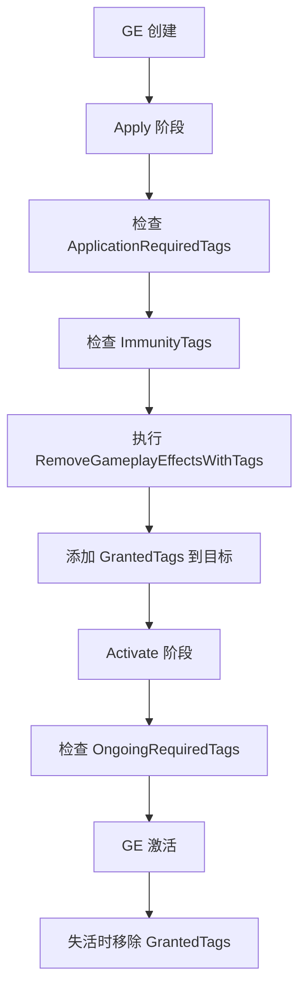
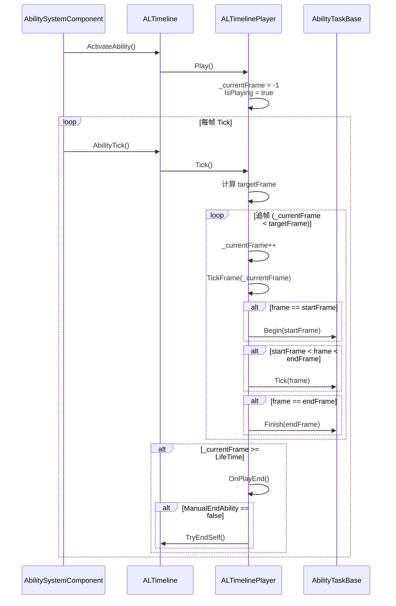
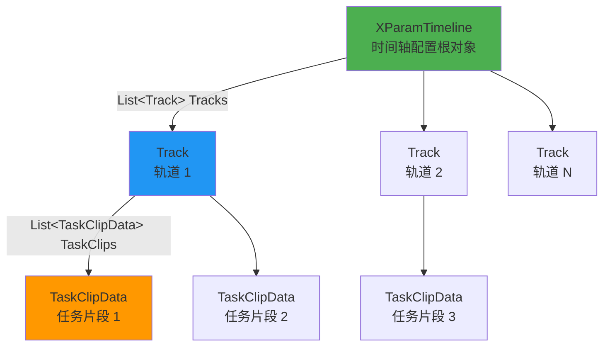
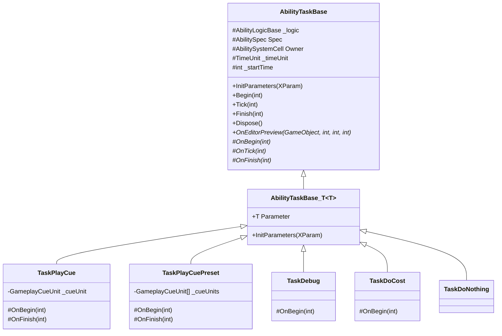

# EX Gameplay Ability System For Unity 2.0
## 前言
该项目为Unreal Engine的Gameplay Ability System的Unity实现，目前实现了部分功能，后续会继续完善。

经历了将近2年的开发，EX-GAS2.0版本总算是公布了。其实2.0才是我认为的完整可用版本，尽管1.0有一些群友也在用，但终究还是有不少缺陷。
而2.0版本，在整体实现框架替换（由传统OOP的Unity Mono转为dop的Unity DOTS）的基础上，还整改了许多1.0使用过程中的不便之处。

>该项目完全开源，欢迎大家一起参与开发，提出建议，共同完善。可以基于该项目进行二次开发。

## 使用事项 【使用EX-GAS前，请务必确认】
1. 该插件要求Unity版本 : 2022.3+
2. 该插件要求使用Unity的官方包 : Entities 1.2.3版本（前后版本不要差距太多）
3. （如果你要使用我提供的配置方案工作流）需要第三方插件 : Odin Inspector 3.2+版本 【付费】
4. （如果你要使用我提供的配置方案工作流）需要第三方配置工作流框架Luban【https://www.datable.cn/docs/intro】

> 关于Entities的版本问题：因为Unity官方对DOTS的维护非常糟糕，一直在频繁变动一些关键API。我开始2.0的开发，选用了2024当时较为稳定的1.2.3版本。
> 但我也并不能完全保证Entities（或者说Unity DOTS）后续的版本兼容性。至少在 Unity6 版本之前，应该所有常用API都是稳定兼容的。

``` 上述使用事项中，若没有较好的方法解决，可以加反馈qq群（616570103），群内提供帮助 ```

目前EX-GAS 2.0没有非常全面的测试，存在不可知的bug和性能问题。所以对于打算使用该插件的朋友请谨慎考虑，当然我是希望更多人用EX-GAS，毕竟相当于是变相的QA。

但是要讲良心嘛，现在的EX-GAS算不上很稳定的版本，如果你是业余时间开发rpg类的独立游戏，开发时间十分充裕，我当然建议你试试EX-GAS，我会尽可能修复bug，提供使用上的帮助。

如果有好兄弟确实打算用，那么请务必加反馈群（616570103）。我会尽力抽时间修复提出的bug。

>我非常希望EX-GAS 2.0能早日稳定，为更多游戏提供支持帮助。

[//]: # (## 参考案例 [Demo]&#40;Assets/Demo&#41;)
## 入门教学案例系列文章

W.I.P 施工中...

## 目录
- 1.[快速开始](#快速开始)
  - [安装](#安装)
  - [使用](#使用)
- 2.[GAS系统介绍](#GAS系统介绍)
  - [2.1 EX-GAS概述](#21-ex-gas概述)
  - [2.2 GameplayTag](#22-gameplaytag)
  - [2.3 Attribute](#23-attribute)
  - [2.4 AttributeSet](#24-attributeset)
  - [2.5 ModifierMagnitudeCalculation](#25-modifiermagnitudecalculation)
  - [2.6 GameplayCue](#26-gameplaycue)
  - [2.7 GameplayEffect](#27-gameplayeffect)
  - [2.8 Ability](#28-ability)
  - [2.9 AbilitySystemComponent](#29-abilitysystemcomponent)
- 3.[API && Source Code Documentation (W.I.P 施工中)](#3api--source-code-documentation)
- 4.[可视化功能](#4可视化功能)
  - [GAS Base Manager (GAS基础配置管理器)](#1-gas-base-manager-gas基础配置管理器)
  - [GAS Asset Aggregator (GAS配置资源聚合器)](#2-gas-asset-aggregator-gas配置资源聚合器)
  - [GAS Runtime Watcher (GAS运行时监视器)](#3-gas-runtime-watcher-gas运行时监视器)
- 5.[如果...我想...,应该怎么做?(持续补充)](#5如果我想应该怎么做wip)
- 6.[暂不支持的功能（可能有遗漏）](#6暂不支持的功能可能有遗漏)
- 7.[后续计划](#7后续计划)
- 8.[特别感谢](#8特别感谢)
- 9.[插件反馈渠道](#9插件反馈渠道)

## 1.快速开始
### 安装
1. （如果你要使用我提供的配置方案工作流）导入Odin Inspector插件(付费),Odin Inspector来源请自行解决。建议使用3.2+版本。
2. （如果你要使用我提供的配置方案工作流）导入Luban的Unity版本插件
3. 导入EX-GAS，建议以下3种方式：
- 使用Unity Package Manager安装
在Unity Package Manager中添加git地址:https://github.com/No78Vino/gameplay-ability-system-for-unity.git?path=Assets/GAS
>【国内镜像】https://gitee.com/exhard/gameplay-ability-system-for-unity.git?path=Assets/GAS
- 使用git clone本仓库[镜像同上]，然后将Assets/GAS文件夹拷贝到你的项目中即可
- 【个人推荐】（给自己的另一个插件打个广告）直接使用EX开源插件管理器来安装时序活动队列管理器。具体使用方法详见（默认menu已经包含EX-GAS）:
   https://zhuanlan.zhihu.com/p/1921532124277765575


### 使用
GAS十分复杂，使用门槛较高。因为本项目是对UE的GAS的模仿移植，所以实现逻辑基本一致。建议先粗略了解一下UE版本的GAS整体逻辑，参考项目文档：https://github.com/BillEliot/GASDocumentation_Chinese

#### *关于配置需求*
如果你正在开发的项目，已经有一套自己完备的配置系统，无法改为luban的结构，又或者你有自己的需求，不希望使用excel转json的配置工作流，
想要使用Unity的ScriptableObject来配置，
那么你可以跳过【建议使用流程】，完全忽略编辑器相关的内容。因为GAS可视化编辑器整个是和配置表强绑定的。
EX-GAS2.0还优化了分层，将数据层和逻辑层做了强分离。我提供的以编辑器和excel为工作流的方案是数据层的，你完全可以使用自己的数据方案来代替。

#### *建议使用流程【Luban->Excel->json 配置工作流】*
0. 准备好luban框架的配置工程目录。 
- 首次导入，可以直接在Edit Menu栏找到【EXTool -> EX-GAS -> 导入模板Luban配置目录】，
  点击【一键部署】后会自动从云端（其实就是我github公共仓库）拷贝模板Luban配置目录到本地项目中。
- 如果你已经熟悉了luban + EX-GAS的配置流程，也可以自己创建目录。

```text
配置工程目录结构规范：
- 根目录
   └── exgas_config/
       └── Datas/
               ├── #exgas.ability.xlsx           \\ 技能配置表
                ├── #exgas.asc.xlsx               \\ ASC预设配置表
                ├── #exgas.attribute.xlsx         \\ 属性配置表
                ├── #exgas.attributeSet.xlsx      \\ 属性集配置表
                ├── #exgas.gameplayCue.xlsx       \\ Cue（演出效果）配置表
                ├── #exgas.gameplayEffect.xlsx    \\ buff效果配置表
                ├── #exgas.gameplayTags.xlsx      \\ 标签配置表
                ├── #exgas.mmc.xlsx               \\ MMC配置表
                ├── #exgas.timelineAbility.xlsx   \\ 时间轴技能数据配置表
                ├── __beans__.xlsx                \\ 自定义数据结构配置表
                ├── __enums__.xlsx                \\ 枚举表
                └── __tables__.xlsx               \\ table导出配置表
        ├── Defines/
                └── builtin.xml                    \\ luban的xml格式数据结构定义文件
        ├── gen.bat     \\ 批量导出json的bat工具文件
        ├── gen.sh     \\ EX-GAS调用的power shell命令文件
        └── luban.conf     \\ luban配置文件
   └── Tools/    
        └── ... (luban导表/生成C#类脚本，用到的一系列工具库和类)
```

---
## 【选读】A. Excel 配置表说明

### 配置表概述

EX-GAS 2.0 采用 **Excel → Luban → JSON** 的配置工作流,所有配置表位于 `配置工程目录/Datas/` 文件夹下。

### 配置表文件列表

| 配置表文件 | JSON 输出 | 用途 |  
|-----------|----------|------|  
| `#exgas.gameplayTags.xlsx` | `exgas_tbgameplaytags.json` | 游戏标签层级结构定义 |  
| `#exgas.attribute.xlsx` | `exgas_tbattribute.json` | 属性定义(生命值、攻击力等) |  
| `#exgas.attributeSet.xlsx` | `exgas_tbattributeset.json` | 属性集合定义 |  
| `#exgas.gameplayEffect.xlsx` | `exgas_tbgameplayeffect.json` | Buff/Debuff 效果配置 |  
| `#exgas.ability.xlsx` | `exgas_tbability.json` | 技能/能力配置 |  
| `#exgas.gameplayCue.xlsx` | `exgas_tbgameplaycue.json` | 视觉/音效表现配置 |  
| `#exgas.mmc.xlsx` | `exgas_tbmmc.json` | 数值计算公式配置 |  
| `#exgas.asc.xlsx` | `exgas_tbasc.json` | ASC 预设模板配置 |  
| `#exgas.timelineAbility.xlsx` | `exgas_tbtimelineability.json` | 时间轴技能配置 | [0-cite-1](#0-cite-1)   

### 通用表格式规范

所有配置表遵循统一的格式规范:

- **第 1 行**: 列名(字段名)
- **第 2-3 行**: Luban 框架的类型定义和注释(由 Luban 使用)
- **第 4 行起【视情况可能从第5行】**: 实际数据行
- **第 2 列**: 必须为 `ID` 字段,作为唯一标识符
- **列名格式**: 支持 `#` 后缀标注 Luban 类型,如 `AssetTags#sep=;`

### 1. GameplayTag 配置表 (`#exgas.gameplayTags.xlsx`)

**用途**: 定义层级化的游戏标签,用于状态判断和逻辑控制。

**字段说明**:
- `ID`: 标签唯一 ID
- `Name`: 标签名称,使用点分隔表示层级(如 `State.Debuff.Stun`)
- `Desc`: 标签描述

**实现功能**: 标签系统支持父子关系查询,用于 GameplayEffect 和 Ability 的条件判断。

### 2. Attribute 配置表 (`#exgas.attribute.xlsx`)

**用途**: 定义游戏中的数值属性。

**字段说明**:
- `ID`: 属性唯一 ID
- `Name`: 属性名称(如 `Health`, `Attack`)
- `Desc`: 属性描述

**实现功能**: 属性是 GAS 数值管理的基础单位,所有数值修改都通过 GameplayEffect 作用于属性。

### 3. AttributeSet 配置表 (`#exgas.attributeSet.xlsx`)

**用途**: 将多个属性组合成集合,便于批量管理。

**字段说明**:
- `ID`: 属性集 ID
- `Name`: 属性集名称
- `Attributes`: 包含的属性 ID 列表(分号分隔)

**实现功能**: 生成对应的 C# AttributeSet 类,用于 ASC 初始化。

### 4. GameplayEffect 配置表 (`#exgas.gameplayEffect.xlsx`)

**用途**: 配置 Buff/Debuff 效果,是属性修改的唯一途径。

**核心字段**: 

- `ID`: 效果唯一 ID
- `Name`: 效果名称
- `Desc`: 效果描述
- `AssetTags`: 描述性标签(分号分隔)
- `GrantedTags`: 激活时授予的标签
- `ApplicationRequiredTags`: 施加时目标需拥有的标签
- `OngoingRequiredTags`: 持续生效需要的标签
- `RemoveGameplayEffectsWithTags`: 移除带有指定标签的效果
- `ImmunityTags`: 免疫标签
- `Duration`: 持续时间配置(包含时间单位、时长、是否重置)
- `Period`: 周期触发配置(周期时长、触发的效果 ID 列表)
- `Stacking`: 叠加配置(最大层数、刷新策略、溢出处理等)
- `Modifiers`: 属性修改器列表
- `CueOnApply/Add/Remove/Activate/Deactivate/Tick`: 各阶段触发的 Cue ID

**实现功能**: 通过组件化设计,支持复杂的 Buff 逻辑,包括持续时间、周期触发、层数叠加、条件激活等。

### 5. Ability 配置表 (`#exgas.ability.xlsx`)

**用途**: 配置技能/能力的基础参数。

**核心字段**:

- `ID`: 技能 ID
- `Name`: 技能名称
- `Desc`: 技能描述
- `Cost`: 消耗的 GameplayEffect ID
- `CdEffect`: 冷却 GameplayEffect ID
- `Cd`: 冷却时间(覆盖 CdEffect 的持续时间)
- `AssetTags`: 技能描述性标签
- `CancelAbilityWithTags`: 激活时取消带有这些标签的技能
- `BlockAbilityWithTags`: 激活时阻塞带有这些标签的技能
- `ActivationOwnedTags`: 激活时获得的标签
- `ActivationRequiredTags`: 激活所需的标签(必须全部拥有)
- `ActivationBlockedTags`: 阻止激活的标签(拥有任意一个即阻止)
- `AbilityLogic`: 技能逻辑类型名称
- **后续 50 列**: 技能逻辑自定义参数(流式配置)

**实现功能**: 配置技能的 GAS 系统参数,自定义逻辑参数由程序员在对应的 AbilitySpec 类中实现。

### 6. GameplayCue 配置表 (`#exgas.gameplayCue.xlsx`)

**用途**: 配置视觉和音效表现。

**核心字段**:

- `ID`: Cue ID
- `Name`: Cue 名称
- `Desc`: Cue 描述
- `CueLogic`: Cue 逻辑类型名称
- **后续 50 列**: Cue 逻辑自定义参数(流式配置)

**实现功能**: 解耦表现和逻辑,由程序员实现具体的 Cue 逻辑类。

### 7. MMC 配置表 (`#exgas.mmc.xlsx`)

**用途**: 配置复杂的数值计算公式。

**核心字段**:

- `ID`: MMC ID
- `Name`: MMC 名称
- `Desc`: MMC 描述
- `MmcLogic`: MMC 逻辑类型名称
- **后续 50 列**: MMC 逻辑自定义参数(流式配置)

**实现功能**: 用于 GameplayEffect 的 Modifier 中,支持基于多属性的复杂计算。

### 8. ASC 配置表 (`#exgas.asc.xlsx`)

**用途**: 配置 AbilitySystemComponent 预设模板。

**核心字段**:

- `id`: 预设 ID
- `Name`: 预设名称
- `Desc`: 预设描述
- `Level`: 等级
- `Tag`: 初始标签列表(分号分隔)
- `AttrSet`: 属性集 ID 列表(分号分隔)
- `Ability`: 初始技能 ID 列表(分号分隔)

**实现功能**: 快速创建预配置的 ASC 实例,用于角色/怪物模板。

### 9. TimelineAbility 配置表 (`#exgas.timelineAbility.xlsx`)

**用途**: 配置基于时间轴的通用技能。

**核心字段**:

- `ID`: 技能 ID
- `Name`: 技能名称
- `LifeTime`: 技能总时长
- `ManualEnd`: 是否支持手动结束
- `TrackName`: 轨道名称
- `StartTime`: 任务开始时间
- `EndTime`: 任务结束时间
- `TaskName`: 任务名称
- `TaskType`: 任务类型

**实现功能**: 支持多轨道、多任务的时序技能配置,无需编写代码即可实现复杂技能。

### 流式配置说明
Ability、Cue、MMC 三种配置表采用**流式配置**,即自定义参数占用连续的 50 列。

**注意事项**:
- 必须在 `XParam` 实现类中正确处理 `DecodeExcelData()` 和 `EncodeExcelData()` 方法
- 空值必须用默认占位数据代替(如 `0`、`""`、`0f`、`false`)
- 参数顺序必须与代码中的解析顺序一致

### 配置表导出流程
1. 在 GAS 中心管理器设置配置工程路径 
2. 编辑 Excel 配置表
3. 点击"导出更新 Json 表"按钮,调用 Luban 的 `gen.bat` 生成


---
## 【选读】B. EX-GAS中心管理器 (GASCenterWindow) 使用说明

GAS 中心管理器是 EX-GAS 2.0 的核心可视化编辑工具,提供了统一的配置管理界面


### 打开方式

通过 Unity 菜单栏: **EXTool → EX-GAS → GAS中心管理器**

窗口会以 1200x600 的尺寸居中显示,并自动加载所有配置数据。

### UI 布局

GAS 中心管理器采用左右分栏布局:

**左侧菜单栏** (配置类型导航):
- Setting 基本设置
- GameplayTag 标签
- Attribute 属性
- Attribute Set 属性集
- GameplayCue 演出提示
- MMC 修改器
- GameplayEffect 效果buff
- GameplayAbility 技能
- ASC 预设

**右侧编辑区域**: 根据左侧选择的配置类型,显示对应的编辑界面。

### 各配置页面功能

#### 1. Setting 基本设置

配置 EX-GAS 的核心路径参数:

- **配置表工程路径**: Luban 配置工程的根目录
- **脚本生成路径**: 生成的 C# 代码输出目录
- **导出 Json 表**: 一键调用 Luban 导出所有配置表

#### 2. GameplayTag 标签页

以树形结构展示所有标签,支持层级查看。

**功能按钮**:
- 打开 Tag Excel 文件所在文件夹
- 打开 Tag Json 文件所在文件夹
- 导出更新 Json 表
- 刷新

#### 3. Attribute 属性页

以表格形式展示所有属性配置。

**功能按钮**:
- 打开属性 Excel 文件所在文件夹
- 打开属性 Json 文件所在文件夹
- 导出更新 Json 表
- 刷新

#### 4. Attribute Set 属性集页

展示属性集配置,每个属性集包含的属性列表。

**功能按钮**: 与 Attribute 页面相同。

#### 5. GameplayCue 演出提示页

编辑 Cue 配置,包括视觉和音效表现。

**编辑界面**:
- 顶部工具栏: 打开文件夹、导出 Json、刷新按钮
- Cue 选择下拉框: 选择要编辑的 Cue (支持添加/删除)
- 基础信息: 名称、描述
- 标签配置: RequiredTags、ImmunityTags
- Cue 逻辑: 选择 Cue 类型及其自定义参数

#### 6. MMC 修改器页

编辑 MMC (Modifier Magnitude Calculation) 配置。

**编辑界面**: 与 Cue 页面类似,包含 MMC 逻辑类型选择和自定义参数编辑。

#### 7. GameplayEffect 效果buff页

编辑 GameplayEffect 配置,这是最复杂的配置页面。

**编辑界面**:
- 顶部工具栏: 打开文件夹、导出 Json 按钮
- Effect 选择下拉框: 选择要编辑的 Effect (支持添加/删除)
- 基础信息: 名称、描述
- **组件列表**: 勾选需要的 Effect 组件
- **详情页签**: 根据勾选的组件显示对应配置项

**支持的组件类型**:
- AssetTags: 描述性标签
- GrantedTags: 授予的标签
- ApplicationRequiredTags: 施加条件标签
- OngoingRequiredTags: 持续条件标签
- RemoveGameplayEffectsWithTags: 移除效果标签
- ImmunityTags: 免疫标签
- Duration: 持续时间
- Period: 周期触发
- Stacking: 层数叠加
- Modifiers: 属性修改器
- GrantedAbility: 授予的技能
- CueOnApply/Tick/Add/Remove/Activate/Deactivate: 各阶段触发的 Cue

#### 8. GameplayAbility 技能页

编辑 Ability 配置。 [1-cite-21](#1-cite-21)

**编辑界面**:
- 顶部工具栏: 打开文件夹、导出 Json 按钮
- Ability 选择下拉框: 选择要编辑的 Ability (支持添加/删除)
- 基础信息: 名称、描述
- **Ability 逻辑类型**: 选择技能逻辑类型
- **自定义参数**: 根据逻辑类型显示对应参数编辑器
- **组件列表**: 勾选需要的 Ability 组件 (Cost、Cooldown、Tags 等)

#### 9. ASC 预设页

编辑 AbilitySystemComponent 预设配置。

**编辑界面**:
- 顶部工具栏: 打开文件夹、导出 Json、刷新按钮
- ASC 选择下拉框: 选择要编辑的 ASC 预设
- 基础信息: 名称、描述、等级
- 初始配置: 初始标签、属性集、技能列表

### 通用操作流程

所有配置页面遵循统一的操作流程:

1. **选择配置项**: 从下拉框选择要编辑的配置
2. **编辑参数**: 在右侧编辑区修改配置参数
3. **保存**: 修改会自动保存到 Excel 文件
4. **导出**: 点击"导出更新 Json 表"生成运行时数据


### 完整使用流程

#### 第一步:初始化配置路径

1. 打开 GAS 中心管理器: **EXTool → EX-GAS → GAS中心管理器** 

2. 在左侧菜单选择 **Setting 基本设置** 

3. 配置以下路径: [2-cite-3](#2-cite-3)
    - **配置表工程路径**: Luban 配置工程根目录(包含 `Datas/` 文件夹和 `gen.bat`)
    - **脚本生成路径**: 生成的 C# 代码输出目录
    - **表导出路径**: JSON 表输出目录
    - **表 class 生成路径**: Luban 生成的表类输出目录

4. 点击 **导出 Json 表** 按钮,验证 Luban 工具链是否正常工作 [2-cite-4](#2-cite-4)

#### 第二步:配置基础数据

按以下顺序配置基础数据,因为后续配置依赖这些基础数据:

**2.1 配置 GameplayTag**
- 在左侧菜单选择 **GameplayTag 标签**
- 点击 **打开 Tag Excel 文件所在文件夹**,在 Excel 中编辑标签
- 编辑完成后,点击 **导出更新 Json 表**
- 点击 **刷新** 查看更新后的标签树
- 关于Tag的使用及运作逻辑详见章节([GameplayTag](#22-gameplaytag))

**2.2 配置 Attribute**
- 在左侧菜单选择 **Attribute 属性**
- 点击 **打开属性 Excel 文件所在文件夹**,编辑属性定义 
- 导出 Json 表并刷新
- 关于Attribute的使用及运作逻辑详见章节([Attribute](#23-attribute))

**2.3 配置 AttributeSet**
- 在左侧菜单选择 **Attribute Set 属性集**
- 编辑属性集配置,组合已定义的属性
- 导出 Json 表并刷新
- 关于AttributeSet的使用及运作逻辑详见章节([AttributeSet](#24-attributeset))

#### 第三步:配置游戏逻辑

基础数据配置完成后,可以配置游戏逻辑相关的配置:

**3.1 配置 GameplayCue**
- 在左侧菜单选择 **GameplayCue 演出提示**
- 使用窗口内的编辑器直接编辑 Cue 配置
- 点击 **保存** 按钮保存到 Excel
- 导出 Json 表
- 详见[GameplayCue](#26-gameplaycue)

**3.2 配置 MMC**
- 在左侧菜单选择 **MMC 修改器**
- 编辑 MMC 配置
- 保存并导出
- 详见[MMC](#25-modifiermagnitudecalculation)

**3.3 配置 GameplayEffect**
- 在左侧菜单选择 **GameplayEffect 效果buff**
- 从下拉框选择要编辑的 Effect,或点击 **添加** 创建新 Effect
- 在 **组件列表** 标签页勾选需要的组件
- 在 **详情** 标签页配置各组件参数
- 点击 **保存** 按钮
- 导出 Json 表
- 详见 [Gameplay Effect](#27-gameplayeffect)

**3.4 配置 GameplayAbility**
- 在左侧菜单选择 **GameplayAbility 技能**
- 选择或创建 Ability 
- 选择 **Ability 逻辑类型**
- 配置自定义参数和组件
- 保存并导出
-  详见 [Ability](#28-ability)

**3.5 配置 ASC 预设(可选)**
- 在左侧菜单选择 **ASC 预设**
- 配置预设的初始标签、属性集和技能
- 保存并导出
- 详见 [AbilitySystemComponent](#29-abilitysystemcomponent)

#### 第四步:生成运行时代码
配置完成后,需要生成 C# 代码供运行时使用:
1. 返回 **Setting 基本设置** 页面
2. 点击 **一键生成所有** 按钮,生成所有必要的 C# 代码
    - 或者根据需要点击单独的生成按钮(Tag 脚本、属性脚本等)

### 日常编辑流程
配置完成后,日常编辑流程简化为:
1. 打开 GAS 中心管理器
2. 选择要编辑的配置类型
3. 编辑配置(直接在窗口内编辑或打开 Excel 编辑)
4. 点击 **保存** 按钮(如果在窗口内编辑)
5. 点击 **导出更新 Json 表** 按钮
6. 如果修改了基础配置(Tag/Attribute/AttributeSet),需要重新生成对应的 C# 代码

### 重要提示
- **Excel 和窗口编辑器同步**: 窗口内的编辑器直接读写 Excel 文件,两者始终保持同步
- **导出顺序**: 必须先导出 Json 表,再生成 C# 代码
- **刷新按钮**: 如果在外部修改了 Excel 或 Json 文件,使用刷新按钮重新加载数据

---
## 2.EX-GAS系统介绍
### 2.1 EX-GAS概述
>EX-GAS是对UnrealEngine的GAS（Gameplay Ability System）的模仿和实现。

GAS 是 "Gameplay Ability System" 的缩写，是一套游戏能力系统。
这个系统的目的是为开发者提供一种灵活而强大的框架，用于实现和管理游戏中的各种角色能力、技能和效果。

如果把EX-GAS高度概括为一句话，那就是：**WHO DO WHAT**。
- Who：AbilitySystemComponent（ASC）,EX-GAS的实例对象，是体系运转的基础单位
- Do：Ability，是游戏中可以触发的一切行为和技能
- What：GameplayEffect(GE)，掌握了游戏内元素的属性实际控制权，GameplayEffect本身应该理解为结果

GAS本质是一套属性数值的管理系统，GameplayCue我个人理解为附加价值（虽然这个附加价值很有分量）。
纵使GAS的Tag体系解决复杂的GameplayEffect和Ability的逻辑，但最终的结果目的也只是掌握属性数值变化。
而属性的最底层修改权力交由了GameplayEffect。所以我把GE理解为结果。

UE的GAS的使用门槛很高，这一点在我构筑完EX-GAS雏形后更是深有体会。
所以在EX-GAS的设计上，我尽可能的做简化，优化，来降低了使用门槛。
我制作了几个关键的编辑器，来帮助开发者快速的使用EX-GAS。
但即便如此，GAS本身的繁多参数依然让编辑器的界面看上去十分臃肿，这很难简化，没有哪个参数是可以被删除的。
甚至，雏形阶段的EX-GAS还有很多功能还未实现，也就是说还有更多的参数是没有被编辑器暴露出来的。

_**GAS的使用者必须至少有一名程序开发人员，因为GAS的使用需要编写大量自定义业务逻辑。
Ability，Cue，MMC等都是必须根据游戏类型和内容玩法而定的。
非程序开发人员则需要完全理解EX-GAS的运作逻辑，才能更好的配合程序开发人员快速配置出各种各样的技能，完善玩法表现。**_

---
### 2.2 GameplayTag
>Gameplay Tag,标签,它用于分类和描述对象的状态，非常有用于控制游戏逻辑。

- Gameplay Tag以树形层级结构（如Parent.Child.Grandchild）组织，用于描述角色状态/事件/属性/等，如眩晕（State.Debuff.Stun）。
- Gameplay Tag主要用于替代布尔值或枚举值，进行逻辑判断。
- 通常将Gameplay Tag添加到AbilitySystemComponent（ASC）以与系统（GameplayEffect，GameplayCue,Ability）交互。

Gameplay Tag在GAS中的使用涉及到标签的添加、移除以及对标签变化的响应。
开发者可以通过[GameplayTag Manager](#22a-gameplaytag-manager)在项目设置中管理这些标签，无需手动编辑配置文件。
Gameplay Tag的灵活性和高效性使其成为GAS中控制游戏逻辑的重要工具。
它不仅可以用于简单的状态描述，还可以用于复杂的游戏逻辑和事件触发。

>举个例子，GameplayEffect中有一个字段RequiredTags，其含义是当前GameplayEffect生效的AbilitySystemComponent（ASC）
需要拥有【所有】的RequiredTags（需求标签）。

上述例子，如果用传统的思路去做，可能需要写很多if-else判断，同时元素的实例脚本可能会增加很多状态标记的变量，
而且还需要考虑多个游戏效果的交互，这使得代码的设计和实现变得复杂，耦合。

GameplayTag的使用可以大大简化这些逻辑，使得代码更加清晰，易于维护。
他把状态和标记全部抽象成了一个独立的Tag系统，而且最巧妙的是树形结构的设计。
他解决了很多Gameplay设计上的问题，常见的问题比如：移除所有Debuff，传统的做法可能是让（中毒，减速，灼伤，等等）继承自Debuff类/接口；
而GameplayTag只需要添加一个Tag（中毒:Debuff.Poison，减速:Debuff.SpeedDown，灼伤:Debuff.Burning）

GameplayTag自身可以作为一个独立的系统去使用。
我在开发Demo的过程中就发现了GameplayTag的强大之处，他几乎替代了我的所有状态值。
甚至我设计了一个全局ASC，专门用来管理全局状态，我不需要对每个系统的状态管理，转而维护一个ASC即可。（虽然最后并没有落地这个设计，因为DEMO没有那么复杂。）

#### 2.2.a GameplayTag Manager


我模仿了UE的GAS的Tag管理视图，做了树结构管理。

GameplayTag 的编辑采用 **Excel 编辑 + 可视化预览** 的工作模式。

##### 编辑流程

###### 1. 打开 Excel 文件进行编辑
在 GAS 中心管理器左侧选择 **GameplayTag 标签** 页面,点击 **打开 Tag Excel 文件所在文件夹** 按钮。

在 Excel 中编辑 `#exgas.gameplayTags.xlsx` 文件:
- **ID 列**: 标签的唯一 ID (整数)
- **Name 列**: 标签名称,使用 `.` 分隔表示层级关系 (如 `State.Debuff.Stun`)
- **Desc 列**: 标签描述

###### 2. 导出 JSON 配置表
Excel 编辑完成后,返回 GAS 中心管理器,点击 **导出更新 Json 表** 按钮。

这会调用 Luban 工具将 Excel 转换为 `exgas_tbgameplaytags.json` 文件。 

###### 3. 刷新预览

点击 **刷新** 按钮,窗口会重新读取 JSON 文件并以树形结构展示标签层级。 

可视化界面会将标签名称中的 `.` 转换为 `/` 显示为树形菜单,方便查看父子关系。 

###### 4. 生成 C# 代码
返回 **Setting 基本设置** 页面,点击 **Tag 脚本** 按钮生成 `XTag.gen.cs` 文件。 

生成的代码包含:
- 所有标签的常量定义 (如 `State_Debuff_Stun`)
- 标签的父子关系映射
- 标签初始化方法
- 标签名称中的 `.` 会在生成的 C# 代码中转换为 `_`,例如 `State.Debuff.Stun` 生成的常量名为 `State_Debuff_Stun`。

###### 关键点
- **编辑位置**: 直接在 Excel 文件中编辑,不在窗口内编辑
- **预览作用**: 窗口仅用于查看标签树形结构和验证配置
- **必须步骤**: 编辑后必须依次执行 "导出 Json 表" → "生成 Tag 脚本"

---
### 2.3 Attribute
>Attribute，属性，是GAS中的核心数据单位，用于描述角色的各种属性，如生命值，攻击力，防御力等。

Attribute和AttributeSet（属性集）需要结合起来才能作为唯一标识，简单点说AttributeSet是姓氏，Attribute是名字。
不同的AttributeSet可以有相同名字的Attribute，但是同一组的AttributeSet不可以有相同名字的Attribute。
常见的情况，如下：
> AttributeSet 人物: 生命值, 法力, 攻击力, 防御力
> 
> AttributeSet 武器: 生命值（耐久度）, 攻击力, 防御力
> 
> 而这两组AttributeSet中的生命值，攻击力，防御力，都是不同的属性，他们的意义和作用不同。但他们可以属于同一个单位。
#### 2.3.a Attribute Manager


Attribute 编辑流程

##### 1. 打开 Excel 文件进行编辑

在 GAS 中心管理器左侧选择 **Attribute 属性** 页面,点击 **打开属性 Excel 文件所在文件夹** 按钮。

在 Excel 中编辑 `#exgas.attribute.xlsx` 文件:
- **ID 列**: 属性的唯一 ID (整数)
- **Name 列**: 属性名称 (如 `Health`, `Attack`, `Defense`)
- **Desc 列**: 属性描述

##### 2. 导出 JSON 配置表

Excel 编辑完成后,返回 GAS 中心管理器,点击 **导出更新 Json 表** 按钮。 

这会调用 Luban 工具将 Excel 转换为 `exgas_tbattribute.json` 文件。

##### 3. 刷新预览
点击 **刷新** 按钮,窗口会重新读取 JSON 文件并以表格形式展示所有属性。

##### 4. 生成 C# 代码
返回 **Setting 基本设置** 页面,点击 **属性脚本** 按钮生成 `XAttribute.gen.cs` 文件。

- 生成的代码包含所有属性的常量定义 (如 `public const int Health = 1001;`)。
- Attribute 名称会直接作为常量名,建议使用 PascalCase 命名 (如 MaxHealth)

---
### 2.4 AttributeSet
>AttributeSet，属性集，是GAS中的核心数据单位集合，用于描述角色的某一类别的属性集合。

在上文的[2.3 Attribute]中，我们提到了AttributeSet是姓氏，Attribute是名字。二者结合起来才能作为唯一标识。
而对于AttributeSet的设计，可以较为随意，大多数情况，大家会更乐意一个单位只有一个AttributeSet。
因为这样便于管理和分类，不同类别的单位直接使用不同的AttributeSet。但实际上一个单位是可以拥有复数AttributeSet。
我其实比较认同一个单位只有一个AttributeSet的设计，因为这对程序开发也是好事，逻辑处理会更简单直白。

配置时的注意项：
- AttributeSet的名字禁止重复或空。这是因为AttributeSet的名字会作为类名。
- AttributeSet内的Attribute禁止重复。

#### 2.4.a AttributeSet Manager


AttributeSet Manager统筹属性集的命名和属性管理。

##### 1. 打开 Excel 文件进行编辑

在 GAS 中心管理器左侧选择 **Attribute Set 属性集** 页面,点击 **打开属性集 Excel 文件所在文件夹** 按钮。 

在 Excel 中编辑 `#exgas.attributeSet.xlsx` 文件:
- **ID 列**: 属性集的唯一 ID (整数)
- **Name 列**: 属性集名称 (如 `Fight`, `Weapon`)
- **Attribute 列**: 包含的属性 ID 列表 (分号分隔,如 `1001;1002;1003`)

##### 2. 导出 JSON 配置表

Excel 编辑完成后,返回 GAS 中心管理器,点击 **导出更新 Json 表** 按钮。 

这会调用 Luban 工具将 Excel 转换为 `exgas_tbattributeset.json` 文件。 

##### 3. 刷新预览

点击 **刷新** 按钮,窗口会重新读取 JSON 文件并以列表形式展示所有属性集及其包含的属性。

##### 4. 生成 C# 代码

返回 **Setting 基本设置** 页面,点击 **属性集脚本** 按钮生成 `XAttrSet.gen.cs` 文件。

生成的代码包含:
- 属性集 ID 常量 (如 `public const int Fight = 2001;`)
- 属性集类定义 (如 `AS_Fight` 类,包含该属性集的所有属性常量)
- 属性集配置映射字典
- `AttributeSet` 名称会生成`AS_`前缀的类名,如 `Fight` 生成 `AS_Fight` 类
- 生成的 AttributeSet 类会包含该集合内所有属性的常量定义,方便代码中引用

---
### 2.5 ModifierMagnitudeCalculation
>ModifierMagnitudeCalculation，修改器，负责GAS中Attribute的数值计算逻辑。

#### 核心概念
MMC 是 GameplayEffect 中属性修改的计算单元,负责将基础模值 (Magnitude) 转换为最终修改值。

**核心作用**: 在 GAS 体系内,只有 GameplayEffect 能修改 Attribute 数值,而 GameplayEffect 正是通过 MMC 来实现数值计算的。

**关键特性**:
- **与 Attribute 集成**: 计算时可读取角色属性值,实现基于属性的动态计算(如伤害随攻击力提升)
- **运行时动态计算**: 根据游戏状态实时调整效果强度,而非固定数值
- **高度复用**: 同一 MMC 可被多个 GameplayEffect 引用,确保计算逻辑一致性
- **自定义扩展**: 支持继承基类实现复杂计算逻辑,满足各种游戏需求
- **灵活性**: 效果强度可根据不同游戏情境动态调整 [6-cite-3](#6-cite-3)

#### MMC 在 GameplayEffect 中的位置

MMC 被存储在 Modifier 中,Modifier 是 GameplayEffect 的组成部分。每个 Modifier 包含:
- **目标属性**: 要修改的属性(如 `AS_Fight.Health`)
- **基础模值 (Magnitude)**: 修改器的基础数值,作为 MMC 计算的输入
- **操作类型**:
    - `Add`: 加法(负值即减法)
    - `Multiply`: 乘法(倒数即除法)
    - `Override`: 直接覆写属性值
- **MMC**: 计算单位,决定如何将 Magnitude 转换为最终修改值 [6-cite-4](#6-cite-4)

#### 内置 MMC 类型详解

##### 1. MMCScalableFloat - 线性缩放计算

**计算公式**: `最终值 = Magnitude × k + b`

这是一个简单的线性函数,适用于大多数基础数值缩放场景。

**参数**:
- `k`: 缩放系数(默认 1.0)
- `b`: 偏移量(默认 0)

**应用场景**:
- 技能伤害随等级提升: `伤害 = 基础伤害 × 等级系数 + 固定加成`
- 治疗量缩放: `治疗量 = 基础治疗 × 1.5 + 10`
- 护盾值计算: `护盾 = 基础护盾 × 2.0 + 0`

**示例**:
```  
配置: k = 1.5, b = 20  
Magnitude = 100  
最终值 = 100 × 1.5 + 20 = 170  
```

##### 2. MMCNone - 直接使用模值

**计算公式**: `最终值 = Magnitude`

不进行任何计算,直接使用 Modifier 的基础模值。

**应用场景**:
- 固定数值的伤害/治疗
- 不需要动态计算的简单效果
- 快速原型开发 

##### 3. AttributeBasedModCalculation - 基于属性的计算(W.I.P)

**计算公式**: `最终值 = AttributeValue × k + b`

与 MMCScalableFloat 类似,但输入值来自角色属性而非 Magnitude。

**核心参数**:
- **attributeFromType**: 属性来源
    - `Source`: 从效果创建者(施法者)获取
    - `Target`: 从效果目标(受击者)获取
- **attributeName**: 属性名称(如 `AS_Fight.Attack`)
- **captureType**: 捕获方式
    - `Track`: 实时追踪,执行时读取当前属性值
    - `SnapShot`: 快照模式,效果创建时记录属性值,后续使用快照值

**应用场景**:
- 伤害基于攻击力: `伤害 = 攻击力 × 1.5 + 10`
- 治疗基于最大生命值: `治疗量 = 最大生命 × 0.1 + 0`
- 护盾基于防御力: `护盾 = 防御 × 2.0 + 50`

**Track vs SnapShot 的区别**:
- **Track**: 适用于需要实时响应属性变化的场景(如推导属性)
- **SnapShot**: 适用于效果创建时确定数值的场景(如技能伤害快照) 

##### 4. SetByCallerModCalculation - 调用者设置(W.I.P)

**特点**: 不使用任何预设值,而是在运行时由调用者动态设置。

**设置方式**:
- 通过字符串键值: `spec.RegisterValue("DamageKey", 150.0f)`
- 通过 GameplayTag: `spec.RegisterValue(damageTag, 150.0f)`

**应用场景**:
- 技能伤害需要根据蓄力时间动态计算
- 效果强度依赖复杂的外部逻辑
- 需要在运行时传递参数的场景

##### 5. CustomCalculation - 自定义计算

**用途**: 当内置 MMC 类型无法满足需求时,继承 `ModMagnitudeCalculationBase<TParam>` 实现自定义逻辑。

**实现示例**:
```csharp  
public class MMCCriticalDamage : ModMagnitudeCalculationBase<MmcParamCritical>  
{  
    public override float CalculateMagnitude(Entity geEntity, float magnitude)  
    {  
        // 获取暴击率和暴击伤害  
        var critRate = Parameter.CritRate;  
        var critDamage = Parameter.CritDamage;  
          
        // 随机判定是否暴击  
        if (Random.value < critRate)  
            return magnitude * critDamage;  
        return magnitude;  
    }  
}  
```  

**应用场景**:
- 暴击系统
- 多属性联合计算(如物理+魔法混合伤害)
- 复杂的游戏逻辑(如连击加成、距离衰减等) 

#### 2.5.a MMC编辑器使用流程


##### 1. 打开 MMC 编辑页面

在 GAS 中心管理器左侧选择 **MMC 修改器**。

##### 2. 创建或选择 MMC

- 从下拉框选择现有 MMC,或点击 **添加** 按钮创建新 MMC
- 输入唯一 ID (整数)

##### 3. 配置 MMC 参数
**基础信息**:
- `Name`: MMC 名称 (如 "伤害x1.5加成")
- `Desc`: 描述信息(如 "技能伤害提升 50%")
- `MmcLogic`: 选择 MMC 类型 (如 `MMCScalableFloat`)

**自定义参数**: 根据选择的 MMC 类型,配置对应参数
- 对于 `MMCScalableFloat`: 设置 k 和 b 值
- 对于自定义 MMC: 配置自定义参数结构

##### 4. 保存并导出
- 点击 **保存** 按钮写入 Excel
- 点击 **导出更新 Json 表** 生成运行时配置 

#### 2.5.b 在 GameplayEffect 中使用 MMC

MMC 在 GameplayEffect 的 Modifier 中引用,完整的数值修改流程如下:

**配置结构**:
- **目标属性**: 要修改的属性 (如 `AS_Fight.Health`)
- **基础模值**: Modifier 的基础数值(如 100)
- **操作类型**: Add / Multiply / Override
- **MMC**: 选择已配置的 MMC ID

**运行时执行流程**:
```  
1. GameplayEffect 被应用到目标 ASC  
2. 系统遍历 Effect 的所有 Modifier  
3. 对每个 Modifier:  
   a. 从配置加载 MMC 实例  
   b. 调用 MMC.CalculateMagnitude(geEntity, magnitude)  
   c. 获得计算后的最终值  
   d. 根据操作类型应用到目标属性  
4. 触发属性变化事件  
```

#### 2.5.c 运行时加载机制
配置表通过 Luban 转换为 JSON,运行时加载流程:
1. **读取配置**: `XLuban.GetMmcConfig(mmcId)` 从 JSON 表读取 MMC 数据
2. **类型解析**: 根据 `MmcLogic` 字段获取对应的 C# 类型
3. **参数填充**: 创建 MMC 参数实例并填充配置数据
4. **实例化**: 返回 `MMCConfig` 对象,包含 MMC 类型和参数
5. **创建 MMC**: 调用 `CreateMmc()` 生成实际的 MMC 实例 

#### 2.5.d 实际应用示例

##### 示例 1: 固定伤害技能
**需求**: 造成 100 点固定伤害

**配置**:
- MMC: `MMCNone`
- Magnitude: 100
- 操作类型: Add
- 目标属性: `AS_Fight.Health`

**结果**: `最终伤害 = 100`

##### 示例 2: 伤害提升技能
**需求**: 造成基础伤害的 150% 并额外增加 20 点

**配置**:
- MMC: `MMCScalableFloat` (k=1.5, b=20)
- Magnitude: 100
- 操作类型: Add
- 目标属性: `AS_Fight.Health`

**结果**: `最终伤害 = 100 × 1.5 + 20 = 170`

---
### 2.6 GameplayCue
#### 2.6.1 什么是 GameplayCue?

GameplayCue (简称 Cue) 是 EX-GAS 的**表现层系统**,专门负责游戏中的视觉和音效反馈。它是连接游戏逻辑与玩家感知的桥梁,将抽象的数值变化转化为直观的视听体验。

**典型应用场景**:
- 受击特效与音效
- 技能释放的粒子效果
- Buff/Debuff 的持续视觉提示
- 伤害数字飘字
- 角色状态动画切换
- UI 提示与反馈

#### 2.6.2 核心设计原则

##### 1. 表现与逻辑分离

Cue 遵循严格的**单一职责原则**,只负责表现,不参与游戏逻辑:

- ✅ **允许**: 播放特效、音效、动画,显示 UI 提示
- ❌ **禁止**: 修改 Attribute 数值、添加/移除 GameplayEffect、影响战斗判定

**为什么这样设计?**
- **可维护性**: 美术和程序可以并行工作,互不干扰
- **可调试性**: 移除所有 Cue 不影响游戏逻辑,便于定位问题
- **可扩展性**: 更换表现方案无需修改核心逻辑

##### 2. 灵活的边界定义

第二条原则"Cue 不应影响玩法"在不同游戏类型中有不同解释: 

- **即时战斗游戏**: Cue 控制角色位移可能影响战斗结果,应避免
- **回合制游戏**: Cue 控制角色位移可视为动画表现,可以接受
- **最终判断**: 由开发者根据游戏类型自行决定边界

> Cue是需要程序开发人员大量实现的，毕竟游戏不同导致游戏提示千变万化。

##### 系统架构特性

##### ECS + OOP 混合架构

EX-GAS 2.0 的 Cue 系统采用创新的混合架构:

**ECS 层 (高性能运行时)**:
- 使用 Unity DOTS Entity 存储 Cue 状态
- 通过 Enable Component 控制播放/停止,避免频繁创建销毁
- 系统化更新,支持大量 Cue 并发

**OOP 层 (开发者友好)**:
- `GameplayCueUnit`: 封装 ECS 操作的控制单元
- `GameplayCueBase<T>`: 继承实现自定义逻辑的基类
- 熟悉的面向对象编程模式,降低学习成本

##### 独立性设计
Cue 系统设计为**可独立使用**的模块:
- 可在 GameplayEffect 中自动触发
- 可在 Ability 中手动控制
- 可在 GAS 体系外独立调用
- 只需遵守核心原则,使用场景不受限制

#### 2.6.3 核心功能特性

##### 1. 标签过滤系统
Cue 支持基于 GameplayTag 的条件播放:
- **RequiredTags**: ASC 必须拥有**所有**这些标签才播放
- **ImmunityTags**: ASC 拥有**任意**这些标签则不播放

**应用场景**:
- 隐身单位不播放受击特效
- 只对玩家控制单位显示 UI 提示
- 根据图形设置标签控制特效质量

##### 2. 生命周期管理
Cue 提供完整的生命周期回调,精确控制表现时机:

| 回调 | 触发时机 | 典型用途 |  
|------|---------|---------|  
| `OnAdd` | Cue 添加到 ASC | 缓存组件引用 |  
| `OnActivate` | Cue 激活 | 播放特效/音效 |  
| `OnTick` | 每帧更新 | 更新粒子/动画 |  
| `OnDeactivate` | Cue 失活 | 暂停效果 |  
| `OnRemove` | Cue 移除 | 清理资源 |  
| `OnDestroy` | 实体销毁 | 最终清理 |  

##### 3. 与 GameplayEffect 深度集成

GameplayEffect 可在不同生命周期阶段自动触发 Cue:

| Effect 类型 | Cue 字段 | 触发时机 |  
|------------|---------|---------|  
| Instant | `CueOnApply` | Effect 执行时 |  
| Duration/Infinite | `CueOnAdd` | Effect 添加时 |  
| Duration/Infinite | `CueOnRemove` | Effect 移除时 |  
| Duration/Infinite | `CueOnActivate` | Effect 激活时 |  
| Duration/Infinite | `CueOnDeactivate` | Effect 失活时 |  
| Duration/Infinite | `CueOnTick` | 每帧更新 |  


##### 4. 编辑器预览支持
Cue 支持在 Timeline 编辑器中实时预览,无需进入播放模式:
- 可视化编辑技能表现
- 快速迭代调整
- 美术人员友好

#### 2.6.4 性能优化特性

##### Enable Component 模式

使用 Unity ECS 的 Enable Component 实现高效状态切换: 

- `ECCuePlayable`: 标记 Cue 可播放
- `ECCuePlaying`: 标记 Cue 正在播放
- Enable/Disable 比创建/销毁 Entity 快得多
- 系统只处理 Enabled 的组件,减少无效遍历

##### 组件缓存策略

推荐在 `OnAdd()` 中缓存 Unity 组件引用,避免每帧查找:

```csharp  
private Animator _animator;  
  
public override void OnAdd(float time)  
{  
    // 一次性查找并缓存  
    _animator = _abilitySystemCell.GameObject  
        .GetComponentInChildren<Animator>();  
}  
  
public override void OnActivate(float time)  
{  
    // 直接使用缓存,无需查找  
    _animator?.Play(Parameter.AnimationName);  
}  
```  

#### 2.6.5 开发友好特性

##### 1. 类型安全的参数系统

每个 Cue 类型对应一个强类型参数类,避免类型转换错误:

```csharp  
public class CuePlayAnimator : GameplayCueBase<XParamAnimator>  
{  
    // Parameter 自动推断为 XParamAnimator 类型  
    public override void OnActivate(float time)  
    {  
        _animator?.Play(Parameter.AnimationName);  
    }  
}  
```  

##### 2. 代码生成与注册

系统自动生成 Cue 类型注册代码,无需手动维护映射:

- 编译时扫描所有 Cue 类型
- 生成 `XCue.gen.cs` 注册脚本
- 运行时通过字符串名称创建实例

##### 3. 调试支持

提供多种调试手段:
- Entity 命名: `Cue_{类型名}_{Version}_{Index}`
- 生命周期日志: 可在回调中输出调试信息
- 标签过滤验证: 检查 RequiredTags/ImmunityTags 是否生效

#### 2.6.a GameplayCue 编辑器使用说明


GameplayCue 编辑器是 GAS 中心管理器的一部分,提供了可视化的 Cue 配置界面。与 Tag/Attribute 不同,Cue 编辑器支持**直接在窗口内编辑**,修改会实时保存到 Excel 文件。 

##### 打开编辑器
在 GAS 中心管理器左侧菜单选择 **GameplayCue 演出提示**。
##### 界面布局

编辑器界面分为三个区域:

###### 1. 顶部工具栏
- **打开 Excel 文件所在文件夹**: 快速定位到 `#exgas.gameplayCue.xlsx` 文件
- **打开 Json 文件所在文件夹**: 查看导出的 `exgas_tbgameplaycue.json`
- **导出更新 Json 表**: 调用 Luban 将 Excel 转换为 JSON
- **刷新**: 重新从 Excel 加载数据
- **保存**: 将当前编辑内容写入 Excel

###### 2. Cue 选择区域
- **当前编辑 Cue 下拉框**: 选择要编辑的 Cue ID
- **添加按钮 (+)**: 创建新 Cue,需输入唯一 ID
- **删除按钮 (垃圾桶)**: 删除当前选中的 Cue (需二次确认)

###### 3. 配置编辑区域
**基础信息**:
- **名字**: Cue 的显示名称,用于在 GameplayEffect/Ability 编辑器中识别
- **描述**: Cue 的功能说明

**标签过滤**:
- **播放时需求的 tag**: ASC 必须拥有**所有**这些标签才播放 Cue
- **播放时免疫的 tag**: ASC 拥有**任意**这些标签则不播放 Cue

**Cue 逻辑**:
- **Cue 类型**: 从下拉框选择 Cue 实现类 (如 `CueLog`, `CuePlayAnimator`)
- **自定义参数**: 根据选择的 Cue 类型,动态显示对应的参数编辑器

##### 完整编辑流程

###### 创建新 Cue
1. 点击 **添加** 按钮
2. 在弹窗中输入唯一的 Cue ID (整数)
3. 系统验证 ID 不重复后创建空配置
4. 自动切换到新创建的 Cue
###### 编辑 Cue 配置
1. 从下拉框选择要编辑的 Cue ID
2. 系统自动加载该 Cue 的配置数据 
3. 编辑各项参数:
    - 填写名称和描述
    - 配置标签过滤 (可选)
    - 选择 Cue 类型
    - 配置 Cue 类型的自定义参数

**Cue 类型切换**: 当切换 Cue 类型时,系统会自动创建对应的参数实例
###### 保存配置
点击 **保存** 按钮,系统会:
1. 将当前编辑的数据写入 Excel 文件 
2. 自动调用刷新,重新加载数据

**保存逻辑**:
- 如果是已存在的 Cue,覆写对应行
- 如果是新创建的 Cue,追加到表格末尾
- Cue 逻辑参数通过 `XParam.EncodeExcelData()` 序列化为 Excel 列

###### 导出运行时数据
1. 点击 **导出更新 Json 表** 按钮
2. 系统调用 Luban 的 `gen.bat` 生成 JSON 文件
3. 运行时通过 `XLuban.GetGameplayCueConfig(id)` 加载配置 
###### 删除 Cue
1. 选择要删除的 Cue
2. 点击 **删除** 按钮
3. 在确认对话框中点击"是"
4. 系统从内存中移除该 Cue 数据
5. 点击保存后,Excel 中对应行会被清空 
##### 数据存储机制

编辑器使用 EPPlus 库直接读写 Excel 文件:

**加载流程** :
1. 读取第 1 行表头,构建列名到列索引的映射 (`_headerMap`)
2. 从第 4 行开始读取数据行 (第 2-3 行是 Luban 类型定义)
3. 将每行数据存储到 `_data` 字典 (键为 Cue ID)
4. 提取 Cue 逻辑参数 (从 `CueLogic` 列后的 50 列)

**保存流程** :
1. 确定写入行号 (已存在则覆写,新建则追加)
2. 写入基础字段 (ID, Name, Desc)
3. 写入标签列表 (分号分隔)
4. 写入 Cue 类型名称
5. 调用 `XParam.EncodeExcelData()` 序列化自定义参数

##### 流式配置说明

Cue 的自定义参数采用**流式配置**,占用 `CueLogic` 列后的连续 50 列。
**关键点**:
- 每个 Cue 类型对应一个 `XParam` 子类
- 参数的序列化/反序列化由 `XParam` 实现
- 空值必须用占位符 (如 `0`, `""`) 代替,不能留空

##### 使用示例

###### 示例 1: 创建日志 Cue
1. 点击添加,输入 ID: `5001`
2. 名称: "测试日志"
3. Cue 类型: 选择 `CueLog`
4. 配置参数: 输入日志内容
5. 点击保存
6. 点击导出 Json 表

###### 示例 2: 创建动画 Cue
1. 点击添加,输入 ID: `5002`
2. 名称: "受击动画"
3. 播放时需求的 tag: 选择 `State.Alive` (只对存活单位播放)
4. Cue 类型: 选择 `CuePlayAnimator`
5. 配置参数:
    - AnimatorNodePath: `Model/Character`
    - AnimationName: `Hit`
6. 点击保存并导出

##### 注意事项
- **ID 唯一性**: Cue ID 必须唯一,系统会在创建时验证
- **保存时机**: 编辑后必须点击保存,否则数据不会写入 Excel
- **导出顺序**: 先保存到 Excel,再导出 Json 表
- **刷新操作**: 如果外部修改了 Excel,使用刷新按钮重新加载


---


### 2.7 GameplayEffect
>GameplayEffect是EX-GAS的核心之一，一切的游戏数值体系交互基于GameplayEffect。

GameplayEffect掌握了游戏内元素的属性控制权。理论上，只有它可以对游戏内元素的属性进行修改
（这里指的是修改，数值的初始化不算是修改）。当然，实际情况下，游戏开发人员当然可以手动直接修改属性值。
但是还是希望游戏开发者尽可能的不要打破EX-GAS的数值体系逻辑，因为过多的额外操作可能会导致游戏的数值体系变得混乱，难以追踪数值变化等等。

另外GameplayEffect还可以触发Cue（游戏提示）完成游戏效果的表现，以及控制获取额外的能力等。

#### 2.7.1 核心职责

- 属性修改: 通过 Modifier 修改目标 ASC 的 Attribute
- 标签管理: 授予/移除 GameplayTag,控制游戏状态
- 能力授予: 临时授予 Ability 给目标单位
- 表现触发: 在不同生命周期阶段触发 GameplayCue
- 效果联动: 移除/触发其他 GameplayEffect

> GameplayEffect的施加（Apply）和激活（Activate）
>   - GameplayEffect的施加（Apply）和激活（Activate）是两个概念，施加是指GameplayEffect被添加到目标身上，激活是指GameplayEffect实际生效。
      >      - 为什么做区分？
>      - 举个例子：固有被动技能（Ability）是持续回血，被动技能的逻辑显然是永久激活的状态，而持续回血的效果（GameplayEffect）
         >        来源于被动技能，那如果单位受到了外部的debuff禁止所有的回血效果，那么是不是被动技能被禁止？显然不是，被动技能还是会持续激活的。
         >        那应该是移除回血效果吗？显然也不是，被动技能整个过程是不做任何变化，如果移除回血效果，那debuff一旦消失，谁再把回血效果加回来？
         >        所以，这里需要区分施加和激活，被动技能的持续回血效果被施加到单位身上，而debuff做的是让回血效果失活，而不是移除回血效果，一旦debuff结束，
         >        回血效果又被激活，而这个激活的操作可以理解为回血效果自己激活的（依赖于Tag系统）。

#### 2.7.2 GameplayEffect 组件一览

| 组件名称 | 参数列表 | 参数说明 | 适用 GE 类型 | 使用场景 |  
|---------|---------|---------|---------|---------|  
| **AssetTags** | `List<int> AssetTags` | 标签 ID 列表 | 全部 | 描述 GE 特性(伤害/治疗/控制);<br/>配合 RemoveGameplayEffectsWithTags 批量移除;<br/>游戏逻辑判断和分类 |
| **GrantedTags** | `List<int> GrantedTags` | 授予的标签 ID 列表 | Duration/Infinite | GE 生效时添加到目标 ASC;<br/>GE 移除时自动移除;<br/>状态标记(如"正在奔跑") |
| **ApplicationRequiredTags** | `List<int> ApplicationRequiredTags` | 必需标签 ID 列表 | 全部 | 目标必须拥有**所有**这些标签才能被施加;<br/>实现条件性 Buff(如"只对眩晕目标生效") |
| **OngoingRequiredTags** | `List<int> OngoingRequiredTags` | 激活条件标签列表 | Duration/Infinite | 目标必须拥有**所有**这些标签才会激活;<br/>控制 GE 激活/失活状态;<br/>标签条件满足时自动重新激活 |
| **RemoveGameplayEffectsWithTags** | `List<int> RemoveGameplayEffectsWithTags` | 要移除的 GE 标签列表 | 全部 | 目标身上拥有**任一**这些标签的 GE 会被移除;<br/>驱散特定类型 Buff/Debuff;<br/>实现互斥效果 | 
| **ImmunityTags** | `List<int> ImmunityTags` | 免疫标签 ID 列表 | 全部 | 目标拥有**任一**这些标签时 GE 无法施加;<br/>实现免疫机制(如"霸体免疫控制") |
| **Duration** | `TimeUnit` (Frame/Turn)<br/>`Time` (int)<br/>`ResetStartTimeWhenActivated` (bool) | 时间单位;<br/>持续时长(-1 表示无限);<br/>激活时是否重置计时 | Duration/Infinite | Duration 类型 GE 必需;<br/>Infinite 类型设置 Time=-1;<br/>控制 Buff/Debuff 持续时间 | 
| **Period** | `Time` (int)<br/>`Effects` (List\<int\>)<br/>`FirstTrigger` (bool) | 周期间隔;<br/>周期执行的 GE ID 列表;<br/>是否首次立即触发 | Duration/Infinite<br/>(需要 Duration 组件) | 持续伤害/治疗(DoT/HoT);<br/>周期性触发效果;<br/>子 GE 通常为 Instant 类型 | 
| **Modifiers** | `AttrSet` (int)<br/>`Attribute` (int)<br/>`Magnitude` (float)<br/>`Operation` (int)<br/>`Mmc` (int) | 属性集 ID;<br/>属性 ID;<br/>基础数值;<br/>操作类型(0=Add, 1=Multiply, 3=Override);<br/>MMC 计算逻辑 ID | 全部 | 修改目标属性值;<br/>支持加法/乘法/覆写;<br/>通过 MMC 实现复杂计算 |
| **CueOnApply** | `List<int> CueOnApply` | Cue ID 列表 | Instant | Instant 类型 GE 执行时触发;<br/>播放音效/特效/UI 提示;<br/>瞬时反馈 |
| **CueOnTick** | `List<int> CueOnTick` | Cue ID 列表 | Duration/Infinite | 持续性特效/音效;<br/>生命周期与 GE 完全同步 |
| **CueOnAdd** | `List<int> CueOnAdd` | Cue ID 列表 | Duration/Infinite | GE 被添加到目标时触发;<br/>播放 Buff 获得提示 |
| **CueOnRemove** | `List<int> CueOnRemove` | Cue ID 列表 | Duration/Infinite | GE 被移除时触发;<br/>播放 Buff 消失提示 |
| **CueOnActivate** | `List<int> CueOnActivate` | Cue ID 列表 | Duration/Infinite | GE 激活时触发;<br/>配合 OngoingRequiredTags 使用 | 
| **CueOnDeactivate** | `List<int> CueOnDeactivate` | Cue ID 列表 | Duration/Infinite | GE 失活时触发;<br/>配合 OngoingRequiredTags 使用 |
| **GrantedAbility** | `Ability` (int)<br/>`AbilityLevel` (int)<br/>`ActivationPolicy` (enum)<br/>`DeactivationPolicy` (enum)<br/>`RemovePolicy` (enum) | 授予的能力 ID;<br/>能力等级;<br/>激活策略(None/WhenAdded/SyncWithEffect);<br/>取消激活策略(None/SyncWithEffect);<br/>移除策略(None/SyncWithEffect/WhenEnd/WhenCancel/WhenCancelOrEnd) | Duration/Infinite | GE 生效期间授予临时能力;<br/>GE 移除时根据策略处理能力 | 
| **Stacking** | `StackingCode` (int)<br/>`StackType` (enum)<br/>`LimitCount` (int)<br/>`DurationRefreshPolicy` (enum)<br/>`PeriodResetPolicy` (enum)<br/>`ExpirationPolicy` (enum)<br/>`denyOverflowApplication` (bool)<br/>`clearStackOnOverflow` (bool)<br/>`overflowEffects` (List\<int\>) | 堆叠唯一标识码;<br/>堆叠类型(None/AggregateBySource/AggregateByTarget);<br/>叠加上限;<br/>持续时间刷新策略(NeverRefresh/RefreshOnSuccessfulApplication);<br/>周期重置策略(NeverReset/ResetOnSuccessfulApplication);<br/>过期策略(ClearEntireStack/RemoveSingleStackAndRefreshDuration/RefreshDuration);<br/>是否拒绝溢出应用;<br/>溢出时是否清空层数;<br/>溢出时施加的 GE ID 列表 | Duration/Infinite | 叠层 Buff 设计(如《黑帝斯》叠攻 buff);<br/>按来源/目标分别计数;<br/>溢出触发额外效果 |   

#### 2.7.3 组件注意事项说明

- **组件化设计**: 每个组件对应一个独立的 `GameplayEffectComponentConfig` 子类
- **类型限制**: 部分组件(如 GrantedTags、OngoingRequiredTags、所有 Cue 组件)仅对特定类型的 GE 有效
- **标签逻辑**: ApplicationRequiredTags 和 OngoingRequiredTags 要求**所有**标签,而 RemoveGameplayEffectsWithTags 和 ImmunityTags 只需**任一**标签
- **Period 前置条件**: Period 组件必须配合 Duration 组件使用

#### 2.7.4 GE主要数据来源【选读】
所有组件参数定义在 Luban 生成的表结构中,运行时通过 `XLuban.GetGameplayEffectConfig(int id)` 加载配置。

#### 2.7.5 GE组件详解

##### 2.7.5.a Tag类组件

| 组件名称 | 数据类型 | 匹配逻辑 | 检查时机 | 作用对象 | 核心功能 | 实现位置 |
|---------|---------|---------|---------|---------|---------|---------|
| **AssetTags** | `List<int>` | 任一匹配 | 被其他 GE 检查时 | GE 自身 | 描述 GE 特性(伤害/治疗/控制等);<br/>被 RemoveGameplayEffectsWithTags 用于识别;<br/>被 CheckEffectHasAnyTags 检查 | [4-cite-1](#4-cite-1)  |
| **GrantedTags** | `List<int>` | - | GE Apply/Remove 时 | 目标 ASC | GE 生效时添加到目标 ASC;<br/>GE 移除时从目标移除;<br/>Instant 类型无效 | [4-cite-2](#4-cite-2)  |
| **ApplicationRequiredTags** | `List<int>` | 全部匹配 | GE Apply 前 | 目标 ASC | 目标必须拥有**所有**这些标签;<br/>否则 GE 无法施加;<br/>Apply 阶段校验 | [4-cite-3](#4-cite-3)  |
| **OngoingRequiredTags** | `List<int>` | 全部匹配 | GE Activate 时 | 目标 ASC | 目标必须拥有**所有**这些标签;<br/>控制 GE 激活/失活状态;<br/>Instant 类型无效 | [4-cite-4](#4-cite-4)  |
| **RemoveGameplayEffectsWithTags** | `List<int>` | 任一匹配 | GE Apply 时 | 目标身上的其他 GE | 移除目标身上拥有**任一**这些标签的 GE;<br/>检查其他 GE 的 AssetTags 和 GrantedTags | [4-cite-5](#4-cite-5)  |
| **ImmunityTags** | `List<int>` | 任一匹配 | GE Apply 前 | 目标 ASC | 目标拥有**任一**这些标签时免疫此 GE;<br/>Apply 阶段校验 | [4-cite-6](#4-cite-6)  |

###### 1. 匹配逻辑差异
Tag 组件分为两种匹配逻辑:
- **全部匹配 (All Tags)**: ApplicationRequiredTags、OngoingRequiredTags
    - 目标必须拥有列表中的**所有**标签才满足条件
    - 实现通过 `ASCHelper.HasAllTags()` 检查 [4-cite-7](#4-cite-7)

- **任一匹配 (Any Tag)**: AssetTags、GrantedTags、RemoveGameplayEffectsWithTags、ImmunityTags
    - 只要拥有列表中的**任意一个**标签即满足条件
    - 实现通过 `ASCHelper.HasAnyTags()` 或 `TagHelper.HasTag()` 检查 [4-cite-8](#4-cite-8)

###### 2. 生命周期阶段
Tag 组件在 GE 不同生命周期阶段发挥作用:



###### 3. Apply vs Activate 分离

OngoingRequiredTags 实现了施加(Apply)和激活(Activate)的分离:
- **Apply**: GE 被添加到目标,但可能未激活
- **Activate**: GE 实际生效,修改属性

这种设计允许 GE 在目标 Tag 变化时自动激活/失活,无需手动管理。

##### 2.7.5.b Cue类组件

| 组件名称 | 数据类型 | 适用 GE 类型 | 触发时机 | 生命周期 | 核心功能 |
|---------|---------|-------------|---------|---------|---------|
| **CueOnApply** | `List<int>` | Instant | GE 执行时 | 瞬时 | Instant 类型 GE 执行时触发;<br/>播放瞬时音效/特效/UI 提示 |
| **CueOnTick** | `List<int>` | Duration/Infinite | 每帧更新 | 持续 | 持续性特效/音效;<br/>生命周期与 GE 完全同步;<br/>每帧调用 OnTick() | 
| **CueOnAdd** | `List<int>` | Duration/Infinite | GE 添加时 | 瞬时 | GE 被添加到目标时触发;<br/>播放 Buff 获得提示 |
| **CueOnRemove** | `List<int>` | Duration/Infinite | GE 移除时 | 瞬时 | GE 被移除时触发;<br/>播放 Buff 消失提示 |
| **CueOnActivate** | `List<int>` | Duration/Infinite | GE 激活时 | 瞬时 | GE 激活时触发;<br/>配合 OngoingRequiredTags 使用;<br/>Apply 后首次激活或失活后重新激活 |
| **CueOnDeactivate** | `List<int>` | Duration/Infinite | GE 失活时 | 瞬时 | GE 失活时触发;<br/>配合 OngoingRequiredTags 使用;<br/>Tag 条件不满足时失活 |

GE的Cue 分为两大类:

- **GameplayCueInstant (瞬时 Cue)**:
    - 触发后立即执行,不持续存在
    - 实现 `Trigger()` 方法
    - 用于 CueOnApply、CueOnAdd、CueOnRemove、CueOnActivate、CueOnDeactivate

- **GameplayCueDurational (持续 Cue)**:
    - 生命周期与 GE 同步
    - 实现 `OnAdd()`、`OnRemove()`、`OnGameplayEffectActivate()`、`OnGameplayEffectDeactivate()`、`OnTick()` 方法
    - 用于 CueOnTick

###### GE的Cue触发流程

Instant 类型 GE
1. GE Apply → 触发 **CueOnApply**
2. GE 执行完毕 → 销毁

Duration/Infinite 类型 GE
1. GE Apply → 触发 **CueOnAdd**
2. 检查 OngoingRequiredTags → 满足则激活 → 触发 **CueOnActivate**
3. GE 激活期间 → 每帧触发 **CueOnTick**
4. Tag 条件不满足 → GE 失活 → 触发 **CueOnDeactivate**
5. Tag 条件重新满足 → GE 重新激活 → 再次触发 **CueOnActivate**
6. GE 移除 → 触发 **CueOnRemove**


###### 运行时GE的Cue实现机制

**1. CueOnApply 触发**

在 Instant 类型 GE 执行时触发:

```
1. 检查目标 ASC 是否满足 Cue 的 RequiredTags
2. 检查目标 ASC 是否拥有 Cue 的 ImmunityTags
3. 重置 Cue 逻辑单元
4. 调用 cue.AddToTargetAsc(targetAsc)
5. 调用 cue.Play(true) 激活播放
```

**2. CueOnAdd 触发**

在 Duration/Infinite 类型 GE 被添加时触发:

通过 `GameplayEffectHelper.GetTriggerCues()` 创建运行时 Cue 实例并存储到 `runtimeCues` 数组中。

**3. CueOnActivate 触发**

在 GE 激活时触发:
```
1. 检查 GE 是否有 CCueOnActivate 组件
2. 调用 GetTriggerCues() 创建 Cue 实例
3. 更新 runtimeCues 数组
```

**4. CueOnDeactivate 触发**

在 GE 失活时触发: 

逻辑与 CueOnActivate 类似,但在 GE 失活时执行。

**5. CueOnRemove 触发**

在 GE 被移除时触发,由系统 `SPlayCueOnRemove` 处理

###### Cue基类的实现思路

所有 Cue 逻辑类继承自 `GameplayCueBase`,提供以下核心方法:

| 方法 | 功能 | 调用时机 |
|-----|------|---------|
| `AddToTargetAsc(Entity e)` | 将 Cue 添加到目标 ASC | Cue 创建时 |
| `RemoveFromTargetAsc()` | 从目标 ASC 移除 Cue | Cue 销毁时 |
| `Play(bool replay)` | 播放 Cue | 触发时 |
| `Stop(bool immediate)` | 停止 Cue | 需要停止时 |
| `OnAdd(float time)` | Cue 添加回调 | 添加到 ASC 时 |
| `OnRemove(float time)` | Cue 移除回调 | 从 ASC 移除时 |
| `OnActivate(float time)` | Cue 激活回调 | GE 激活时 |
| `OnDeactivate(float time)` | Cue 失活回调 | GE 失活时 |
| `OnTick(float time)` | Cue 每帧更新 | 每帧调用 |

##### 2.7.5.c 时间类组件
| 组件名称 | 适用 GE 类型 | 核心功能 |
|---------|-------------|---------|
| **Duration** | Duration/Infinite | 控制 GE 持续时间;<br/>管理激活/失活状态;<br/>支持 Frame/Turn 两种时间单位 | 
| **Period** | Duration/Infinite<br/>(需要 Duration 组件) | 周期性执行子 GE;<br/>支持首次立即触发;<br/>失活时可重置计时 |
###### **Duration 组件详解**

| 参数名称 | 类型 | 说明 | 配置示例 |
|---------|------|------|---------|
| `duration` | `int` | 持续时间,≤0 表示无限 | `600` (600 帧或回合) |
| `timeUnit` | `TimeUnit` | 计时单位(Frame/Turn) | `TimeUnit.Frame` |
| `ResetStartTimeWhenActivated` | `bool` | 激活时是否重置计时起始时间 | `false` |
| `StopTickWhenDeactivated` | `bool` | 失活时是否停止计时 | `false` |
| `activeTime` | `int` | (运行时)开始计时的时间点 | - |
| `active` | `bool` | (运行时)是否激活生效中 | - |
| `lastActiveTime` | `int` | (运行时)上次开始计时时间 | - |
| `remianTime` | `int` | (运行时)剩余持续时间 | - |

> 时间单位说明:
> 
> GAS 的所有计时单位只有 **Frame(逻辑帧)** 和 **Turn(回合)** 两种:
> - **Frame**: 逻辑帧,适用于实时游戏
> - **Turn**: 回合,适用于回合制游戏
> - 编辑器可能显示单位"秒",但实际存储时会换算为 Frame

> 激活机制:
>
> Duration 组件控制 GE 的激活/失活状态。激活时会记录当前时间:
> ```
> 1. 检查是否已激活,避免重复激活
> 2. 设置 active = true
> 3. 根据 timeUnit 获取当前 Frame 或 Turn
> 4. 如果 ResetStartTimeWhenActivated=true 或首次激活,重置 activeTime
> 5. 更新 lastActiveTime
> ```

###### **Period  组件详解**
| 参数名称 | 类型 | 说明 | 配置示例 |
|---------|------|------|---------|
| `Period` | `int` | 周期间隔(帧或回合) | `5` (每 5 帧执行一次) |
| `ResetTimeCountWhenDeactivated` | `bool` | 失活时是否重置计时 | `true` |
| `GameplayEffects` | `NativeArray<Entity>` | 周期执行的子 GE Entity 数组 | - |
| `StartTime` | `int` | (运行时)开始计时的时间点 | - |

> 前置条件:
> 
> **重要**: Period 组件必须配合 Duration 组件使用,否则不会生效。

**执行流程**:
```
1. 过滤未激活的 GE (duration.active == false)
2. 获取当前时间(Frame 或 Turn)
3. 如果 StartTime == 0,初始化为当前时间
4. 检查是否到达周期间隔: (当前时间 - StartTime) >= Period
5. 到达间隔时:
   - 重置 StartTime 为当前时间
   - 遍历 GameplayEffects 数组
   - 实例化每个子 GE
   - 设置子 GE 的 Source、Target、Level
   - 添加到 EntityCommandBuffer 等待应用
```

###### Duration 与 Stacking 的交互
在堆叠系统中,Duration 和 Period 都有对应的刷新策略: 

- DurationRefreshPolicy : 当 GE 堆叠成功时,可以选择是否刷新持续时间
  - **NeverRefresh**: 从不刷新,持续时间从第一层生效后就不再受影响
  - **RefreshOnSuccessfulApplication**: 每次堆叠成功后刷新持续时间
- PeriodResetPolicy:当 GE 堆叠成功时,可以选择是否重置周期计时: 
  - **NeverReset**: 从不重置周期 
  - **ResetOnSuccessfulApplication**: 每次堆叠成功后重置周期计时

###### 激活/失活与时间组件
Duration 组件与 OngoingRequiredTags 配合实现激活/失活机制: 

**激活时**:
1. 检查 OngoingRequiredTags
2. 设置 duration.active = true
3. 根据 timeUnit 记录 activeTime
4. 添加 GrantedTags 到目标
5. 触发 CueOnActivate

**失活时**:
- Period 组件会停止执行(因为过滤了 `duration.active == false`)
- 如果 `StopTickWhenDeactivated = true`,会暂停计时并记录剩余时间

##### 2.7.5.d Modifiers属性修改器
详见[MMC](#25-modifiermagnitudecalculation)

##### 2.7.5.e Stacking 堆叠Buff

Stacking:堆叠。该组件是为了处理常见的叠层类型Buff。比如《黑帝斯》中酒神，爱神，冬神的叠攻buff。stacking的参数基本囊括了绝大多数的叠层型buff的设计。
- 生效的GE类型：只有非Instant类型（持续型）的GameplayEffect，可以产生叠加（stacking）。
- stackingCodeName: 堆叠GE的唯一标识码，用于可堆叠GE的识别。
    - 本身是字符串，但是runtime实际使用的是其对应的HashCode。如果为空，则视为不可堆叠
    - stackingCodeName除了基础的堆叠类GE识别功能外，另一个作用是用于支持不同GE的共同堆叠。举个例子：有一个团队性质的增伤buff【元素增伤】，团队所有成员对同一个目标都可以叠加【元素增伤】，至多10层，增伤
      随层数增加而增加。但是增伤是指定第一个施加buff成员的元素，比如第一层打的是【火增伤】，那么之后不管是【水增伤】，【雷增伤】，都是【火增伤】buff往上叠加。遇到这种特殊情况，就可以把【水增伤】，【雷增伤】，【火增伤】
      的stackingCodeName设置为同一个值，这样就可以实现【元素增伤】的共同堆叠。
- stackingType：GameplayEffect的叠加类型，有三种：
    -  | stacking类型 | 作用                                                                                                                                                               |
       |---|------------------------------------------------------------------------------------------------------------------------------------------------------------------|
       | None | 不叠加                                                                                                                                                              |
       | AggregateBySource | 基于GE来源（ASC）的叠加计数，所有释放单位各自管理一个叠加计数的GE。 举例：BUFF【聚能】效果是单位被叠加三次该buff（来自同一单位）后触发爆炸。 小怪被A玩家叠了2次【聚能】，然后B玩家又对小怪施加了1次【聚能】，但是不会触发爆炸。因为叠加计数是按来源单位各自计数，需要A再叠1次或者B叠2次，小怪才会爆炸。 |
       | AggregateByTarget | 基于GE目标（ASC）的叠加计数，所有释放单位共享一个叠加计数的GE。举例：BUFF【诅咒】效果是单位被叠加3次该buff（无关来源单位）后触发即死效果。经典魂游的咒蛙攻击buff。玩家被数只咒蛙围攻，只要被咒蛙打到3次就死亡。在场所有咒蛙的【诅咒】都会叠加在玩家身上一个计数器上。                    |
- limitCount：叠加上限。
    - 需要注意一点，叠加溢出的效果触发是在叠加计数【大于】limitCount时触发。举个例子，如果某个buff叠加3层后触发爆炸伤害，那limitCount应该是2。
- DurationRefreshPolicy：持续时间刷新策略。GE叠加成功后，GE的持续时间的刷新策略。
    - | DurationRefreshPolicy | 作用 |
      |-----------------------|---------------------------------------|
      | NeverRefresh                  | 从不刷新持续时间。即叠加的BUFF持续时间从第一层生效后计时就不再受影响。 |
      | RefreshOnSuccessfulApplication | 每次Effect叠加apply成功后刷新Effect的持续时间。      |
- PeriodResetPolicy：周期重置策略。GE叠加成功后，GE的周期（Period）的刷新策略。
    -  | PeriodResetPolicy | 作用                       |
       |-----------------------|--------------------------|
       | NeverReset                  | 从不重置周期。                  |
       | ResetOnSuccessfulApplication | 每次apply成功后重置Effect的周期计时。 |
- ExpirationPolicy：过期策略（持续时间结束时逻辑处理）。GE叠加成功后，GE的过期时间（Expiration）的刷新策略。
    - | ExpirationPolicy | 作用                                      |
      |-----------------------|-----------------------------------------|
      | ClearEntireStack                  | 持续时间结束时,清楚所有层数                          |
      | RemoveSingleStackAndRefreshDuration | 持续时间结束时减少一层，然后重新经历一个Duration，一直持续到层数减为0 | 
      | RefreshDuration | 持续时间结束时,再次刷新Duration，这相当于无限Duration。    | 
- denyOverflowApplication：布尔类型。是否允许溢出的GE叠加生效。
    - 对应于DurationRefreshPolicy = RefreshOnSuccessfulApplication时，如果为true则多余的Apply不会刷新Duration
- clearStackOnOverflow: 布尔类型。是否溢出时清空所有层数，移除GE。
    - 当DenyOverflowApplication为True是才有效，当Overflow时是否直接删除所有层数，移除GE。
- overflowEffects:GameplayEffect的数组，溢出时施加的游戏效果。当Stack计数溢出时，对生效单位执行这些GE。

##### 2.7.5.f Granted Ability
授予的能力，只有DurationPolicy为Duration或者Infinite时有效。在GameplayEffect生命周期内，GameplayEffect的持有者会被授予这些能力。

GameplayEffect被移除时，这些能力也会被移除。具体详见[GrantedAbility](#28c-granted-ability-from-gameplayeffect-来自游戏效果授予的能力)


---

### 2.8 Ability
> Ability是EX-GAS的核心类之一，它是游戏中的所有能力基础。
>
> 同时Ability也是程序开发人员最常接触的类，Ability的完整逻辑都是由程序开发人员实现的。

在EX-GAS内，Ability是游戏中可以触发的一切行为和技能。多个Ability可以在同一时刻激活, 例如移动和持盾防御。
Ability作为EX-GAS的核心类之一，他起到了Do（做）的功能。

Ability的业务逻辑取决于游戏类型和玩法。所以不存在一个通用的Ability模板，当然可以针对游戏类型制作一些通用的ability。
Ability的逻辑并非自由，如果胡乱的实现Ability逻辑，可能会导致游戏逻辑混乱，所以需要遵循一些规则。

Ability的具体实现需要策划和程序配合。

Ability运作逻辑的组成可以拆成两部分：
- GAS系统内的运作逻辑：所有Ability通用的数据字段，如各功能性的Tag。
- 具体游戏内的表现逻辑：每个Ability都有自己的表现逻辑（AbilityLogic），这部分逻辑是由程序开发人员自行实现的。

#### 2.8.1 Ability各组件介绍
| 字段名 | 类别 | 必填 | 数据类型 | 功能说明  | 典型应用场景 |
|-------|------|------|---------|---------|-----------|
| **ID** | 基础 | ✓ | 整数 | Ability 的全局唯一标识符,用于代码中引用、配置表查询和运行时加载。生成的常量会以 `ABILITY_{Name}` 形式存在于 `XAbility.gen.cs` 中 | 所有 Ability 必须配置。通过 `ASC.GrantAbility(10001)` 授予技能,通过 `XLuban.GetAbilityConfig(10001)` 加载配置 |
| **Name** | 基础 | ✓ | 字符串 | Ability 的英文名称,用于编辑器显示、调试日志和代码常量生成。必须唯一且符合 C# 命名规范(不含空格和特殊字符) | 编辑器中快速识别 Ability,生成常量 `ABILITY_move = 10001` 供代码引用,调试时输出可读的技能名称 |
| **Desc** | 基础 | - | 字符串 | Ability 的中文描述或详细说明,纯文档用途,不影响任何运行时逻辑 | 帮助策划理解技能用途,在编辑器中提供额外的上下文信息,便于团队协作 |
| **Cost** | 资源 | - | 整数(GE ID) | 激活时消耗的资源,通过引用 GameplayEffect ID 实现。该 GE 会在激活检查通过后、`ActivateAbility()` 执行前应用到 Owner 身上。为 `0` 表示无消耗 | 技能消耗魔法值(GE 修改 Mana 属性),攻击消耗耐力(GE 修改 Stamina 属性),使用道具消耗数量(GE 修改 ItemCount 属性) |
| **CdEffect** | 资源 | - | 整数(GE ID) | 冷却效果的 GameplayEffect ID,该 GE 会在激活成功后立即应用,通常包含一个 Duration 和授予冷却 Tag 的逻辑。与 `Cd` 字段配合使用| 定义技能冷却的 GameplayEffect,该 GE 会授予 `Cooldown.Skill` 等 Tag,阻止技能在冷却期间再次激活 |
| **Cd** | 资源 | - | 整数(毫秒) | 冷却时长,会覆盖 `CdEffect` 引用的 GameplayEffect 的 Duration 字段。允许同一个冷却 GE 模板配置不同的冷却时长| 为不同等级的技能配置不同冷却时间,例如 1 级技能 10 秒 CD,2 级技能 8 秒 CD,但都使用同一个 CdEffect 模板 |
| **AssetTags** | Tag | - | 整数数组 | 描述 Ability 特性的标签,纯描述性质,不影响激活逻辑。用于分类、查询和 UI 显示 | 标记技能类型(如 `Ability.Attack`、`Ability.Heal`),在 UI 中显示技能图标分类,通过 Tag 查询所有伤害类技能 |
| **CancelAbilityWithTags** | Tag | - | 整数数组 | 激活时,取消 Owner 当前所有拥有**任意**这些 Tag 的 Ability。用于实现技能之间的互斥关系 | 攻击技能激活时取消移动技能,受击技能激活时取消施法技能,死亡技能激活时取消所有主动行为 |
| **BlockAbilityWithTags** | Tag | - | 整数数组 | 激活时,阻止 Owner 激活所有拥有**任意**这些 Tag 的 Ability。已激活的不受影响,只阻止新的激活 | 冲刺技能激活时阻止普通移动激活,施法技能激活时阻止攻击激活,眩晕状态阻止所有主动技能激活 |
| **ActivationOwnedTags** | Tag | - | 整数数组 | 激活时 Owner 获得这些 Tag,失活时自动移除。用于标识 Ability 的激活状态 | 移动技能授予 `State.Moving`,攻击技能授予 `State.Attacking`,防御技能授予 `State.Blocking`,用于其他系统判断当前状态 |
| **ActivationRequiredTags** | Tag | - | 整数数组 | Owner 必须拥有**所有**这些 Tag 才能激活。用于定义激活的前置条件 | 跳跃需要 `State.Grounded`(在地面上),冲刺需要 `State.Moving`(正在移动),施法需要 `State.Alive`(存活状态) |
| **ActivationBlockedTags** | Tag | - | 整数数组 | Owner 拥有**任意**这些 Tag 时无法激活。用于定义激活的禁止条件 | 攻击时阻止 `State.Attacking`(防止重复攻击),眩晕时阻止 `State.Stunned`(无法行动),沉默时阻止 `State.Silenced`(无法施法) |
| **AbilityLogic** | 逻辑 | ✓ | 多态对象 | 定义 Ability 的具体执行逻辑和参数。包含 `$type`(逻辑类型名)和 `Param`(逻辑参数对象)两个字段。不同的逻辑类型对应不同的参数结构 | `ALMove` 实现移动控制,`ALApplyEffect` 施加 GameplayEffect,`ALTimeline` 执行基于时间轴的复杂技能序列,`ALDebugLog` 输出调试信息 |

#### 2.8.2 【选读】Ability配置工作流程

| 阶段 | 工具 | 操作内容 | 输出结果 | 注意事项 |
|------|------|---------|---------|---------|
| **1. 策划配置** | Excel 编辑器 | 在 `#exgas.ability.xlsx` 中按字段顺序填写数据 | Excel 文件 | 确保 ID 唯一,Name 符合命名规范 |
| **2. 导出数据** | Luban 工具 | 运行 `gen.bat` 将 Excel 转换为 JSON | `exgas_tbability.json`   | 检查 JSON 格式是否正确,Tag 数组是否为空 |
| **3. 生成代码** | Unity 编辑器 | 在 GAS 中心管理器点击"生成 Ability 脚本" | `XAbility.gen.cs`(常量和注册代码) | 确保所有 AbilityLogic 类型已实现并编译通过 |
| **4. 运行时加载** | 游戏启动 | `XLauncher.Launch()` 初始化,`XLuban.GetAbilityConfig(id)` 加载 | 运行时 `AbilityConfig` 对象 | 确保 JSON 文件已打包到资源中 |

**配置路径设置**: 在 GAS 设置资产中配置 Excel、JSON 和代码生成路径
> 注意事项：
> - 所有 Tag 字段(AssetTags、CancelAbilityWithTags 等)都支持空数组 `[]`,表示不使用该功能
> - `Cost` 和 `CdEffect` 为 `0` 时表示不配置该组件,Ability 无消耗或无冷却
> - `AbilityLogic` 的 `Param` 结构由 `$type` 决定,需查看对应的 `XParam` 子类定义
> - 编辑器界面会根据配置的组件类型动态显示/隐藏相关字段
> - Tag 字段在 Excel 中使用分号 `;` 分隔多个 Tag ID,在 JSON 中自动转换为数组格式

#### 2.8.a Ability编辑界面


##### 编辑器入口
**打开方式**: 在 Unity 菜单栏选择 **EXTool → EX-GAS → GAS中心管理器**,然后在左侧菜单树中选择 **"GameplayAbility技能"**

##### 顶部工具栏
编辑器顶部提供了一组快捷操作按钮:

| 按钮名称 | 功能说明 | 实现方法          |
|---------|---------|---------------|
| **打开Excel文件所在文件夹** | 在文件浏览器中定位到 `#exgas.ability.xlsx` 文件 | `OpenExcelFileExplore()`|
| **打开Json文件所在文件夹** | 在文件浏览器中定位到 `exgas_tbability.json` 文件 | `OpenJsonFileExplore()`|
| **导出更新Json表** | 触发 Luban 工具,将 Excel 数据导出为 JSON 并生成代码 | `ExportJson()`|
| **刷新** | 重新从 Excel 加载数据到编辑器 | `RefreshAll()` |
| **保存** (绿色) | 将当前编辑的数据写回 Excel 文件 | `SaveConfig()` |

##### Ability 选择与管理
- **字段**: `SelectedId`
- **功能**:
  - 下拉框显示所有已配置的 Ability ID
  - 选择不同 ID 时,自动加载对应的配置数据
- **操作按钮**:
  - **添加** (`+`): 创建新的 Ability,弹出对话框输入新 ID
  - **删除** (垃圾桶图标): 删除当前选中的 Ability,需二次确认

##### Ability组件列表选择
> Ability的编辑逻辑与GameplayEffect类似,通过勾选需要的组件（组装功能）来显示对应的配置字段。
- **字段**: `ComponentTypes`
- **功能**: 多选下拉框,勾选需要配置的组件类型
- **可选组件**:
  - `Cost` - 消耗[GE]
  - `Cooldown` - 冷却[GE]
  - `AssetTags` - 描述标签
  - `CancelAbilityWithTags` - 拥有【任意】Tag的Ability会被取消
  - `BlockAbilityWithTags` - 拥有【任意】Tag的Ability会被阻止
  - `ActivationOwnedTags` - 激活后获得的Tag
  - `ActivationRequiredTags` - 激活需要的Tag
  - `ActivationBlockedTags` - 阻止激活的Tag

##### 组件详情面板
编辑器使用 `[ShowIf]` 特性实现条件显示,只有在 `ComponentTypes` 中勾选了对应组件,才会显示其配置字段。

##### 配置数据存储
- 加载流程 : 当选择不同的 Ability ID 时,触发 `OnSelectedIdChanged()` 方法
  1. 从 `_data` 字典中读取对应 ID 的行数据
  2. 解析各个字段值(Name, Desc, Cost, CD 等)
  3. 解析 Tag 数组(使用分号 `;` 分隔的字符串转为整数列表)
  4. 解析 AbilityLogic 类型和参数
  5. 根据已配置的字段自动勾选 `ComponentTypes`
- 保存流程 : 点击"保存"按钮时,触发 `SaveFile()` 方法 :
  1. 使用 EPPlus 库打开 Excel 文件
  2. 根据 `_idToRowMap` 确定写入的行号
  3. 写入基础字段(ID, Name, Desc)
  4. 根据 `ComponentTypes` 条件写入各组件字段
  5. 写入Excel 文件并保存


#### 2.8.b TimelineAbility 通用性顺序时间轴技能
> 在实际的开发过程中，我发现，许多的Ability都有顺序和时限两个特点。
> 
> 每次都新写一个Ability类来实现某个指定技能让我十分烦躁，于是我制作了TimelineAbility，一个极具通用性的顺序，时限Ability。

**TimelineAbility 实现流程**

新版 TimelineAbility 基于**帧驱动**的播放机制,通过 `ALTimeline` 和 `ALTimelinePlayer` 协同工作:


---
TimelineAbility 的运行时结构采用**三层嵌套**的数据组织方式:



- 1. XParamTimeline - 时间轴根配置  
  - **定义**:
  
      | 字段 | 类型 | 功能说明 |
      |------|------|---------|
      | `ID` | `int` | 时间轴技能的唯一标识符 |
      | `Name` | `string` | 时间轴技能名称,用于编辑器显示 |
      | `LifeTime` | `int` | 技能总帧数,决定时间轴长度 |
      | `ManualEndAbility` | `bool` | 是否需要手动结束技能(false 则播放完自动结束) |
      | `Tracks` | `List<Track>` | 包含的所有轨道列表 |
  - **用途**: 作为整个 Timeline 的配置容器,在 `ALTimeline.SetParam()` 时被加载 
- 2. Track - 轨道容器
  - **定义**:
    ```csharp
    public class Track
    {
        public string Name { get; set; }
        public List<TaskClipData> TaskClips = new List<TaskClipData>();
    }
    ```
    | 字段 | 类型 | 功能说明 |
    |------|------|---------|
    | `Name` | `string` | 轨道名称,用于编辑器中组织和识别(如"动画轨道"、"音效轨道") |
    | `TaskClips` | `List<TaskClipData>` | 该轨道包含的所有任务片段 |
  - **设计理念**: Track 是**纯粹的容器**,不包含任何执行逻辑,仅用于组织和分类 TaskClip。多个 Track 可以并行执行,互不干扰。
- 3. TaskClipData - 任务片段配置
  - **定义**: 
    ```csharp
    public class TaskClipData
    {
        public string Name;           // 任务显示名称
        public int StartTime;         // 起始帧
        public int EndTime;           // 结束帧
        public string TaskType;       // 任务类型名(如 "TaskPlayCue")
        public XParam Parameter;      // 任务参数
        
        public int Duration => EndTime - StartTime;  // 持续帧数
    }
    ```
    | 字段 | 类型 | 功能说明 |
    |------|------|---------|
    | `Name` | `string` | 任务片段的显示名称,用于编辑器识别 |
    | `StartTime` | `int` | 任务开始执行的帧索引 |
    | `EndTime` | `int` | 任务结束执行的帧索引 |
    | `TaskType` | `string` | 任务类型的类名(如 `TaskPlayCue`、`TaskDebug`) |
    | `Parameter` | `XParam` | 任务的配置参数,类型由 `TaskType` 决定 |
    | `Duration` | `int` (只读) | 计算属性,返回 `EndTime - StartTime` |

  - **实例化方法**:
    ```csharp
    public AbilityTaskBase InstantiateTask(AbilityLogicBase logic)
    {
        var task = AbilityHelper.TryCreateAbilityTask(TaskType, logic);
        task.InitParameters(Parameter);
        return task;
    }
    ```

- 4. 配置数据 → 运行时实例
  - 在 `ALTimelinePlayer.InitData()` 中,配置数据被转换为运行时结构:
    ```mermaid
    graph LR
        subgraph "配置层 (XParamTimeline)"
            Track["Track<br/>Name: '动画轨道'"]
            TaskClipData["TaskClipData<br/>StartTime: 2<br/>EndTime: 24<br/>TaskType: 'TaskPlayCue'"]
        end
        
        subgraph "运行时层 (ALTimelinePlayer)"
            RuntimeTaskClip["RuntimeTaskClip<br/>startFrame: 2<br/>endFrame: 24<br/>task: TaskPlayCue实例"]
        end
        
        Track --> TaskClipData
        TaskClipData -->|InstantiateTask()| RuntimeTaskClip
    ```
    **转换代码**:
    ```csharp
    public void InitData()
    {
        _cacheTaskTrack.Clear();
        foreach (var track in Param.Tracks)           // 遍历所有轨道
        foreach (var clip in track.TaskClips)         // 遍历轨道中的所有片段
        {
            var runtimeTaskClip = new RuntimeTaskClip
            {
                startFrame = clip.StartTime,
                endFrame = clip.EndTime,
                task = clip.InstantiateTask(_alTimeline)  // 实例化 Task
            };
            _cacheTaskTrack.Add(runtimeTaskClip);
        }
    }
    ```
  - **关键点**:
    - 所有 Track 的 TaskClip 被**扁平化**到 `_cacheTaskTrack` 列表中
    - Track 的层级结构在运行时被**忽略**,仅用于编辑器组织
    - 每个 `TaskClipData` 生成一个 `RuntimeTaskClip` 实例

- 5. RuntimeTaskClip - 运行时任务片段
  - **定义**:
    ```csharp
    internal class RuntimeTaskClip : RuntimeClipInfo
    {
        public AbilityTaskBase task;  // 实例化的任务对象
    }
    
    internal abstract class RuntimeClipInfo
    {
        public int endFrame;
        public int startFrame;
    }
    ```
    | 字段 | 类型 | 功能说明 |
    |------|------|---------|
    | `startFrame` | `int` | 任务开始帧(继承自 `RuntimeClipInfo`) |
    | `endFrame` | `int` | 任务结束帧(继承自 `RuntimeClipInfo`) |
    | `task` | `AbilityTaskBase` | 实例化的任务对象,包含执行逻辑 |

---
- 6. 执行时的帧驱动逻辑
  - 帧遍历与 Task 调度:
    在 `ALTimelinePlayer.TickFrame()` 中,遍历所有 `RuntimeTaskClip` 并根据当前帧调度: 
    ```csharp
    private void TickFrame(int frame)
    {
        foreach (var taskClip in _cacheTaskTrack)
        {
            if (frame == taskClip.startFrame)
                taskClip.task.Begin(frame);
            
            if (frame >= taskClip.startFrame && frame <= taskClip.endFrame)
                taskClip.task.Tick(frame);
            
            if (frame == taskClip.endFrame)
                taskClip.task.Finish(frame);
        }
    }
    ```
    **执行规则表**:
    
    | 帧条件 | 调用方法 | 说明 |
    |--------|---------|------|
    | `frame == startFrame` | `task.Begin(frame)` | 任务开始,仅调用一次 |
    | `startFrame ≤ frame ≤ endFrame` | `task.Tick(frame)` | 任务持续执行,每帧调用 |
    | `frame == endFrame` | `task.Finish(frame)` | 任务结束,仅调用一次 |

    > **示例时间线**:
    > ```
    > Frame:  0  1  2  3  4  5  6  7  8  9  10
    > Task A: -  -  B  T  T  T  F  -  -  -  -   (StartTime=2, EndTime=6)
    > Task B: -  -  -  -  -  B  T  T  F  -  -   (StartTime=5, EndTime=8)
    >
    > B = Begin(), T = Tick(), F = Finish()
    > ```

  - Track 的并行性:
    由于所有 `RuntimeTaskClip` 被扁平化到同一个列表,**不同 Track 的 Task 会在同一帧内并行执行**:
    ```
    Frame 5:
      - Track "动画轨道" 的 Task A: Tick()
      - Track "音效轨道" 的 Task B: Begin()
      - Track "特效轨道" 的 Task C: Tick()
    ```
    **执行顺序**: 按照 `_cacheTaskTrack` 列表的顺序,即**配置表中 Track 和 TaskClip 的声明顺序**。

---

#### 2.8.b.1 AbilityTask
AbilityTask 是**可复用的行为单元**,用于实现技能的具体逻辑。每个 Task 占据一个时间段(StartTime 到 EndTime),并在播放过程中接收生命周期回调。

> AbilityTask在TimelineAbility 中应用最广泛，整个TimelineAbility的实现都是基于它。

**核心特点**:
- **帧驱动**: 基于离散帧执行,不受帧率波动影响
- **参数化**: 通过 `XParam` 系统接收类型安全的配置参数
- **可组合**: 一个Ability内，可以复数个AbilityTask组合使用
- **可预览**: 支持编辑器中的非运行时预览

##### AbilityTask 基类架构

**核心属性**

| 属性 | 类型 | 功能说明 |
|------|------|---------|
| `_logic` | `AbilityLogicBase` | 父级 AbilityLogic 引用(通常是 `ALTimeline`) |
| `Spec` | `AbilitySpec` | Ability 规格,包含配置信息 |
| `Owner` | `AbilitySystemCell` | 拥有该 Ability 的 ASC |
| `_timeUnit` | `TimeUnit` | 时间单位(Frame/Second) |
| `_startTime` | `int` | Task 开始执行的帧 |

**生命周期：三阶段执行模型**

| 方法 | 调用时机 | 调用次数 | 典型用途 |
|------|---------|---------|---------|
| `Begin(int startTime)` | `frameIndex == startFrame` | 1 次 | 初始化状态,创建资源(如特效、音效) |
| `Tick(int tickTime)` | `startFrame ≤ frameIndex ≤ endFrame` | 每帧 | 更新持续效果(如动画采样、位置插值) |
| `Finish(int endTime)` | `frameIndex == endFrame` | 1 次 | 清理资源,触发结束逻辑 |

**执行示例**:
```
Frame:  0  1  2  3  4  5  6  7  8
Task A: -  -  B  T  T  T  F  -  -   (StartTime=2, EndTime=6)

B = Begin(), T = Tick(), F = Finish()
```
**参数初始化**:

泛型基类 `AbilityTaskBase<T>` 提供类型安全的参数传递:
```csharp
public override void InitParameters(XParam parameter)
{
    if (parameter is T t)
        Parameter = t;  // 自动类型转换
    else
        Debug.LogError($"Parameter type mismatch");
}
```
##### 官方提供的功能性 Task(W.I.P)

| Task 类名 | 参数类型 | 功能说明 |
|----------|---------|---------|
| `TaskPlayCue` | `XParamCue` | 播放单个 GameplayCue(动画/音效/特效) |
| `TaskPlayCuePreset` | `XParamCueList` |
| `TaskDebug` | `XParamString` | 输出调试日志 |
| `TaskDoCost` | `XParamNone` | 执行 Ability 消耗 |
| `TaskDoNothing` | `XParamNone` | 空任务(占位/测试用) |

- TaskPlayCue - 播放单个 Cue
  - **功能**: 播放单个 GameplayCue,支持 Tag 过滤和编辑器预览
  - **生命周期**:
    ```csharp
    InitParameters() → 创建 GameplayCueUnit
    OnBegin()        → AddToAsc() + Play()
    OnFinish()       → Stop() + RemoveFromAsc()
    ```
- TaskPlayCuePreset - 批量播放 Cue
  - **功能**: 同时播放多个 Cue,适用于复杂的视听效果组合
  - **核心逻辑**:
    ```csharp
    InitParameters() → 创建 GameplayCueUnit 数组
    OnBegin()        → foreach(cue) { Create() + AddToAsc() + Play() }
    OnFinish()       → foreach(cue) { Stop() + RemoveFromAsc() + Destroy() }
    ```
  - **参数**: `XParamCueList.IDs` - Cue ID 数组
- TaskDebug - 调试日志
  - **功能**: 在指定帧输出调试信息,用于验证 Timeline 执行流程
  - **实现**: 仅在 `OnBegin()` 输出 `Parameter.Value` 字符串
- TaskDoCost - 执行消耗
  - **功能**: 在技能执行过程中应用 Cost GameplayEffect
  - **典型用法**: 放在 Timeline 的第 1 帧,确保消耗在技能开始时扣除
- TaskDoNothing - 空任务
  - **功能**: 不执行任何逻辑,用于:
    - 占位(预留轨道位置)
    - 测试 Timeline 播放流程
    - 标记特定时间点


#### 2.8.b.3 TimelineAbility 编辑器


#### 2.8.c Granted Ability From GameplayEffect 来自游戏效果授予的能力
能力不仅仅可以由AbilitySystemComponent直接授予，还可以通过GE来授予,甚至是GE来全权控制。

我们为了更通俗的去理解BUFF的概念，就必须允许GE可以实现自由的逻辑自定义。
但是GAS本身的GE仅仅是遵循体系内固定逻辑，不存在开发者自定义GE逻辑。
GAS为GE提供了Granted Ability的解决方案。
> 为了更好理解这种情况，举个例子：
> 
> 在一个RPG游戏中，有一个名为“亡灵收割”的BUFF。
> “亡灵收割”效果为：BUFF持有者，在x米范围内，每当有单位死亡便获得y点生命值。
> 
> 一般的做法可能是把“亡灵收割”视作一个被动技能（Ability）,然后根据设计需求动态的添加/移除/激活/失活“亡灵收割”效果。
> 可能有些设计者为了使之更符合BUFF的逻辑，会通过GE的Add/Remove/Active/Deactive回调，来关联“亡灵收割”添加/移除/激活/失活。

上述例子的这个做法当然是没问题的，而且十分合理。 
而在EX-GAS中，我为了减少Ability管理的事件注册这个繁琐步骤。我对GE的逻辑进行了优化，兼并了这一设计方案。
做法就是在GE中，添加了GrantedAbility变量。
GrantedAbility有5个参数：
- Ability：授予的能力（数据）
- AbilityLevel：授予的能力等级
- ActivationPolicy: 授予的能力的激活策略，类型如下：
  - | 激活策略              | 作用                       |
    |-------------------|--------------------------
    | None | 无激活逻辑, 需要用户自己调用ASC能力激活接口 |
    | WhenAdded | 能力添加时激活（GE添加时激活）         |
    | SyncWithEffect | 同步GE，GE激活时激活             |
- DeactivationPolicy: 授予的能力的取消激活策略，类型如下：
    - | 取消激活策略              | 作用                           |
      |-------------------|------------------------------|
      | None | 无相关取消激活逻辑, 需要用户调用ASC能力取消激活接口 |
      | SyncWithEffect | 同步GE，GE失活时取消激活               |
- RemovePolicy: 授予的能力的移除策略，类型如下：
    - | 移除策略              | 作用                       |
      |-------------------|--------------------------
      | None | 不移除 |
      | SyncWithEffect | 同步GE，GE移除时移除           |
      |WhenEnd| 能力结束时自己移除|
      |WhenCancel|  能力取消时自己移除|
      |WhenCancelOrEnd|  能力结束或取消时自己移除|

到这里Granted Ability的逻辑就清晰了。我们提前将Ability的生命周期通过参数，来确定哪些阶段交给GE来管理。
> 有一点需要注意，Granted Ability的激活不会传任何参数，请保证Ability执行逻辑中依赖的参数，都可以通过Owner（ASC）直接或间接获取。

Granted Ability只是EX-GAS给出的一个现成设计方案，依然可以通过各个事件监听/回调，来实现同样的效果。

---
### 2.9 AbilitySystemCell
> AbilitySystemComponent是EX-GAS的核心之一，它是GAS的基本运行单位。
> 1.0版本中，AbilitySystemComponent是运行单位。2.0版本替换为了AbilitySystemCell，原本的AbilitySystemComponent实则变为了AbilitySystemCellMono。
> 在2.0版本中，AbilitySystemCell是运行时的数据基础，而AbilitySystemCellMono是运行依托的实例，类似于View和Model的关系。

ASC(之后都使用缩写指代AbilitySystemCell),持有Tag，Ability，AttributeSet，GameplayEffect等数据。
其主要职责如下：
- 管理能力（Abilities）： ASC 负责管理角色的所有能力。它允许角色获得、激活、取消和执行各种不同类型的能力，如攻击、防御、技能等。
- 处理效果（GameplayEffects）： ASC 负责处理与能力相关的效果，包括伤害、治疗、状态效果等。它能够跟踪和应用这些效果，并在需要时触发相应的回调或事件。
- 处理标签（Tags）： ASC 负责管理角色身上的标签。标签用于标识角色的状态、属性或其他特征，以便在能力和效果中进行条件检查和过滤。
- 处理属性（Attributes）： ASC 负责管理角色的属性。属性通常表示角色的状态，如生命值、能量值等。ASC 能够增减、修改和监听这些属性的变化。

整个GAS的运作都是围绕着ASC的，所有的Tag，GameplayEffect的作用对象最后都是ASC。而Ability也必须依赖ASC来执行。

ASC是GAS中最复杂，且操作空间最多的组件。对ASC的良好管理和操作就是程序开发人员的重任了。
GAS本身是被动的，而让推动和改变GAS的是ASC。换言之，Runtime下开发者其实是在操作ASC，而不是GAS。
增删管理ASC，调用ASC的Ability执行，以及ASC的体系外Tag，Effect管理才是Runtime下开发者的主要工作。
这之外的GAS配置和拓展，应该由策划承担大部分工作。（但实际上对于中小型团队，程序开发人员还是在做GAS配置的维护工作。）

#### 2.9.a AbilitySystemComponent Preset
AbilitySystemComponent Preset是ASC的预设，用于方便初始化ASC的数据。

ASC预设是为了可视化角色（单位）的参数。
- 基本信息：ASC的基本信息，仅用于显示，方便配置人员阅读，Runtime不会用到这些参数。
- 属性集：上文提到过，ASC的属性集设计建议只有一个属性集。不建议多个。
- 固有Tag：ASC的基础Tag，通常会把描述性的Tag作为固有Tag，
  比如种族（Race.Human,Race.Monster ）,职业（Job.Wizard,Job.Archer）,阵营（Camp.Good,Camp.Evil）等等。
  当然Tag本身是不做任何限制的，但从Gameplay设计的角度上，状态性质的Tag不建议作为固有Tag。就算设计一个绝对无敌的
  角色，那也应该是把无敌的Tag放在一个永久GameplayEffect上，然后挂到ASC上。而不是把无敌Tag直接当作固有Tag。
- 固有能力：Abilities，单位的基础能力。通常会把单位的基础能力放在这里，比如攻击，防御，跳跃等等。

>如何使用ASC预设？
> 
> 1.AbilitySystemComponent组件自带了序列化的ASC预设字段，可以通过预制体添加，也可以实例化添加。
> 2.依赖ASC预设的初始化，通过AbilitySystemComponentExtension中的静态扩展方法InitWithPreset即可。
> 
> InitWithPreset的参数：
>  - AbilitySystemComponent asc：初始化的ASC，
>  - int level：初始等级
>  - AbilitySystemComponentPreset preset：初始化用的ASC预设
>  - 
> 示例： asc.InitWithPreset(1,ascPreset); // 如果预制体已经设置了参数，那么可以不传ascPreset。

---
## 3.API && Source Code Documentation
本章节会在介绍API和源码的同时，从代码的角度来理解GAS的运作逻辑。

> 该图简单的解释了GAS的运作逻辑。GAS其实简单的只干一件事：ASC使用Ability对指定的（可以包括自己）ASC释放GameplayEffect。
>
> GAS的推进和运行，就是在不断的重复这件事。
> 体系外的脚本不断的拨动ASC的Ability，而GAS内部会对Ability的运行结果自行消化。

### 3.1 Core 

#### 3.1.1 GameplayAbilitySystem
GameplayAbilitySystem作为核心类，他的作用有2个：管理ASC，控制GAS的运行与否。
- ` static GameplayAbilitySystem GAS`
  - GAS的单例，所有的GAS操作都是通过GAS单例来进行的。
- ` List<AbilitySystemComponent> AbilitySystemComponents { get; } `
  - GAS当前运行的所有AbilitySystemComponent的集合。
- `void Register(AbilitySystemComponent abilitySystemComponent)`
  -  注册ASC到GAS中。
- `void UnRegister(AbilitySystemComponent abilitySystemComponent)`
  -  从GAS中注销ASC。
- `bool IsPaused`
  - GAS是否暂停运行。
- ` void Pause()`
  - 暂停GAS运行。 
- ` void Unpause()`
  - 恢复GAS运行。 
#### 3.1.2 GASTimer
GASTimer是GAS的计时器，它是GAS的时间基准。
- `static long Timestamp()`
  - GAS当前时间戳（毫秒）
- `static long TimestampSeconds()`
  - GAS当前时间戳（秒）
- `static int CurrentFrameCount`
  - GAS当前运行帧数
- `static long StartTimestamp`
  - GAS启动时间戳
- `static void InitStartTimestamp()`
  - GAS初始化启动时间戳
- `static void Pause()`
  - 暂停GASTimer计时 
- `static void Unpause()`
  - 恢复GASTimer计时 
- `static int FrameRate`
  - GAS帧率
#### 3.1.3 GasHost
GasHost是GAS的宿主，它是GAS的运行机器和环境，GasHost没有API可以从外部干涉。

---
### 3.2 AbilitySystemComponent
#### 3.2.1 AbilitySystemComponent
AbilitySystemComponent是GAS的基本运行单位，它是GAS的核心类。
ASC的public方法和属性就是外部干涉GAS的唯一手段。
- `AbilitySystemComponentPreset Preset`
  - ASC的预设。外部读取用，修改preset需要通过SetPreset方法
- `void SetPreset(AbilitySystemComponentPreset preset)`
  - 修改ASC的预设。 
- `int Level { get; protected set; }`
  - ASC的等级
- `GameplayEffectContainer GameplayEffectContainer { get; private set; } `
  - ASC当前所有GameplayEffect的容器，可以通过GameplayEffectContainer对GameplayEffect进行一定的外部干涉。
- `GameplayTagAggregator GameplayTagAggregator { get; private set;} `
  - ASC的GameplayTag聚合器，单位的Tag全部都由聚合器管理，外部可以通过聚合器对Tag进行一定的外部干涉。
- `AbilityContainer AbilityContainer { get; private set;}`
  - ASC的Ability容器，可以通过AbilityContainer对Ability进行一定的外部干涉。 
- `AttributeSetContainer AttributeSetContainer { get; private set;}`
  - ASC的AttributeSet容器，可以通过AttributeSetContainer对AttributeSet进行一定的外部干涉。
- `void Init(GameplayTag[] baseTags, Type[] attrSetTypes,AbilityAsset[] baseAbilities,int level)`
  - 初始化ASC
  - baseTags：ASC的基础Tag
  - attrSetTypes：ASC的初始化AttributeSet类型
  - baseAbilities：ASC的初始化Ability
  - level：ASC的初始化等级
- `void SetLevel(int level)`
  - 设置ASC的等级
- `bool HasTag(GameplayTag gameplayTag)`
  - 判断ASC是否持有指定Tag
  - gameplayTag：指定Tag
  - 返回值：是否持有
- `bool HasAllTags(GameplayTagSet tags)`
  - 判断ASC是否持有指定Tag集合中的所有Tag
  - tags：指定Tag集合
  - 返回值：是否持有
- `bool HasAnyTags(GameplayTagSet tags)`
  - 判断ASC是否持有指定Tag集合中的任意一个Tag
  - tags：指定Tag集合
  - 返回值：是否持有
- `void AddFixedTags(GameplayTagSet tags)`
  - 添加固有Tag
  - tags：添加的Tag集合
- `void RemoveFixedTags(GameplayTagSet tags)`
  - 移除固有Tag
  - tags：移除的Tag集合
- `void AddFixedTag(GameplayTag tag)`
  - 添加固有Tag
  - tag：添加的Tag
-  `void RemoveFixedTag(GameplayTag tag)`
  - 移除固有Tag
  - tag：移除的Tag
- `void RemoveGameplayEffect(GameplayEffectSpec spec)`
  - 移除指定的GameplayEffect
  - spec：指定的GameplayEffect的规格类实例
- `GameplayEffectSpec ApplyGameplayEffectTo(GameplayEffect gameplayEffect, AbilitySystemComponent target)`
  - 对指定的ASC施加指定的GameplayEffect
  - gameplayEffect：指定的GameplayEffect
  - target：目标ASC
  - 返回值：施加的GameplayEffect的规格类实例
- `GameplayEffectSpec ApplyGameplayEffectToSelf(GameplayEffect gameplayEffect)`
  - 对自己施加指定的GameplayEffect
  - gameplayEffect：指定的GameplayEffect
  - 返回值：施加的GameplayEffect的规格类实例
- `void GrantAbility(AbstractAbility ability)`
  - 获得指定的Ability
  - ability：指定的Ability
- `void RemoveAbility(string abilityName)`
  - 移除指定的Ability
  - abilityName：指定的Ability的U-Name
- `float? GetAttributeCurrentValue(string setName, string attributeShortName)`
  - 获取指定Attribute的当前值 
  - setName：AttributeSet的名字
  - attributeShortName：Attribute的短名
  - 返回值：Attribute的当前值
- `float? GetAttributeBaseValue(string setName, string attributeShortName)`
  - 获取指定Attribute的基础值 
  - setName：AttributeSet的名字
  - attributeShortName：Attribute的短名
  - 返回值：Attribute的基础值
- `Dictionary<string, float> DataSnapshot()`
  - 获取ASC的数据快照
  - 返回值：ASC的数据快照
- ` bool TryActivateAbility(string abilityName, params object[] args)`
  - 尝试激活指定的Ability
  - abilityName：指定的Ability的U-Name
  - args：激活Ability的参数
  - 返回值：是否激活成功
- `void TryEndAbility(string abilityName)`
  - 尝试结束指定的Ability
  - abilityName：指定的Ability的U-Name
- `void TryCancelAbility(string abilityName)`
  - 尝试取消指定的Ability
  - abilityName：指定的Ability的U-Name
- `void ApplyModFromInstantGameplayEffect(GameplayEffectSpec spec)`
  - 从Instant GameplayEffect中应用Mod
  - spec：Instant GameplayEffect的规格类实例
- `CooldownTimer CheckCooldownFromTags(GameplayTagSet tags)`
  - 通过Tag检查冷却时间
  - tags：指定的Tag集合
  - 返回值：冷却计时器
- `T AttrSet<T>() where T : AttributeSet`
  - 获取指定类的AttributeSet
  - 返回值：指定类的AttributeSet
- `void ClearGameplayEffect()`
  - 清空ASC的所有GameplayEffect
 
#### 3.2.2 AbilitySystemComponentPreset
AbilitySystemComponentPreset是ASC的预设，用于方便初始化ASC的数据。
- `string[] AttributeSets`
  - ASC的初始化AttributeSet类型 
- `GameplayTag[] BaseTags` 
  - ASC的基础Tag
- `AbilityAsset[] BaseAbilities`
  - ASC的初始化Ability
  
#### 3.2.3 AbilitySystemComponentExtension
AbilitySystemComponentExtension是ASC的扩展方法类，用于方便ASC的初始化和操作。
AbilitySystemComponentExtension不是EX-GAS框架内脚本的，需要EX-GAS框架基础配置完成后，通过生成脚本生成。
- `static Type[] PresetAttributeSetTypes(this AbilitySystemComponent asc)`
  - 获取ASC的预设AttributeSet类型
  - 返回值：ASC的预设AttributeSet类型
- `static GameplayTag[] PresetBaseTags(this AbilitySystemComponent asc)`
  - 获取ASC的预设基础Tag
  - 返回值：ASC的预设基础Tag
- `static void InitWithPreset(this AbilitySystemComponent asc,int level, AbilitySystemComponentPreset preset = null)`
  - 通过预设初始化ASC
  - level：ASC的初始化等级
  - preset：ASC的预设

### 3.3 GameplayTag
#### 3.3.1 GameplayTag
GameplayTag是GAS的标签类，它是GAS的核心类。Tag的设计结构虽然简单，但是在实际应用中十分高效有用。
- `int HashCode => _hashCode;`
  - Tag的HashCode
- `string[] AncestorNames => _ancestorNames;`
  - Tag的父级名 
- `int[] AncestorHashCodes => _ancestorHashCodes;`
  - Tag的父级HashCode集合
- `bool Root => _ancestorHashCodes.Length == 0;`
  - Tag是否是根Tag 
- `bool IsDescendantOf(GameplayTag other)`
  - Tag是否是指定Tag的子Tag
  - other：指定Tag
  - 返回值：是否是子Tag
- `bool HasTag(GameplayTag tag)`
  - Tag是否持有指定Tag,比如‘Buff.Burning’ 持有 ‘Buff’
  - tag：指定Tag
  - 返回值：是否持有
#### 3.3.2 GameplayTagSet
GameplayTagSet是Tag集合类之一。GameplayTagSet适用于稳定不会改变的Tag集合。通常数据类的Tag集合都用GameplayTagSet。
- `readonly GameplayTag[] Tags`
  - Tag数据
- `bool Empty => Tags.Length == 0;`
  - Tag集合是否为空
- `bool HasTag(GameplayTag tag)`
  - TagSet是否持有指定Tag
  - tag：指定Tag
  - 返回值：是否持有
- `bool HasAllTags(GameplayTagSet other) / bool HasAllTags(params GameplayTag[] tags)`
  - TagSet是否持有指定Tag集合中的所有Tag
  - other：指定Tag集合
  - 返回值：是否持有
- `bool HasAnyTags(GameplayTagSet other) / bool HasAnyTags(params GameplayTag[] tags)`
  - TagSet是否持有指定Tag集合中的任意一个Tag
  - other：指定Tag集合
  - 返回值：是否持有
- `bool HasNoneTags(GameplayTagSet other) / bool HasNoneTags(params GameplayTag[] tags)`
  - TagSet是否不持有指定Tag集合中的所有Tag
  - other：指定Tag集合
  - 返回值：是否不持有

#### 3.3.3 GameplayTagContainer
GameplayTagContainer是Tag集合类之一。GameplayTagContainer适用于经常改变的Tag集合。
- `List<GameplayTag> Tags { get; }`
  - Tag数据
- `void AddTag(GameplayTag tag)`
  - 添加Tag
  - tag：指定Tag
- `void AddTag(GameplayTagSet tagSet)`
  - 添加Tag集合
  - tagSet：要添加的Tag集合
- `void RemoveTag(GameplayTag tag)` 
  - 移除Tag
  - tag：指定Tag
- `void RemoveTag(GameplayTagSet tagSet)`
  - 移除Tag集合
  - tagSet：要移除的Tag集合
- `bool HasTag(GameplayTag tag)`
  - TagContainer是否持有指定Tag
  - tag：指定Tag
- `bool HasAllTags(GameplayTagSet other) / bool HasAllTags(params GameplayTag[] tags)`
  - TagContainer是否持有指定Tag集合中的所有Tag
  - other：指定Tag集合
  - 返回值：是否持有
- `bool HasAnyTags(GameplayTagSet other) / bool HasAnyTags(params GameplayTag[] tags)`
  - TagContainer是否持有指定Tag集合中的任意一个Tag
  - other：指定Tag集合
  - 返回值：是否持有
- `bool HasNoneTags(GameplayTagSet other) / bool HasNoneTags(params GameplayTag[] tags)`
  - TagContainer是否不持有指定Tag集合中的所有Tag
  - other：指定Tag集合
  - 返回值：是否不持有

#### 3.3.4 GameplayTagAggregator
GameplayTagAggregator是专门针对ASC的Tag管理类，会针对固有Tag和动态Tag做不同的处理。
- `void Init(GameplayTag[] tags)`
  - 初始化
  - tags：初始化的固有Tag
- `void AddFixedTag(GameplayTag tag)`
  - 添加固有Tag
  - tag：添加的Tag
- `void AddFixedTag(GameplayTagSet tagSet)`
  - 添加固有Tag集合
  - tagSet：添加的Tag集合
- `void RemoveFixedTag(GameplayTag tag)`
  - 移除固有Tag
  - tag：移除的Tag
- `void RemoveFixedTag(GameplayTagSet tagSet)`
  - 移除固有Tag集合
  - tagSet：移除的Tag集合
- `void ApplyGameplayEffectDynamicTag(GameplayEffectSpec source)`
  - 从GameplayEffect中应用动态Tag（Granted Tags）
  - source：GameplayEffect的规格类实例
- `void ApplyGameplayAbilityDynamicTag(AbilitySpec source)`
  - 从Ability中应用动态Tag（Activation Owned Tags）
  - source：Ability的规格类实例
- `RestoreGameplayEffectDynamicTags(GameplayEffectSpec effectSpec)`
  - 从GameplayEffect中恢复动态Tag（Granted Tags）
  - effectSpec：GameplayEffect的规格类实例
- `RestoreGameplayAbilityDynamicTags(AbilitySpec abilitySpec)`
  - 从Ability中恢复动态Tag（Activation Owned Tags）
  - abilitySpec：Ability的规格类实例
- `bool HasTag(GameplayTag tag)` 
  - TagAggregator是否持有指定Tag
  - tag：指定Tag
  - 返回值：是否持有
- `bool HasAllTags(GameplayTagSet other) / bool HasAllTags(params GameplayTag[] tags)`
  - TagAggregator是否持有指定Tag集合中的所有Tag
  - other：指定Tag集合
  - 返回值：是否持有
- `bool HasAnyTags(GameplayTagSet other) / bool HasAnyTags(params GameplayTag[] tags)`
  - TagAggregator是否持有指定Tag集合中的任意一个Tag
  - other：指定Tag集合
  - 返回值：是否持有
- `bool HasNoneTags(GameplayTagSet other) / bool HasNoneTags(params GameplayTag[] tags)`
  - TagAggregator是否不持有指定Tag集合中的所有Tag
  - other：指定Tag集合
  - 返回值：是否不持有 
#### 3.3.5 GTagLib(Script-Generated Code)
GTagLib是GAS的标签库，它是GAS的标签管理类。
GTagLib不是EX-GAS框架内脚本的，需要EX-GAS框架Tag配置改动后，通过生成脚本生成。
- `public static GameplayTag XXX { get;} = new GameplayTag("XXX");`
- `public static GameplayTag XXX_YYY { get;} = new GameplayTag("XXX.YYY");`
  - GTagLib会把所有的Tag都生成为静态字段，方便外部调用。格式如上所示。
  - A.B.C的Tag会生成为A_B_C的静态字段。
- `public static Dictionary<string, GameplayTag> TagMap = new Dictionary<string, GameplayTag>
  {
  ["A"] = A,
  ["A.B"] = A_B,
  ["A.C"] = A_C,
  };`
  - GTagLib还包含了一个TagMap，方便外部通过Tag的字符串名来获取Tag。

---
### 3.4 Attribute
#### 3.4.1 AttributeValue
AttributeValue是一个数据结构体。是实际存储Attribute的值的单位。
- `float BaseValue => _baseValue;`
    - Attribute的基础值，是属性，只读。修改baseValue需要通过AttributeBase的SetBaseValue方法
- `float CurrentValue => _currentValue;`
    - Attribute的当前值，是属性，只读。修改currentValue需要通过AttributeBase的SetCurrentValue方法
- `void SetBaseValue(float value)`
    - 设置Attribute的基础值
    - value：指定的值
- `void SetCurrentValue(float value)`
    - 设置Attribute的当前值
    - value：指定的值
#### 3.4.2 AttributeBase
AttributeBase是GAS的属性基类，它是GAS的核心类之一。
负责管理AttributeValue的值变化，已经Attribute相关回调处理。
- `readonly string Name`
  - Attribute的名字(完整)
- `readonly string ShortName`
  - Attribute的短名
- `readonly string SetName`
  - Attribute所属的AttributeSet的名字
- `AttributeValue Value => _value;`
  - Attribute的值类，数据类
- `float BaseValue => _value.BaseValue;`
  - Attribute的基础值
- `float CurrentValue => _value.CurrentValue;`
  - Attribute的当前值
- `void SetCurrentValue(float value)`
  - 设置Attribute的当前值,会触发_onPreCurrentValueChange和_onPostCurrentValueChange回调
  - value：指定的值
- `void SetBaseValue(float value)`
  - 设置Attribute的基础值,会触发_onPreBaseValueChange和_onPostBaseValueChange回调
  - value：指定的值
- `void SetCurrentValueWithoutEvent(float value)`
  - 设置Attribute的当前值,但不会触发_onPreCurrentValueChange和_onPostCurrentValueChange回调 
  - value：指定的值
- `void SetBaseValueWithoutEvent(float value)`
  - 设置Attribute的基础值,但不会触发_onPreBaseValueChange和_onPostBaseValueChange回调
  - value：指定的值
- `void RegisterPreBaseValueChange(Func<AttributeBase, float,float> func)`
  - 注册Attribute的基础值变化前回调
  - func：回调函数
    - AttributeBase：AttributeBase实例
    - float：变化前的值
    - float：准备变化的值
    - 返回值：回调处理完的变化值
- `void RegisterPostBaseValueChange(Action<AttributeBase, float, float> action)`
  - 注册Attribute的基础值变化后回调
  - action：回调函数
    - AttributeBase：AttributeBase实例
    - float：变化前的值
    - float：变化后的实际值
- `void RegisterPreCurrentValueChange(Func<AttributeBase, float, float> func)`
  - 注册Attribute的当前值变化前回调
  - func：回调函数
    - AttributeBase：AttributeBase实例
    - float：变化前的值
    - float：准备变化的值
    - 返回值：回调处理完的变化值
- `void RegisterPostCurrentValueChange(Action<AttributeBase, float, float> action)`
  - 注册Attribute的当前值变化后回调
  - action：回调函数
    - AttributeBase：AttributeBase实例
    - float：变化前的值
    - float：变化后的实际值
- `void UnregisterPreBaseValueChange(Func<AttributeBase, float,float> func)`
  - 注销Attribute的基础值变化前回调
  - func：注销的回调函数
- `void UnregisterPostBaseValueChange(Action<AttributeBase, float, float> action)`
  - 注销Attribute的基础值变化后回调
  - action：注销的回调函数
- `void UnregisterPreCurrentValueChange(Func<AttributeBase, float, float> func)`
  - 注销Attribute的当前值变化前回调
  - func：注销的回调函数
- `void UnregisterPostCurrentValueChange(Action<AttributeBase, float, float> action)`
  - 注销Attribute的当前值变化后回调
  - action：注销的回调函数

#### 3.4.3 AttributeAggregator
AttributeAggregator是Attribute的单位性质的聚合器，每个AttributeBase会对应一个AttributeAggregator。
AttributeAggregator是完全闭合独立运作，除了构造函数外不提供任何对外方法。
每当AttributeBase的BaseValue变化时，AttributeAggregator会自动更新自己的CurrentValue。

#### 3.4.4 DerivedAttribute(W.I.P)
推导性质的Attribute，理论上不是一个类，而是一个Attribute的设计策略。

---
### 3.5 AttributeSet
#### 3.5.1 AttributeSet
AttributeSet是一个抽象基类。
- `public abstract AttributeBase this[int index] { get; }`
  - 通过AttributeBase的短名作为索引获取AttributeBase
- `public abstract string[] AttributeNames { get; }`
  - AttributeSet的所有Attribute的短名 
- `public void ChangeAttributeBase(string attributeShortName, float value)`
    - 修改AttributeBase的基础值
    - attributeShortName：Attribute的短名
    - value：指定的值
##### 3.5.1.a GAttrSetLib.gen( Script-Generated Code)
GAttrSetLib.gen是便于读取，管理AttributeSet工具脚本。
GAttrSetLib.gen不是EX-GAS框架内脚本的，需要EX-GAS框架AttributeSet配置改动后，通过生成脚本生成。
- 脚本内包含如下静态工具类
- ```
  public static class GAttrSetLib
  {
     public static readonly Dictionary<string,Type> AttrSetTypeDict = new Dictionary<string, Type>()
     {
        {"Fight",typeof(AS_Fight)},
     };
  
     public static List<string> AttributeFullNames=new List<string>()
     {
       "AS_Fight.HP",
       "AS_Fight.MP",
       "AS_Fight.STAMINA",
       "AS_Fight.POSTURE",
       "AS_Fight.ATK",
       "AS_Fight.SPEED",
     };
  }
  ```
- AttrSetTypeDict：AttributeSet的类型字典，方便外部通过字符串名获取AttributeSet的类型。
- AttributeFullNames：所有AttributeSet的所有Attribute的完整名

- 举例:由脚本生成的AttributeSet类
```
public class AS_XXX:AttributeSet
{
    private AttributeBase _A = new AttributeBase("AS_XXX","A");
    public AttributeBase A => _A;
    public void InitA(float value)
    {
        _A.SetBaseValue(value);
        _A.SetCurrentValue(value);
    }
      public void SetCurrentA(float value)
    {
        _A.SetCurrentValue(value);
    }
      public void SetBaseA(float value)
    {
        _A.SetBaseValue(value);
    }
    
      public override AttributeBase this[string key]
      {
          get
          {
              switch (key)
              {
                 case "A":
                    return _A;
              }
              return null;
          }
      }

      public override string[] AttributeNames { get; } =
      {
          "A",
      };
}
``` 
- 配置的AttributeSet名为XXX，包含一个Attribute名为A。

#### 3.5.2 AttributeSetContainer
AttributeSetContainer是AttributeSet的容器类，用于ASC管理AttributeSet。
- `Dictionary<string,AttributeSet> Sets => _attributeSets;` :AttributeSet的集合,为属性，只读。
- `void AddAttributeSet<T>() where T : AttributeSet`:添加AttributeSet
  - `T`：指定的AttributeSet类
- `void AddAttributeSet(Type attrSetType)`:添加AttributeSet
  - `attrSetType`：指定的AttributeSet类型
- `bool TryGetAttributeSet<T>(out T attributeSet) where T : AttributeSet` :尝试获取AttributeSet
  - `attributeSet`：获取的AttributeSet
  - 返回值：是否获取成功
- `float? GetAttributeBaseValue(string attrSetName,string attrShortName)`
  - 获取指定Attribute的基础值
  - attrSetName：AttributeSet的名字
  - attrShortName：Attribute的短名
  - 返回值：Attribute的基础值
- `float? GetAttributeCurrentValue(string attrSetName,string attrShortName)`
  - 获取指定Attribute的当前值
  - attrSetName：AttributeSet的名字
  - attrShortName：Attribute的短名
  - 返回值：Attribute的当前值
- `Dictionary<string, float> Snapshot()`
  - 获取AttributeSetContainer的数据快照
  - 返回值：数据快照
#### 3.5.3 CustomAttrSet
CustomAttrSet是AttributeSet的自定义类，适用于Runtime时动态生成AttributeSet。
- `void AddAttribute(AttributeBase attribute)`
  - 添加Attribute
  - attribute：添加的Attribute
- `void RemoveAttribute(string attributeName)`
  - 移除Attribute
  - attributeName：移除的Attribute的短名

---
### 3.6 GameplayEffect
#### 3.6.1 GameplayEffectAsset
GameplayEffectAsset是GAS的游戏效配置类，是预设用ScriptableObject。
- `EffectsDurationPolicy DurationPolicy;` :GameplayEffect的持续时间策略
- `float Duration` :GameplayEffect的持续时间 
- `float Period` : GameplayEffect的周期
- `GameplayEffectAsset PeriodExecution` :GameplayEffect的周期执行的GameplayEffect
- `GameplayEffectModifier[] Modifiers`:GameplayEffect修改器
-  `GameplayTag[] AssetTags` :GameplayEffect的描述标签
- `GameplayTag[] GrantedTags` :GameplayEffect的授予标签，GameplayEffect生效时会授予目标ASC这些标签，失效时会移除这些标签
- `GameplayTag[] ApplicationRequiredTags`:GameplayEffect的应用要求标签，只有目标ASC持有【所有】这些标签时，GameplayEffect才会生效 
- `GameplayTag[] OngoingRequiredTags`: GameplayEffect的持续要求标签，只有目标ASC持有【所有】这些标签时，GameplayEffect才会持续生效
- `GameplayTag[] RemoveGameplayEffectsWithTags` :GameplayEffect的移除标签，只要目标ASC的GameplayEffect持有【任意】这些标签时，这些GameplayEffect就会被移除
- `GameplayTag[] ApplicationImmunityTags`:GameplayEffect的免疫标签，只要目标ASC持有【任意】这些标签时，这个GameplayEffect就不会生效
- `GameplayCueInstant[] CueOnExecute;` :GameplayEffect执行时触发的GameplayCue
- `GameplayCueDurational[] CueDurational` :GameplayEffect持续时触发的GameplayCue
- `GameplayCueInstant[] CueOnAdd`:GameplayEffect添加时触发的GameplayCue
- `GameplayCueInstant[] CueOnRemove`:GameplayEffect移除时触发的GameplayCue
- `GameplayCueInstant[] CueOnActivate`:GameplayEffect激活时触发的GameplayCue
- `GameplayCueInstant[] CueOnDeactivate`:GameplayEffect失效时触发的GameplayCue

#### 3.6.2 GameplayEffect
GameplayEffect是GAS的Runtime的游戏效果数据类.运行游戏运行时动态生成GameplayEffect。
- GameplayEffect的数据结构与GameplayEffectAsset几乎一致。这里就不再多赘述数据变量了。
- 
#### 3.6.3 GameplayEffectSpec
- `void Apply()`：应用游戏效果。
- `void DisApply()`：取消游戏效果的应用。
- `void Activate()`：激活游戏效果。
- `void Deactivate()`：停用游戏效果。
- `bool CanRunning()`：检查游戏效果是否可以运行。
- `void Tick()`：更新游戏效果的周期性行为。
- `void TriggerOnExecute()`：触发游戏效果执行时的事件。
- `void TriggerOnAdd()`：触发游戏效果添加时的事件。
- `void TriggerOnRemove()`：触发游戏效果移除时的事件。
- `void TriggerOnTick()`：触发游戏效果进行周期性更新时的事件。
- `void TriggerOnImmunity()`：触发游戏效果免疫时的事件。
- `void RemoveSelf()`：移除游戏效果自身。
- `void RegisterValue(GameplayTag tag, float value)`：注册与游戏标签关联的值。
  - `tag`：游戏标签。
  - `value`：与游戏标签关联的值。
- `void RegisterValue(string name, float value)`：注册与名称关联的值。
  - `name`：名称。
  - `value`：与名称关联的值。
- `bool UnregisterValue(GameplayTag tag)`：取消注册与游戏标签关联的值。
    - `tag`：游戏标签。
    - 返回值：如果成功取消注册，则返回 `true`，否则返回 `false`。
- `bool UnregisterValue(string name)`：取消注册与名称关联的值。
    - `name`：名称。
    - 返回值：如果成功取消注册，则返回 `true`，否则返回 `false`。
- `float? GetMapValue(GameplayTag tag)`：获取与游戏标签关联的值。
    - `tag`：游戏标签。
    - 返回值：如果找到与指定游戏标签关联的值，则返回该值；否则返回 `null`。
- `float? GetMapValue(string name)`：获取与名称关联的值。
    - `name`：名称。
    - 返回值：如果找到与指定名称关联的值，则返回该值；否则返回 `null`。
  
#### 3.6.4 GameplayEffectContainer
GameplayEffectContainer是GameplayEffect的容器类，用于ASC管理GameplayEffect。
- `List<GameplayEffectSpec> GetActiveGameplayEffects()`：获取当前生效的游戏效果列表。
- `void Tick()`：处理所有生效游戏效果的周期性更新。
- `void RegisterOnGameplayEffectContainerIsDirty(Action action)`：注册效果容器变为脏状态时的回调函数。
  - `action`：回调函数。 
- `void UnregisterOnGameplayEffectContainerIsDirty(Action action)`：取消注册效果容器变为脏状态时的回调函数。
  - `action`：回调函数。 
- `void RemoveGameplayEffectWithAnyTags(GameplayTagSet tags)`：移除具有指定标签的游戏效果。
  - `tags`：指定的标签。 
- `bool AddGameplayEffectSpec(GameplayEffectSpec spec)`：添加一个游戏效果实例。
  - `spec`：指定的游戏效果规范。 
- `void RemoveGameplayEffectSpec(GameplayEffectSpec spec)`：移除指定的游戏效果实例。
  - `spec`：指定的游戏效果规范。 
- `void RefreshGameplayEffectState()`：刷新游戏效果的状态，包括激活新效果和移除已停用的效果。
- `CooldownTimer CheckCooldownFromTags(GameplayTagSet tags)`：检查指定标签的冷却状态。
  - `tags`：指定的标签。 
  - 返回值：冷却计时器。
- `void ClearGameplayEffect()`：清除所有游戏效果，包括移除已应用的效果和停用的效果。

#### 3.6.5 CooldownTimer
CooldownTimer是冷却计时结构体，用于保存冷却时间数据。
- `public float TimeRemaining;` : 剩余时间
- `public float Duration;` : 总时间
#### 3.6.6 GameplayEffectModifier
GameplayEffectModifier是游戏效果修改器类，用于实现对Attribute的修改。
- `string AttributeName`：属性名称，用于标识游戏效果修改器所影响的属性。
- `float ModiferMagnitude`：修改器的幅度值，用于指定属性修改的具体数值。
- `GEOperation Operation`：修改器的操作类型，指定属性修改的方式，如增加、减少等。
- `ModifierMagnitudeCalculation MMC`：修改器的计算方式，用于指定如何计算修改的幅度值。
- `void SetModiferMagnitude(float value)`：设置修改器的幅度值。
    - `value`：修改器的新幅度值。
- `void OnAttributeChanged()`：当属性名称发生变化时调用的方法，用于更新相关字段的值。
- `static void SetAttributeChoices()`：设置属性选择列表。
- `string AttributeSetName`：属性集名称，用于标识游戏效果修改器所影响的属性集。
- `string AttributeShortName`：属性短名称，用于标识游戏效果修改器所影响的属性的简短版本。

##### 3.6.6.0 ModifierMagnitudeCalculation
ModifierMagnitudeCalculation是一个抽象基类，所有MMC必须继承自他。
- `public abstract float CalculateMagnitude(GameplayEffectSpec spec, AttributeBase attribute, float value)`：计算修改器的幅度值方法是MMC的根本。
    - `spec`：游戏效果规范。
    - `attribute`：属性基类。
    - `value`：指定的值。
    - 返回值：修改器的幅度值。
##### 3.6.6.1 ScalableFloatModCalculation
ScalableFloatModCalculation是一个MMC的实现类，用于实现可缩放的浮点数修改器。
```
    public class ScalableFloatModCalculation:ModifierMagnitudeCalculation
    {
        [SerializeField] private float k;
        [SerializeField] private float b;

        public override float CalculateMagnitude(GameplayEffectSpec spec,float input)
        {
            return input * k + b;
        }
    }
```
- `float k`：缩放系数。
- `float b`：偏移量。
- 执行逻辑：`input * k + b`。线性缩放。
##### 3.6.6.2 AttributeBasedModCalculation
AttributeBasedModCalculation是一个MMC的实现类，用于实现基于属性的修改器。
```
    public class AttributeBasedModCalculation : ModifierMagnitudeCalculation
    {
        public enum AttributeFrom
        {
            Source,
            Target
        }

        public enum GEAttributeCaptureType
        {
            SnapShot,
            Track
        }

        public string attributeName;
        public string attributeSetName;
        public string attributeShortName;
        public AttributeFrom attributeFromType;
        public GEAttributeCaptureType captureType;
        public float k = 1;
        public float b = 0;

        public override float CalculateMagnitude(GameplayEffectSpec spec, float modifierMagnitude)
        {
            if (attributeFromType == AttributeFrom.Source)
            {
                if (captureType == GEAttributeCaptureType.SnapShot)
                {
                    var snapShot = spec.Source.DataSnapshot();
                    var attribute = snapShot[attributeName];
                    return attribute * k + b;
                }
                else
                {
                    var attribute = spec.Source.GetAttributeCurrentValue(attributeSetName, attributeShortName);
                    return (attribute ?? 1) * k + b;
                }
            }

            if (captureType == GEAttributeCaptureType.SnapShot)
            {
                var attribute = spec.Owner.DataSnapshot()[attributeName];
                return attribute * k + b;
            }
            else
            {
                var attribute = spec.Owner.GetAttributeCurrentValue(attributeSetName, attributeShortName);
                return (attribute ?? 1) * k + b;
            }
        }
    }
```
- `string attributeName`：属性名称。
- `string attributeSetName`：属性集名称。
- `string attributeShortName`：属性短名称。
- `AttributeFrom attributeFromType`：属性来源类型。
- `GEAttributeCaptureType captureType`：游戏效果属性捕获类型。
- `float k`：缩放系数。
- `float b`：偏移量。
- 执行逻辑：根据属性来源类型和游戏效果属性捕获类型，获取属性的当前值或快照值，并进行线性缩放。

##### 3.6.6.3 SetByCallerFromNameModCalculation
SetByCallerFromNameModCalculation是一个MMC的实现类，用于实现根据名称设置的修改器。
```
    public class SetByCallerFromNameModCalculation : ModifierMagnitudeCalculation
    {
        [SerializeField] private string valueName;
        public override float CalculateMagnitude(GameplayEffectSpec spec,float input)
        {
            var value = spec.GetMapValue(valueName);
            return value ?? 0;
        }
    }
```
- `string valueName`：键值值名称。
- 执行逻辑：根据值名称获取与名称关联的值。
##### 3.6.6.4 SetByCallerFromTagModCalculation
SetByCallerFromTagModCalculation是一个MMC的实现类，用于实现根据标签设置的修改器。
```
public class SetByCallerFromTagModCalculation:ModifierMagnitudeCalculation
    {
        [SerializeField] private GameplayTag _tag;
        public override float CalculateMagnitude(GameplayEffectSpec spec  ,float input)
        {
            var value = spec.GetMapValue(_tag);
            return value ?? 0;
        }
    }
```
- `GameplayTag _tag`：键值标签。
- 执行逻辑：根据游戏标签获取与游戏标签关联的值。

---
### 3.7 Ability
#### 3.7.1 AbilityAsset
AbilityAsset是GAS的游戏能力配置类，是预设用ScriptableObject。他本身是一个抽象基类，所有的AbilityAsset都必须继承自他。
- `abstract Type AbilityType()`：能力的类型。用于把AbilityAsset和Ability类一一匹配。
    - 返回值：能力的类型。
- `string UniqueName`：唯一名称，用于标识该能力。
- `GameplayEffectAsset Cost`：花费效果，该能力的消耗效果。
- `GameplayEffectAsset Cooldown`：冷却效果，该能力的冷却效果。如果为空，冷却时间也不会生效。
- `float CooldownTime`：冷却时间，该能力的冷却时间长度。
- `GameplayTag[] AssetTag`：资产标签，该能力的标签。
- `GameplayTag[] CancelAbilityTags`：取消能力标签，用于取消该能力的标签。
- `GameplayTag[] BlockAbilityTags`：阻止能力标签，用于阻止该能力的标签。
- `GameplayTag[] ActivationOwnedTag`：激活所需标签，该能力激活所需的标签。
- `GameplayTag[] ActivationRequiredTags`：激活要求标签，该能力激活所需的标签。
- `GameplayTag[] ActivationBlockedTags`：激活阻止标签，用于阻止该能力的激活标签。

#### 3.7.2 AbstractAbility
AbstractAbility是GAS的游戏能力数据基类，他本身是一个抽象基类，所有的Ability都必须继承自他。
- `string Name`：名称，表示能力的名称。
- `AbilityAsset DataReference`：数据引用，指向与该能力相关联的能力资产。
- `AbilityTagContainer Tag`：标签，该能力的标签容器。
- `GameplayEffect Cooldown`：冷却效果，该能力的冷却效果。
- `float CooldownTime`：冷却时间，该能力的冷却时间长度。
- `GameplayEffect Cost`：花费效果，该能力的消耗效果。
- `AbstractAbility(AbilityAsset abilityAsset)`：抽象能力构造函数，初始化抽象能力实例。
  - `abilityAsset`：能力资产，与该能力相关联的能力资产。
- `abstract AbilitySpec CreateSpec(AbilitySystemComponent owner)`：创建能力规格的抽象方法，用于生成能力的规格实例。
  - `owner`：所有者，拥有该能力的实体。
- `void SetCooldown(GameplayEffect coolDown)`：设置冷却效果的方法。
  - `coolDown`：冷却效果，要设置的冷却效果。
- `void SetCost(GameplayEffect cost)`：设置花费效果的方法。
  - `cost`：花费效果，要设置的花费效果。
#### 3.7.2.a AbstractAbility<T> :AbstractAbility where T : AbilityAsset
AbstractAbility<T>是AbstractAbility的泛型子类，用于实现AbstractAbility的泛型版本。
通常Ability都继承自他。方便对应的AbilityAsset和Ability一一匹配。
#### 3.7.3 AbilitySpec
AbilitySpec是GAS的游戏能力规格类，用于实现对Ability的实例化。本身是一个抽象基类，所有的AbilitySpec都必须继承自他。
AbilitySpec是用于实现Ability游戏内实际的表现逻辑。
- `AbstractAbility Ability`：能力，与该能力规格类相关联的能力实例。
- `AbilitySystemComponent Owner`：所有者，拥有该能力规格的单位。
- `float Level`：等级，该能力的等级。
- `bool IsActive`：是否激活，表示该能力当前是否处于激活状态。
- `int ActiveCount`：激活计数，记录该能力被激活的次数。
- ` void RegisterActivateResult(Action<AbilityActivateResult> onActivateResult)`：注册激活结果的方法，用于注册激活结果的回调函数。
- ` void UnregisterActivateResult(Action<AbilityActivateResult> onActivateResult)`：注销激活结果的方法，用于注销激活结果的回调函数。
- ` void RegisterEndAbility(Action onEndAbility)`：注册结束能力的方法，用于注册结束能力的回调函数。
- ` void UnregisterEndAbility(Action onEndAbility)`：注销结束能力的方法，用于注销结束能力的回调函数。
- ` void RegisterCancelAbility(Action onCancelAbility)`：注册取消能力的方法，用于注册取消能力的回调函数。
- ` void UnregisterCancelAbility(Action onCancelAbility)`：注销取消能力的方法，用于注销取消能力的回调函数。
- ` virtual AbilityActivateResult CanActivate()`：检查能力规格是否可以被激活。
  - 返回值：激活结果：
    - Success：成功
    - FailHasActivated：失败，已经激活
    - FailTagRequirement：失败，Tag要求不满足
    - FailCost： 失败，消耗不足
    - FailCooldown： 失败，还在冷却
    - FailOtherReason： 失败，其他原因
- ` void DoCost()`：执行花费的方法，用于执行激活该能力规格的花费操作。
- ` virtual bool TryActivateAbility(params object[] args)`：尝试激活能力
- ` virtual void TryEndAbility()`：尝试结束能力
- ` virtual void TryCancelAbility()`：尝试取消能力
- ` void Tick()`：处理能力的帧更新。
- ` abstract void ActivateAbility(params object[] args)`：激活能力的抽象方法，用于执行激活该能力的操作。
- ` abstract void CancelAbility()`：取消能力的抽象方法，用于执行取消该能力的操作。
- ` abstract void EndAbility()`：结束能力的抽象方法，用于执行结束该能力的操作。
#### 3.7.4 AbilityContainer
能力容器，是ASC的间接管理能力的对象。
- `void Tick()`：处理的方法，用于处理能力容器中所有能力的Tick逻辑。
- ` void GrantAbility(AbstractAbility ability)`：授予能力的方法，用于向能力容器中添加新的能力。
  - `ability`：能力，要添加的新能力实例。
- `void RemoveAbility(AbstractAbility ability)`：移除能力的方法，根据能力实例从能力容器中移除能力规格。
  - `ability`：能力，要移除的能力实例。
- `public void RemoveAbility(string abilityName)`：移除能力的方法，根据能力名称从能力容器中移除能力规格。
  - `abilityName`：能力名称，要移除的能力名称。
- `bool TryActivateAbility(string abilityName, params object[] args)`：尝试激活能力的方法
  - `abilityName`：能力名称，要激活的能力名称。
  - `args`：参数，激活能力所需的额外参数。
  - 返回值：布尔值，表示能否成功激活能力。
- `void EndAbility(string abilityName)`：结束能力
  - `abilityName`：能力名称，要结束的能力名称。
- `void CancelAbility(string abilityName)`：取消能力
  - `abilityName`：能力名称，要取消的能力名称。
- `Dictionary<string, AbilitySpec> AbilitySpecs()`：获取容器内所有能力字典
  - 返回值：包含所有能力规格的能力名称与对应的能力规格实例。
#### 3.7.5 AbilityTask(W.I.P)
Ability我们只能控制他的激活，结束等，并且这些接口都是功能性的即时方法，不存在异步，持续管理的说法。

但是Ability不可能都是瞬时逻辑，因此在Ability的逻辑实现中需要开发者对Tick处理，或者使用异步自行实现逻辑。
而在UE的GAS中，为了解决这个问题，设计团队创造了AbilityTask的概念，他们让AbilityTask来承载实现Ability
逻辑的任务。在UE版本的GAS中，AbilityTask的种类很多，他们能实现即时/异步/持续/等待的逻辑处理。功能非常强大。

因此，我也试着模仿了这个概念，但目前的版本来说，AbilityTask的功能和目的性还很弱。在之后的版本迭代中，我会慢慢完善
AbilityTask，以此来强化GAS中的Ability的逻辑处理能力和可编辑性。
- AbilityTaskBase:基类，Task是依附于Ability的存在，因此他的初始化必须依赖于AbilitySpec。
  - ```
    public abstract class AbilityTaskBase
    {
        protected AbilitySpec _spec;
        public AbilitySpec Spec => _spec;
        public virtual void Init(AbilitySpec spec)
        {
            _spec = spec;
        }
    }
    ```
- InstantAbilityTask: 即时类型的Task，最为常见的Task之一。
  - ```
    public abstract class InstantAbilityTask:AbilityTaskBase
    {
        #if UNITY_EDITOR
        /// <summary>
        ///  编辑器预览用
        ///  【注意】 覆写时，记得用UNITY_EDITOR宏包裹，这是预览表现用的函数，不该被编译。
        /// </summary>
        public virtual void OnEditorPreview()
        {
        }
        #endif
        public abstract void OnExecute();
    }
    ``` 
- OngoingAbilityTask: 持续类型的Task，目前这类Task和TimelineAbility强关联，往后的设计里会抽象出来，让Task更加灵活。
  - ```
    public abstract class OngoingAbilityTask:AbilityTaskBase
    {
        #if UNITY_EDITOR
        /// <summary>
        /// 编辑器预览用
        /// 【注意】 覆写时，记得用UNITY_EDITOR宏包裹，这是预览表现用的函数，不该被编译。
        /// </summary>
        /// <param name="frame"></param>
        /// <param name="startFrame"></param>
        /// <param name="endFrame"></param>
        public virtual void OnEditorPreview(int frame, int startFrame, int endFrame)
        {
        }
        #endif
        public abstract void OnStart(int startFrame);

        public abstract void OnEnd(int endFrame);

        public abstract void OnTick(int frameIndex,int startFrame,int endFrame);
    }
    ```     
---

[//]: # (### 3.7.EX Timeline Ability（W.I.P）)

[//]: # (#### 3.7.EX.1 TimelineAbilityAsset)

[//]: # (#### 3.7.EX.2 TimelineAbility)

[//]: # (#### 3.7.EX.3 TimelineAbilitySpec)

[//]: # (#### 3.7.EX.4 TimelineAbilityPlayer)

[//]: # (#### 3.7.EX.5 Target Catcher)

[//]: # (##### 3.7.EX.5.1 TargetCatcherBase)

[//]: # (##### 3.7.EX.5.2 CatchSelf)

[//]: # (##### 3.7.EX.5.3 CatchTarget)

[//]: # (##### 3.7.EX.5.4 CatchAreaBox2D)

[//]: # (##### 3.7.EX.5.5 CatchAreaCircle2D)

---
### 3.8 GameplayCue
#### 3.8.1 GameplayCue
GameplayCue是GAS的游戏提示配置类，用于实现对游戏效果的提示。他本身是一个抽象基类，所有的GameplayCue都必须继承自他。
- `GameplayTag[] RequiredTags;` :GameplayCue的要求标签,持有【所有】RequiredTags才可触发
- `GameplayTag[] ImmunityTags;` :GameplayCue的免疫标签,持有【任意】ImmunityTags不可触发
##### 3.8.1.a public abstract class GameplayCue<T> : GameplayCue where T : GameplayCueSpec
这个泛型类是为了方便对应的GameplayCueSpec和GameplayCue一一匹配，方便使用。
#### 3.8.2 GameplayCueSpec
GameplayCueSpec是GAS的游戏提示规格类，用于实现对GameplayCue的实例化。本身是一个抽象基类，所有的GameplayCueSpec都必须继承自他。
GameplayCueSpec内实现GameplayCue游戏内实际的表现逻辑。

-  
```
        public virtual bool Triggerable()
        {
            return _cue.Triggerable(Owner);
        }
``` 
- Triggerable()：检查是否可以触发游戏提示的方法。

#### 3.8.3 GameplayCueParameters
GameplayCueParameters是GAS的游戏提示参数结构体，用于实现对GameplayCue的参数化。
目前逻辑简单粗暴，存在拆装箱过程。
```
    public struct GameplayCueParameters
    {
        public GameplayEffectSpec sourceGameplayEffectSpec; 
        public AbilitySpec sourceAbilitySpec;
        public object[] customArguments;
    }
```
#### 3.8.4 GameplayCueInstant
GameplayCueInstant是GAS的GameplayCue中的一大类,属于OneShot类型的Cue。
##### 3.8.4.a GameplayCueInstant
- `InstantCueApplyTarget applyTarget`：立即提示应用目标，指示立即提示的应用目标类型。
- `virtual void ApplyFrom(GameplayEffectSpec gameplayEffectSpec)`：从GameplayEffectSpec应用InstantCue。
  - `gameplayEffectSpec`：游戏效果规格，触发立即提示的游戏效果规格实例。
- `virtual void ApplyFrom(AbilitySpec abilitySpec, params object[] customArguments)`：从AbilitySpec应用InstantCue。
  - `abilitySpec`：能力规格，触发立即提示的能力规格实例。
  - `customArguments`：自定义参数，自定义参数数组。

##### 3.8.4.b GameplayCueInstantSpec
GameplayCueInstantSpec必须覆写Trigger()方法，用于实现对GameplayCueInstant触发。
```
public abstract class GameplayCueInstantSpec : GameplayCueSpec
    {
        public GameplayCueInstantSpec(GameplayCueInstant cue, GameplayCueParameters parameters) : base(cue,
            parameters)
        {
        }
        
        public abstract void Trigger();
    }
```
#### 3.8.5 GameplayCueDuration
GameplayCueDuration是GAS的GameplayCue中的一大类,属于持续类型的Cue。
##### 3.8.5.a GameplayCueDurational
- `public GameplayCueDurationalSpec ApplyFrom(GameplayEffectSpec gameplayEffectSpec)`: 从GameplayEffectSpec应用DurationalCue。
  - `gameplayEffectSpec`：游戏效果规格，触发持续提示的游戏效果规格实例。
- `public GameplayCueDurationalSpec ApplyFrom(AbilitySpec abilitySpec, params object[] customArguments)`: 从AbilitySpec应用DurationalCue。
  - `abilitySpec`：能力规格，触发持续提示的能力规格实例。
  - `customArguments`：自定义参数，自定义参数数组。 
##### 3.8.5.b GameplayCueDurationalSpec
GameplayCueDurationalSpec必须覆写
OnAdd()，
OnRemove()，
OnGameplayEffectActivate()，
OnGameplayEffectDeactivate()，
OnTick()方法，
用于实现对GameplayCueDurational触发和运作。
```
    public abstract class GameplayCueDurationalSpec : GameplayCueSpec
    {
        protected GameplayCueDurationalSpec(GameplayCueDurational cue, GameplayCueParameters parameters) : 
            base(cue, parameters)
        {
        }

        public abstract void OnAdd();
        public abstract void OnRemove();
        public abstract void OnGameplayEffectActivate();
        public abstract void OnGameplayEffectDeactivate();
        public abstract void OnTick();
    }
```

---
## 4.可视化功能
### 1. GAS Setting Manager (GAS基础配置管理器)

基础配置是与项目工程唯一对应的，所以入口放在了ProjectSetting，另外还有Edit Menu栏入口：EX-GAS -> Setting

- GameplayTag Manager

- Attribute Manager

- AttributeSet Manager


### 2. GAS Asset Aggregator (GAS配置资源聚合器)

因为GAS使用过程需要大量的配置（各类预设：ASC，游戏能力，游戏效果/buff，游戏提示，MMC），为了方便集中管理，我制作了一个配置资源聚合器。

通过在菜单栏EX-GAS -> Asset Aggregator 可以打开配置资源聚合器。

聚合器支持：分类管理，文件夹树结构显示，搜索栏快速查找，快速创建/删除配置文件（右上角的快捷按钮）
- ASC预设管理

- 能力配置管理

- 游戏效果管理

- 游戏提示 & MMC 管理


### 3. GAS Runtime Watcher (GAS运行时监视器)

__*注意！由于该监视器的监视刷新逻辑过于暴力，因此存在明显的性能问题。监视器只是为了方便调试，所以建议不要一直后台挂着监视器，有需要时再打开。*__

>目前监视器较为简陋，以后可能会优化监视器。

---

## 5.如果...我想...,应该怎么做?(W.I.P)
- Q:我想实现血量（HpMax）上限，随力量(STR)每增加1点，血量上限增加10%，怎么办？
  - A: 有两种常见的方法：
    - 1. 采用Derived Attribute的设计方法，给单位添加一个Infinite的GameplayEffect，
         在修改器参数列表中添加一个修改器：修改属性为HpMax；操作类型为乘法；模值随意；
         MMC为STR属性依赖的MMC，来源为Target，并且Capture必须为Track（只有为Track时才能触发实时重计算），剩下的线性参数为k=0.1，b=1 (Magnitude = 1 + 10% * STR )。
    - 2. 采用监听STR属性的变化事件，手动对HpMax的BaseValue进行修改同步。
---
## 6.暂不支持的功能（可能有遗漏）
- RPC相关的GE复制广播
- GameplayEffect Execution，目前只有Modifier，没有Execution
- Ability的触发判断用的Source/Target Tag目前不生效
- GE过期时，触发的游戏效果

## 7.后续计划
- 修复bug ，性能优化
- 补全遗漏的功能 
- 3.0版本：支持RPC的GE复制广播，网络同步 

## 8.特别感谢
本插件全面参考了[UE的GAS解析](https://github.com/tranek/GASDocumentation)，来自github --[@tranek](https://github.com/tranek)

同时还有[中译版本](https://github.com/BillEliot/GASDocumentation_Chinese)，来自github --[@BillEliot](https://github.com/BillEliot)

没有上述二位的文章，本项目的开发会非常痛苦。

另外还要感谢开源项目：[UnityToolchainsTrick](https://github.com/XINCGer/UnityToolchainsTrick)

多亏UnityToolchainsTrick中的大量Editor开发技巧，极大的缩减了项目中编辑器的制作时间，省了很多事儿。非常感谢！

感谢参与EX-GAS开发的朋友们:
- [BCC](https://github.com/kenkinky) :优化了很多编辑器的体验以及bug，还提出了很多问题和反馈。
- [RERoger](https://github.com/RERoger) :都是哥们
- [Smilelifer](https://github.com/Smilelifer) :都是哥们
- [Alex](https://github.com/Alex-Rachel) :这是大佬！ TEngine作者

## 9.插件反馈渠道
QQ群号:616570103

目前该插件是一定有大量bug存在的，因为有非常多的细节没有测试到，虽然有Demo演示，但也只是一部分的功能。所以我希望有人能使用该插件，多多反馈，来完善该插件。

GAS使用门槛高，所以有任何GAS相关使用的疑问，bug或者建议，欢迎来反馈群里交流。我都会尽可能回答的。


